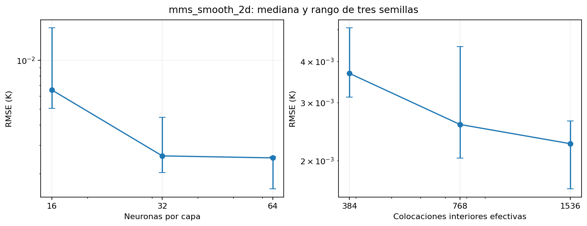
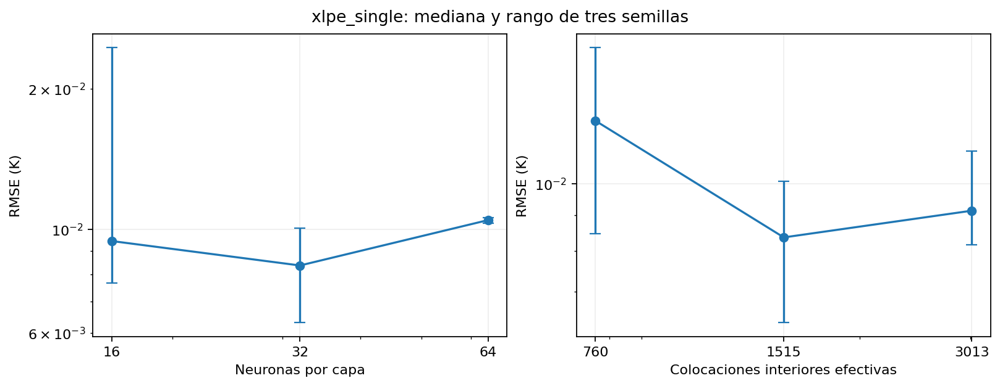

# Análisis interno de resolución, convergencia y propagación de error

Este expediente complementa INFORME_INTERNO.md. Los cálculos se generan desde campos y metadatos, mediante `python Benchmarks/numerical_analysis.py`.

## Fundamento y alcance

La separación de capacidad, muestreo y optimización sigue De Ryck y Mishra (2024: 24–27, 51–57). Las cotas de error requieren estabilidad y control del residuo y de su cuadratura (Mishra y Molinaro, 2020: 7–8). Se calculan pendientes empíricas y errores observados; no se asigna un orden teórico universal a PINN ni se aplica GCI al número de neuronas.

## Protocolo

Se comparan 16/32/64 neuronas por capa, 384/768/1536 puntos globales y un presupuesto duplicado, en un MMS continuo y un XLPE nominal acoplado. Se conservan tres semillas, un hilo, fronteras y evaluación comunes: 36 entrenamientos. N en las tablas es el número interior efectivo. Para diferencias entre soluciones, la tolerancia es 0,5 % del incremento máximo de referencia, tanto en RMS de campo como en Tmax; además ambos entrenamientos deben cumplir los criterios físicos. La tolerancia se declaró antes de cerrar la campaña.

## Resultados de resolución

| Caso | Prueba | Parámetros | N interior | Adam/L-BFGS | Error mediano K | Desv. K | Aceptadas |
| --- | --- | --- | --- | --- | --- | --- | --- |
| mms_smooth_2d | W16 | 609 | 768 | 1200/800 | 0.006557 | 0.005823 | 3/3 |
| mms_smooth_2d | W32 | 2241 | 768 | 1200/800 | 0.002575 | 0.001260 | 3/3 |
| mms_smooth_2d | W64 | 8577 | 768 | 1200/800 | 0.002503 | 0.000528 | 3/3 |
| mms_smooth_2d | N384 | 2241 | 384 | 1200/800 | 0.003680 | 0.000999 | 3/3 |
| mms_smooth_2d | N1536 | 2241 | 1536 | 1200/800 | 0.002251 | 0.000502 | 3/3 |
| mms_smooth_2d | B2 | 2241 | 768 | 2400/1600 | 0.001736 | 0.000322 | 3/3 |
| xlpe_single | W16 | 616 | 1515 | 1200/1600 | 0.009440 | 0.009247 | 3/3 |
| xlpe_single | W32 | 2248 | 1515 | 1200/1600 | 0.008370 | 0.001881 | 3/3 |
| xlpe_single | W64 | 8584 | 1515 | 1200/1600 | 0.010469 | 0.000144 | 3/3 |
| xlpe_single | N384 | 2248 | 760 | 1200/1600 | 0.012309 | 0.003601 | 3/3 |
| xlpe_single | N1536 | 2248 | 3013 | 1200/1600 | 0.009142 | 0.001510 | 3/3 |
| xlpe_single | B2 | 2248 | 1515 | 2400/3200 | 0.010308 | 0.003567 | 3/3 |

| Caso | Comparación | Máx. diferencia campo % | Máx. diferencia Tmax % | Estables |
| --- | --- | --- | --- | --- |
| mms_smooth_2d | W16-W32 | 0.05478 | 0.00684 | 3/3 |
| mms_smooth_2d | W32-W64 | 0.01653 | 0.00318 | 3/3 |
| mms_smooth_2d | N384-W32 | 0.01751 | 0.00475 | 3/3 |
| mms_smooth_2d | W32-N1536 | 0.01480 | 0.00468 | 3/3 |
| mms_smooth_2d | W32-B2 | 0.01376 | 0.00277 | 3/3 |
| xlpe_single | W16-W32 | 0.14049 | 0.10293 | 3/3 |
| xlpe_single | W32-W64 | 0.06275 | 0.07345 | 3/3 |
| xlpe_single | N384-W32 | 0.08079 | 0.03188 | 3/3 |
| xlpe_single | W32-N1536 | 0.04593 | 0.02639 | 3/3 |
| xlpe_single | W32-B2 | 0.08832 | 0.01480 | 3/3 |

## Pendientes empíricas de PINN

| Caso | Intervalo | q observado |
| --- | --- | --- |
| mms_smooth_2d | N384-W32 | 0.51512 |
| mms_smooth_2d | W32-N1536 | 0.19416 |
| xlpe_single | N384-W32 | 0.55908 |
| xlpe_single | W32-N1536 | -0.12829 |

Un q negativo indica que el mayor muestreo produjo más error bajo el presupuesto fijado. La pendiente depende de la red entrenada, no solo de una regla de cuadratura. B2 examina si el presupuesto explica parte de esa dependencia.

## Orden observado FEM

| Caso | RMSE nivel 0 | RMSE nivel 1 | RMSE nivel 2 | p01 | p12 |
| --- | --- | --- | --- | --- | --- |
| annulus | 0.00743045525637248 | 0.0011118137588075167 | 0.00015367089743373264 | None | None |
| mms_constant | 0.0020774113254907736 | 0.0002498345167420621 | 3.2296091395079503e-05 | 3.055742180432575 | 2.9515413314345222 |
| mms_high_contrast | 0.0020811155238890885 | 0.0002503107431938096 | 3.23043235583265e-05 | 3.055564934993387 | 2.953921041079217 |
| mms_interface | 0.0003705229021633283 | 4.5937981144348666e-05 | 5.792157344865659e-06 | 3.0118033583235575 | 2.9875147562833626 |
| mms_layered_y | 0.00036694652170997025 | 4.538921207800288e-05 | 5.796743511844386e-06 | 3.015148472439619 | 2.9690348871129495 |
| mms_robin | 0.00014456512882964827 | 1.7850979489433528e-05 | 2.2807320127587007e-06 | 3.0176444529229363 | 2.9684343933274526 |
| mms_smooth_2d | 0.002076228596656833 | 0.0002496436292333747 | 3.229510761344094e-05 | 3.056023300391734 | 2.9504825576811915 |
| mms_variable | 0.0020783332586872903 | 0.00024996709196187635 | 3.229790416891728e-05 | 3.0556169250710483 | 2.952225721642881 |

Las tasas se calculan con h reducido a la mitad en las mallas cuadradas, sobre la misma nube. Tres niveles apoyan una tasa observada; no prueban por sí solos el régimen asintótico. El anillo no recibe un p uniforme.

## Presupuesto del error frente a una solución exacta

| Caso | Semilla | PINN-FEM K | FEM-exacta K | PINN-exacta K | Cota triangular inferior | Cota triangular superior |
| --- | --- | --- | --- | --- | --- | --- |
| annulus | 11 | 0.0002372179303700148 | 0.00015367089743373264 | 0.00017844495351026005 | 8.354703293628215e-05 | 0.00039088882780374747 |
| annulus | 23 | 0.000153637128519273 | 0.00015367089743373264 | 7.164402230869173e-06 | 3.376891445964168e-08 | 0.00030730802595300565 |
| annulus | 37 | 0.0005133250607299587 | 0.00015367089743373264 | 0.0004864472814561419 | 0.0003596541632962261 | 0.0006669959581636914 |
| mms_constant | 11 | 0.0019125108463485115 | 3.2296091395079503e-05 | 0.001912406262970618 | 0.001880214754953432 | 0.001944806937743591 |
| mms_constant | 23 | 0.0031489529305982846 | 3.2296091395079503e-05 | 0.003148966699339017 | 0.003116656839203205 | 0.0031812490219933643 |
| mms_constant | 37 | 0.002857536030965017 | 3.2296091395079503e-05 | 0.0028566954626118033 | 0.0028252399395699373 | 0.0028898321223600966 |
| mms_high_contrast | 11 | 0.0032391292240819248 | 3.23043235583265e-05 | 0.0032386027194987706 | 0.0032068249005235984 | 0.003271433547640251 |
| mms_high_contrast | 23 | 0.0016962000818647727 | 3.23043235583265e-05 | 0.0016955554189545799 | 0.0016638957583064462 | 0.0017285044054230992 |
| mms_high_contrast | 37 | 0.0027497984298656387 | 3.23043235583265e-05 | 0.0027491021777657646 | 0.0027174941063073123 | 0.002782102753423965 |
| mms_interface | 11 | 0.0022003243594650303 | 5.792157344865659e-06 | 0.0022003165403935232 | 0.0021945322021201647 | 0.002206116516809896 |
| mms_interface | 23 | 0.0023071567047419656 | 5.792157344865659e-06 | 0.0023072257744147905 | 0.0023013645473971 | 0.002312948862086831 |
| mms_interface | 37 | 0.0029585176033942212 | 5.792157344865659e-06 | 0.0029586186899583805 | 0.0029527254460493557 | 0.002964309760739087 |
| mms_layered_y | 11 | 0.004206107553870257 | 5.796743511844386e-06 | 0.0042060620975302 | 0.004200310810358412 | 0.004211904297382101 |
| mms_layered_y | 23 | 0.0026930571354305674 | 5.796743511844386e-06 | 0.002693092566735922 | 0.002687260391918723 | 0.0026988538789424117 |
| mms_layered_y | 37 | 0.0023143564819853293 | 5.796743511844386e-06 | 0.0023143371571568232 | 0.002308559738473485 | 0.0023201532254971736 |
| mms_robin | 11 | 0.0011822184805696753 | 2.2807320127587007e-06 | 0.0011822187702074472 | 0.0011799377485569166 | 0.001184499212582434 |
| mms_robin | 23 | 0.0004732217881428335 | 2.2807320127587007e-06 | 0.000473195679752666 | 0.0004709410561300748 | 0.0004755025201555922 |
| mms_robin | 37 | 0.000772566630067219 | 2.2807320127587007e-06 | 0.0007725331989331258 | 0.0007702858980544603 | 0.0007748473620799777 |
| mms_smooth_2d | 11 | 0.00214326828956989 | 3.229510761344094e-05 | 0.002143359049441536 | 0.002110973181956449 | 0.002175563397183331 |
| mms_smooth_2d | 23 | 0.002342608584222165 | 3.229510761344094e-05 | 0.0023425887492480695 | 0.002310313476608724 | 0.002374903691835606 |
| mms_smooth_2d | 37 | 0.00410537927546458 | 3.229510761344094e-05 | 0.004105350055705619 | 0.0040730841678511395 | 0.004137674383078021 |
| mms_variable | 11 | 0.0031088534492264217 | 3.229790416891728e-05 | 0.0031084245355756414 | 0.0030765555450575043 | 0.003141151353395339 |
| mms_variable | 23 | 0.002383156462179038 | 3.229790416891728e-05 | 0.002382571535575564 | 0.0023508585580101207 | 0.0024154543663479555 |
| mms_variable | 37 | 0.00441730509767702 | 3.229790416891728e-05 | 0.0044167647372822475 | 0.0043850071935081026 | 0.004449603001845937 |

## Propagación del error electrotérmico

Para corriente nominal fija, M = identidad − I² R20 α A. La identidad ΔT = M⁻¹e + M⁻¹A r separa defecto térmico e incumplimiento eléctrico. Su suma vectorial se comprueba contra el error real frente a FEM; los máximos individuales pueden compensarse. Se calcula una cota de norma del error de temperatura del conductor dentro del modelo reducido. No es una distribución probabilística de incertidumbre de materiales.

| Caso | Amplificación infinito | Condición infinito | Radio espectral |
| --- | --- | --- | --- |
| aras_flat | 1.1353765265505387 | 1.0972917911120508 | 0.11426646401655494 |
| aras_single | 1.2038151865766047 | 1.0 | 0.169307705077398 |
| kim_layered | 1.1211435364966575 | 1.1209245768483522 | 0.10175702105179993 |
| kim_pac | 1.1278389090117136 | 1.1314165451386944 | 0.10692099750057271 |
| kim_sand | 1.1413101605010318 | 1.146028466461889 | 0.11513532271695184 |
| xlpe_backfill | 1.0561505834708547 | 0.9999999999999999 | 0.05316531974666494 |
| xlpe_discrete_layers | 1.073301540520099 | 0.9999999999999999 | 0.0682953836855379 |
| xlpe_dry_far | 1.071118315101662 | 1.0 | 0.06639632064821159 |
| xlpe_dry_large | 1.1082811694939199 | 0.9999999999999999 | 0.09770189413519037 |
| xlpe_dry_near | 1.0987778134893442 | 1.0 | 0.08989789589549453 |
| xlpe_single | 1.0709549637269435 | 0.9999999999999999 | 0.06625391928715567 |

| Caso | Semilla | Aporte térmico K | Aporte eléctrico K | Error real K | Cota K | Defecto identidad K |
| --- | --- | --- | --- | --- | --- | --- |
| aras_flat | 11 | 0.005762791702077536 | 0.0009175273215907032 | 0.006577553968035943 | 0.0068637620070531955 | 3.493563077716644e-11 |
| aras_flat | 23 | 0.0019306625199975987 | 0.0008992471991154 | 0.0011041134827181054 | 0.002895475108753437 | 3.4938647678131596e-11 |
| aras_flat | 37 | 0.004719112345501651 | 0.0010149040971937622 | 0.0056439752284376254 | 0.005951393130104563 | 3.4931957500206057e-11 |
| aras_single | 11 | 0.009233028187009046 | 0.0032327502804330105 | 0.012465778445246656 | 0.012465778467442054 | 2.219540176651158e-11 |
| aras_single | 23 | 0.0030565958766996314 | 0.0032739123874010807 | 0.006330508241902066 | 0.006330508264100713 | 2.2198645699411657e-11 |
| aras_single | 37 | 0.0032037806194990122 | 0.0032558042169735036 | 5.202357527878121e-05 | 0.006459584836472516 | 2.2195710113609435e-11 |
| kim_layered | 11 | 1.4936697296003827 | 0.01617330425361689 | 1.505172354096267 | 1.5246288226739777 | 5.058509167099601e-11 |
| kim_layered | 23 | 1.6496015977597691 | 0.03963569198220934 | 1.670499561057241 | 1.7193112172493803 | 5.058464758178616e-11 |
| kim_layered | 37 | 1.0301491024769487 | 0.02784868432937047 | 1.0304995179289662 | 1.0741186846455877 | 5.058597984941571e-11 |
| kim_pac | 11 | 1.519567119439529 | 0.016615771385693902 | 1.5361828908936346 | 1.5602526342808962 | 1.2080159095262388e-10 |
| kim_pac | 23 | 2.197735281297946 | 0.03577244445065954 | 2.2197014886386484 | 2.2757272215544773 | 1.208035893540682e-10 |
| kim_pac | 37 | 1.9688447391358939 | 0.022465143584108244 | 1.9913098827933595 | 2.0284970207359314 | 1.2080492162169776e-10 |
| kim_sand | 11 | 0.048082678966461345 | 0.0004807461386296995 | 0.048440046155633354 | 0.04980972775157266 | 4.779308199198695e-11 |
| kim_sand | 23 | 0.0741728808001465 | 0.0011547909093918847 | 0.07532767168655141 | 0.07660583500713085 | 4.779571183277653e-11 |
| kim_sand | 37 | 0.03326889828438057 | 0.00032614262032921673 | 0.03359504088172116 | 0.035333297193297496 | 4.779229702961407e-11 |
| xlpe_backfill | 11 | 0.09170324733194007 | 0.00855773230252756 | 0.10026097961399216 | 0.10026097963446765 | 2.047546854289095e-11 |
| xlpe_backfill | 23 | 0.04565999443038543 | 0.008856835538887324 | 0.054516829948795476 | 0.054516829969272755 | 2.047727959419987e-11 |
| xlpe_backfill | 37 | 0.4358010851653359 | 0.0134103613341662 | 0.4492114464790262 | 0.4492114464995021 | 2.0475843243161762e-11 |
| xlpe_discrete_layers | 11 | 0.007857409394068317 | 3.19743426300395e-05 | 0.007889383742870848 | 0.007889383736698357 | 6.172491337497199e-12 |
| xlpe_discrete_layers | 23 | 0.07069830042819311 | 0.00021897734016805329 | 0.07047932309419735 | 0.07091727776836117 | 6.172298783191366e-12 |
| xlpe_discrete_layers | 37 | 0.08262235746429265 | 0.00033671075006609327 | 0.0822856467203934 | 0.08295906821435875 | 6.1668448125828945e-12 |
| xlpe_dry_far | 11 | 0.1746827626116511 | 0.00022399976491369194 | 0.1749067623672076 | 0.1749067623765648 | 9.35720945172136e-12 |
| xlpe_dry_far | 23 | 0.26589565068897275 | 0.0004799210641294249 | 0.26637557174374393 | 0.26637557175310217 | 9.358236408019138e-12 |
| xlpe_dry_far | 37 | 0.20144726660479959 | 0.0005742129106650029 | 0.20202147950610794 | 0.20202147951546456 | 9.356654340209047e-12 |
| xlpe_dry_large | 11 | 0.8351604837468597 | 0.01765332599308679 | 0.8528138097407592 | 0.8528138097399465 | 8.126832540256146e-13 |
| xlpe_dry_large | 23 | 0.542995468077663 | 0.0020081370538445145 | 0.5409873310246311 | 0.5450036051315076 | 8.126832540256146e-13 |
| xlpe_dry_large | 37 | 1.151302198823762 | 0.02944773294744293 | 1.18074993177202 | 1.180749931771205 | 8.151257446797899e-13 |
| xlpe_dry_near | 11 | 0.12346092133503059 | 0.0030539036136183603 | 0.12651482496055166 | 0.12651482494864896 | 1.1902728802581919e-11 |
| xlpe_dry_near | 23 | 0.30098394151095376 | 0.0014058410480737812 | 0.30238978257092697 | 0.30238978255902754 | 1.1899425889083659e-11 |
| xlpe_dry_near | 37 | 0.1622154833998212 | 0.009598830359669309 | 0.17181431377139234 | 0.17181431375949052 | 1.1901840624162219e-11 |
| xlpe_single | 11 | 0.006023764095497616 | 0.00033834679537001036 | 0.006362110886719563 | 0.006362110890867627 | 4.148062969500099e-12 |
| xlpe_single | 23 | 0.011518861446215068 | 0.00033963215645229446 | 0.011858493598516873 | 0.011858493602667363 | 4.150490715004729e-12 |
| xlpe_single | 37 | 0.0019149634544241483 | 0.0003384252174005228 | 0.0022533886676754378 | 0.0022533886718246712 | 4.1492334741655146e-12 |

## Propagación de la diferencia entre mallas

La perturbación usa A de la malla intermedia menos A de la malla fina. Se contrasta la linealización con la solución matricial completa y la derivada de temperatura con diferencias centrales. La corriente límite se calcula mediante una raíz de la misma respuesta FEM. En empates se informa la derivada direccional del conductor limitante. La diferencia entre mallas no se convierte en una cota rigurosa del error FEM.

| Caso | ΔT real K | ΔT lineal K | Resto K | ΔI real A | ΔI lineal A | Resto A | Activos |
| --- | --- | --- | --- | --- | --- | --- | --- |
| aras_flat | 0.0010645529834292233 | 0.001064556774409501 | 3.790980277742703e-09 | 0.020449184738708936 | 0.02044876508418175 | 4.1965452718742413e-07 | [1] |
| aras_single | 0.002728402358201265 | 0.002728426615262176 | 2.4257060910696376e-08 | 0.04087427173612923 | 0.040872931993613686 | 1.3397425155450837e-06 | [0] |
| kim_layered | 0.0011158671197719627 | 0.001115870946095614 | 3.82632365136977e-09 | 0.023405253420150984 | 0.02340468596817667 | 5.674519743155415e-07 | [1] |
| kim_pac | 0.0009563797938696439 | 0.0009563825057797798 | 2.711910135908338e-09 | 0.018391157516816747 | 0.01839079869249229 | 3.5882432445830115e-07 | [1] |
| kim_sand | 0.0012344640487924607 | 0.0012344685334814225 | 4.484688961772093e-09 | 0.020369332798964024 | 0.020368873591106305 | 4.592078577184133e-07 | [1] |
| xlpe_backfill | 0.0006571159766295409 | 0.0006571176408352973 | 1.6642057563834647e-09 | 0.011843020200217325 | 0.011842633405300259 | 3.8679491706598845e-07 | [0] |
| xlpe_discrete_layers | 0.0010178641980473913 | 0.0010178679940418451 | 3.79599445388297e-09 | 0.012200481821423637 | 0.01220001656839204 | 4.652530315972514e-07 | [0] |
| xlpe_dry_far | 0.0011358949813313757 | 0.0011358997318901686 | 4.750558792914264e-09 | 0.014261580756965486 | 0.01426095393423625 | 6.268227292355322e-07 | [0] |
| xlpe_dry_large | 0.0033379523204715156 | 0.0033379918379399486 | 3.9517468432975766e-08 | 0.02193138128876626 | 0.021929583220716538 | 1.7980680497228785e-06 | [0] |
| xlpe_dry_near | 0.002279491526778088 | 0.0022795101038071202 | 1.8577029032261494e-08 | 0.017263301090338246 | 0.01726223239757757 | 1.0686927606751162e-06 | [0] |
| xlpe_single | 0.0010378527044849761 | 0.00103785665325959 | 3.948774613933906e-09 | 0.01307659192121946 | 0.013076065499582444 | 5.264216370159253e-07 | [0] |

## Ventajas y limitaciones

- Las comparaciones separan capacidad, colocación y presupuesto; conservan semillas desfavorables.

- Las soluciones exactas permiten distinguir error PINN y error de referencia.

- La identidad electrotérmica explica por qué el acoplamiento amplifica o compensa defectos.

- Dos casos y un intervalo de tamaños no acreditan independencia para todos los cables; las interfaces y geometrías más complejas requieren el mismo protocolo.

- No se varía aquí la densidad de frontera ni se garantiza optimización global. Las tasas empíricas no autorizan extrapolación asintótica.

- La propagación es determinista y local para cambios de malla; no estima probabilidades ni incertidumbre física no medida.

## Referencias

De Ryck, T., & Mishra, S. (2024). *Numerical analysis of physics-informed neural networks and related models in physics-informed machine learning* [Prepublicación, versión 1]. arXiv. https://arxiv.org/abs/2402.10926v1

Mishra, S., & Molinaro, R. (2020). *Estimates on the generalization error of physics informed neural networks (PINNs) for approximating PDEs* [Prepublicación, versión 1]. arXiv. https://arxiv.org/abs/2006.16144v1
