# Informe interno de todos los casos y configuraciones calculados

Este documento es el expediente de análisis del que se extraen tablas, figuras y conclusiones para la tesis. Se genera con `python Benchmarks/internal_report.py` a partir de resultados guardados; no contiene resultados simulados para completar la redacción.

Batería: **19 casos**, **57 soluciones FEM de verificación**, **66 expedientes FEM acoplados** y **290 entrenamientos evaluados**. Los 66 expedientes acoplados incluyen operación y ampacidad en tres mallas. Construir sus matrices y resolver ambos estados requiere 150 sistemas lineales en total, incluidas las excitaciones unitarias. La cantidad de entrenamientos por caso aparece en cada tabla; los intentos interrumpidos se documentan al final.

## Reglas de interpretación

- Referencia física única en JSON; temperaturas FEM excluidas del entrenamiento PINN.

- Tres mallas P2 y 6000 puntos de comparación independientes del entrenamiento.

- Puerta térmica: NRMSE ≤ 5 %, error del incremento máximo ≤ 5 % y balance ≤ 2 %. Se informan además máximos locales y residuos.

- Semilla 5: exploración; semillas 11, 23 y 37: sensibilidad. Ajustar y evaluar sobre un mismo caso no prueba generalización.

- Los cables usan flujo circular uniforme y reconstrucción radial de capas. Se separa esta reducción de un FEM multicapa completo.

- La operación y la ampacidad DC actualizan R(T) individualmente. Los ensayos a R20 fija se identifican como controles térmicos; no incluyen el acoplamiento.

- Acoplamiento: residuo eléctrico ≤ 0,1 %. Ampacidad: además, error de corriente frente a FEM ≤ 5 % y distancia a 90 °C ≤ 0,1 K. No se calcula ampacidad IEC completa.

- En la tabla de entrenamientos, «Pasa» corresponde a la puerta térmica o electrotérmica; «Pasa corriente» incorpora además los criterios de corriente límite.

- Los tiempos incluyen concurrencia y entornos distintos; no sustentan una ventaja de velocidad.

## Decisión sobre arquitectura e hiperparámetros

El menor error puntual y la menor complejidad aceptable son criterios distintos. C05 tiene el menor RMSE exploratorio entre los ocho candidatos; C04 obtiene un error próximo con menos parámetros. Se adopta C04 como configuración compacta para transferencia a casos de un cable; el escenario seco próximo conserva la alternativa de 32 neuronas que produjo menor error entre semillas. Esta es una selección observada y condicionada, no un óptimo universal.

Los seis cables necesitan representar variaciones angulares alrededor de cada superficie. La variante multipolar agrega funciones armónicas y coeficientes entrenables, manteniendo una MLP de 32×3. Se compara con un control de igual presupuesto; el piloto 64×4, con más iteraciones, se conserva incluso cuando no resulta aceptable.

La campaña acoplada usa esa base de 32×3 y agrega una potencia desconocida por conductor. Mantiene 1200 pasos Adam y hasta 1600 iteraciones L-BFGS en los once casos, con tres semillas. Es una extensión común evaluada, no una nueva búsqueda exhaustiva de arquitectura para cada corriente. La campaña C01–C08 conserva su alcance de comparación térmica a potencia fija.

| Candidato | Arquitectura | Parámetros | RMSE K | Balance % | Pasa |
| --- | --- | --- | --- | --- | --- |
| C01_enriched | 32×3 | 2241 | 0.671317 | 88.2530 | False |
| C02_energy | 32×3 | 2241 | 0.394852 | 0.0027 | True |
| C03_reference | 32×3 | 2241 | 0.036734 | 0.0032 | True |
| C04_width16 | 16×3 | 609 | 0.034972 | 0.0038 | True |
| C05_width64 | 64×3 | 8577 | 0.033703 | 0.0031 | True |
| C06_depth4 | 32×4 | 3297 | 0.037125 | 0.0029 | True |
| C07_lr0005 | 32×3 | 2241 | 0.038702 | 0.0030 | True |
| C08_sampling1536 | 32×3 | 2241 | 0.038856 | 0.0016 | True |

Las ocho verificaciones analíticas se repitieron en `verification_final` con fuentes archivadas. Las ejecuciones precedentes se conservan y figuran en las tablas; no se cuentan como casos físicos distintos. Las configuraciones de corriente límite con pesos 1000 se probaron también en los dos casos XLPE que incumplieron inicialmente. Esta ampliación usa el mismo presupuesto y es una decisión adaptada a la campaña observada.

### Selección completa de configuraciones acopladas

Primero se maximiza la cantidad de semillas aceptadas, conservando los fallos. En operación nominal, entre candidatos dentro del 5 % del mejor RMSE mediano se elige menor cantidad de parámetros y luego menor dispersión del RMSE. En ampacidad se minimiza el peor error de corriente entre las configuraciones con más semillas aceptadas. Es una selección finita sobre casos conocidos, no una prueba independiente de generalización.

Las semillas se agrupan por configuración; no se construye una configuración ficticia eligiendo la mejor semilla de cada alternativa. Los ensayos a mayor presupuesto y los cambios de pesos se identifican por separado. La variante de 64 neuronas mantiene el presupuesto inicial; el control de semilla 5 separa el efecto del presupuesto del peso eléctrico.

**aras_flat** — nominal: `coupled_final/aras_flat`; ampacidad: `ampacity_final/aras_flat`.

| Modo | Campaña | Ancho | Adam/L-BFGS | Peso R(T) | Peso límite | RMSE mediano K | Máx. residuo eléctrico % | Aceptadas |
| --- | --- | --- | --- | --- | --- | --- | --- | --- |
| Nominal | coupled_final/aras_flat | 32 | 1200/1600 | 100.0 | No aplica | 0.01215 | 0.00268 | 3/3 |
| Ampacidad | ampacity_final/aras_flat | 32 | 1200/1600 | 100.0 | 100.0 | 0.01930 | 0.00446 | 3/3 |

**aras_single** — nominal: `coupled_final/aras_single`; ampacidad: `ampacity_final/aras_single`.

| Modo | Campaña | Ancho | Adam/L-BFGS | Peso R(T) | Peso límite | RMSE mediano K | Máx. residuo eléctrico % | Aceptadas |
| --- | --- | --- | --- | --- | --- | --- | --- | --- |
| Nominal | coupled_final/aras_single | 32 | 1200/1600 | 100.0 | No aplica | 0.00802 | 0.00524 | 3/3 |
| Ampacidad | ampacity_final/aras_single | 32 | 1200/1600 | 100.0 | 100.0 | 0.01056 | 0.00660 | 3/3 |

**kim_layered** — nominal: `comparisons/adaptive_nominal_uniform/kim_layered`; ampacidad: `comparisons/ampacity_constraints1000/kim_layered`.

| Modo | Campaña | Ancho | Adam/L-BFGS | Peso R(T) | Peso límite | RMSE mediano K | Máx. residuo eléctrico % | Aceptadas |
| --- | --- | --- | --- | --- | --- | --- | --- | --- |
| Nominal | coupled_final/kim_layered | 32 | 1200/1600 | 100.0 | No aplica | 0.50359 | 0.32365 | 1/3 |
| Nominal | comparisons/coupled_refined/kim_layered | 32 | 2000/3000 | 1000 | No aplica | 0.64309 | 0.01656 | 1/3 |
| Nominal | comparisons/coupled_width64/kim_layered | 64 | 1200/1600 | 100.0 | No aplica | 0.61866 | 0.21336 | 1/3 |
| Nominal | comparisons/adaptive_nominal_uniform/kim_layered | 32 | 1200/1600 | 100.0 | No aplica | 0.50356 | 0.20255 | 1/3 |
| Nominal | comparisons/adaptive_nominal_residual/kim_layered | 32 | 1200/1600 | 100.0 | No aplica | 0.70534 | 0.16023 | 1/3 |
| Nominal | comparisons/adaptive_nominal_gradient/kim_layered | 32 | 1200/1600 | 100.0 | No aplica | 0.54403 | 0.13478 | 1/3 |
| Ampacidad | ampacity_final/kim_layered | 32 | 1200/1600 | 100.0 | 100.0 | 2.14029 | 0.10917 | 0/3 |
| Ampacidad | comparisons/ampacity_constraints1000/kim_layered | 32 | 1200/1600 | 1000.0 | 1000.0 | 3.01168 | 0.03095 | 2/3 |

**kim_pac** — nominal: `coupled_final/kim_pac`; ampacidad: `comparisons/ampacity_constraints1000/kim_pac`.

| Modo | Campaña | Ancho | Adam/L-BFGS | Peso R(T) | Peso límite | RMSE mediano K | Máx. residuo eléctrico % | Aceptadas |
| --- | --- | --- | --- | --- | --- | --- | --- | --- |
| Nominal | coupled_final/kim_pac | 32 | 1200/1600 | 100.0 | No aplica | 0.67576 | 0.16580 | 1/3 |
| Nominal | comparisons/coupled_refined/kim_pac | 32 | 2000/3000 | 1000 | No aplica | 0.70446 | 0.02181 | 1/3 |
| Nominal | comparisons/coupled_width64/kim_pac | 64 | 1200/1600 | 100.0 | No aplica | 0.66942 | 0.18791 | 0/3 |
| Ampacidad | ampacity_final/kim_pac | 32 | 1200/1600 | 100.0 | 100.0 | 2.27847 | 0.14373 | 1/3 |
| Ampacidad | comparisons/ampacity_constraints1000/kim_pac | 32 | 1200/1600 | 1000.0 | 1000.0 | 3.13425 | 0.01824 | 2/3 |

**kim_sand** — nominal: `coupled_final/kim_sand`; ampacidad: `ampacity_final/kim_sand`.

| Modo | Campaña | Ancho | Adam/L-BFGS | Peso R(T) | Peso límite | RMSE mediano K | Máx. residuo eléctrico % | Aceptadas |
| --- | --- | --- | --- | --- | --- | --- | --- | --- |
| Nominal | coupled_final/kim_sand | 32 | 1200/1600 | 100.0 | No aplica | 0.05036 | 0.00504 | 3/3 |
| Ampacidad | ampacity_final/kim_sand | 32 | 1200/1600 | 100.0 | 100.0 | 0.16222 | 0.00604 | 3/3 |

**xlpe_backfill** — nominal: `coupled_final/xlpe_backfill`; ampacidad: `comparisons/adaptive_ampacity_residual/xlpe_backfill`.

| Modo | Campaña | Ancho | Adam/L-BFGS | Peso R(T) | Peso límite | RMSE mediano K | Máx. residuo eléctrico % | Aceptadas |
| --- | --- | --- | --- | --- | --- | --- | --- | --- |
| Nominal | coupled_final/xlpe_backfill | 32 | 1200/1600 | 100.0 | No aplica | 0.26571 | 0.08902 | 3/3 |
| Ampacidad | ampacity_final/xlpe_backfill | 32 | 1200/1600 | 100.0 | 100.0 | 1.37645 | 0.00547 | 0/3 |
| Ampacidad | comparisons/ampacity_constraints1000/xlpe_backfill | 32 | 1200/1600 | 1000.0 | 1000.0 | 4.00135 | 0.01610 | 0/3 |
| Ampacidad | comparisons/adaptive_ampacity_uniform/xlpe_backfill | 32 | 1200/1600 | 1000.0 | 1000.0 | 4.10663 | 0.00834 | 1/3 |
| Ampacidad | comparisons/adaptive_ampacity_residual/xlpe_backfill | 32 | 1200/1600 | 1000.0 | 1000.0 | 2.43370 | 0.00861 | 2/3 |
| Ampacidad | comparisons/adaptive_ampacity_gradient/xlpe_backfill | 32 | 1200/1600 | 1000.0 | 1000.0 | 2.66945 | 0.00519 | 1/3 |

**xlpe_discrete_layers** — nominal: `coupled_final/xlpe_discrete_layers`; ampacidad: `ampacity_final/xlpe_discrete_layers`.

| Modo | Campaña | Ancho | Adam/L-BFGS | Peso R(T) | Peso límite | RMSE mediano K | Máx. residuo eléctrico % | Aceptadas |
| --- | --- | --- | --- | --- | --- | --- | --- | --- |
| Nominal | coupled_final/xlpe_discrete_layers | 32 | 1200/1600 | 100.0 | No aplica | 0.04808 | 0.00168 | 3/3 |
| Ampacidad | ampacity_final/xlpe_discrete_layers | 32 | 1200/1600 | 100.0 | 100.0 | 0.11309 | 0.00608 | 3/3 |

**xlpe_dry_far** — nominal: `coupled_final/xlpe_dry_far`; ampacidad: `ampacity_final/xlpe_dry_far`.

| Modo | Campaña | Ancho | Adam/L-BFGS | Peso R(T) | Peso límite | RMSE mediano K | Máx. residuo eléctrico % | Aceptadas |
| --- | --- | --- | --- | --- | --- | --- | --- | --- |
| Nominal | coupled_final/xlpe_dry_far | 32 | 1200/1600 | 100.0 | No aplica | 0.15986 | 0.00296 | 3/3 |
| Ampacidad | ampacity_final/xlpe_dry_far | 32 | 1200/1600 | 100.0 | 100.0 | 0.43099 | 0.00742 | 3/3 |

**xlpe_dry_large** — nominal: `coupled_final/xlpe_dry_large`; ampacidad: `comparisons/ampacity_constraints1000/xlpe_dry_large`.

| Modo | Campaña | Ancho | Adam/L-BFGS | Peso R(T) | Peso límite | RMSE mediano K | Máx. residuo eléctrico % | Aceptadas |
| --- | --- | --- | --- | --- | --- | --- | --- | --- |
| Nominal | coupled_final/xlpe_dry_large | 32 | 1200/1600 | 100.0 | No aplica | 0.45710 | 0.09684 | 3/3 |
| Ampacidad | ampacity_final/xlpe_dry_large | 32 | 1200/1600 | 100.0 | 100.0 | 0.32744 | 0.00712 | 2/3 |
| Ampacidad | comparisons/ampacity_constraints1000/xlpe_dry_large | 32 | 1200/1600 | 1000.0 | 1000.0 | 0.79276 | 0.00832 | 3/3 |

**xlpe_dry_near** — nominal: `coupled_final/xlpe_dry_near`; ampacidad: `ampacity_final/xlpe_dry_near`.

| Modo | Campaña | Ancho | Adam/L-BFGS | Peso R(T) | Peso límite | RMSE mediano K | Máx. residuo eléctrico % | Aceptadas |
| --- | --- | --- | --- | --- | --- | --- | --- | --- |
| Nominal | coupled_final/xlpe_dry_near | 32 | 1200/1600 | 100.0 | No aplica | 0.12258 | 0.03478 | 3/3 |
| Ampacidad | ampacity_final/xlpe_dry_near | 32 | 1200/1600 | 100.0 | 100.0 | 0.11089 | 0.01248 | 3/3 |

**xlpe_single** — nominal: `coupled_final/xlpe_single`; ampacidad: `ampacity_final/xlpe_single`.

| Modo | Campaña | Ancho | Adam/L-BFGS | Peso R(T) | Peso límite | RMSE mediano K | Máx. residuo eléctrico % | Aceptadas |
| --- | --- | --- | --- | --- | --- | --- | --- | --- |
| Nominal | coupled_final/xlpe_single | 32 | 1200/1600 | 100.0 | No aplica | 0.00837 | 0.00176 | 3/3 |
| Ampacidad | ampacity_final/xlpe_single | 32 | 1200/1600 | 100.0 | 100.0 | 0.01060 | 0.00577 | 3/3 |

## Reproducción en un entorno Python nuevo

Se reinstalaron PyTorch CPU, NumPy y pytest en un entorno virtual sin paquetes compartidos con el original. Las pruebas y los dos recálculos terminaron correctamente. El caso manufacturado también cambió de dos hilos a uno; no se atribuye su diferencia únicamente al paquete PyTorch. FEniCSx se recalculó en el entorno WSL declarado, sin afirmar una reinstalación de Conda.

| Caso | PyTorch original | PyTorch aislado | Máx. diferencia de campo K | Aceptado |
| --- | --- | --- | --- | --- |
| mms_constant | 2.9.0+xpu | 2.9.0+cpu | 0.00416018 | True |
| xlpe_single | 2.9.0+xpu | 2.9.0+cpu | 0.00000000 | True |

## Resumen de casos seleccionados

| Caso | RMSE mediano K | Desviación entre semillas K | Máx. error Tmax K | Máx. balance % | Aceptadas |
| --- | --- | --- | --- | --- | --- |
| annulus | 0.00024 | 0.00019 | 0.0005 | 0.0008 | 3/3 |
| aras_flat | 0.01215 | 0.00063 | 0.0048 | 0.0038 | 3/3 |
| aras_single | 0.00802 | 0.00106 | 0.0125 | 0.0030 | 3/3 |
| kim_layered | 0.50356 | 0.15806 | 1.4925 | 0.3851 | 1/3 |
| kim_pac | 0.67576 | 0.07134 | 1.9217 | 0.1754 | 1/3 |
| kim_sand | 0.05036 | 0.00447 | 0.0696 | 0.0146 | 3/3 |
| mms_constant | 0.00286 | 0.00065 | 0.0010 | 0.0031 | 3/3 |
| mms_high_contrast | 0.00275 | 0.00079 | 0.0009 | 0.0070 | 3/3 |
| mms_interface | 0.00231 | 0.00041 | 0.0052 | 0.0077 | 3/3 |
| mms_layered_y | 0.00269 | 0.00100 | 0.0089 | 0.0048 | 3/3 |
| mms_robin | 0.00077 | 0.00036 | 0.0003 | 0.0016 | 3/3 |
| mms_smooth_2d | 0.00234 | 0.00108 | 0.0015 | 0.0047 | 3/3 |
| mms_variable | 0.00311 | 0.00103 | 0.0010 | 0.0030 | 3/3 |
| xlpe_backfill | 0.26571 | 0.04919 | 0.4492 | 0.0884 | 3/3 |
| xlpe_discrete_layers | 0.04808 | 0.01549 | 0.0823 | 0.0033 | 3/3 |
| xlpe_dry_far | 0.15986 | 0.02922 | 0.2664 | 0.0115 | 3/3 |
| xlpe_dry_large | 0.45710 | 0.10057 | 1.1807 | 0.0330 | 3/3 |
| xlpe_dry_near | 0.12258 | 0.01777 | 0.3024 | 0.0325 | 3/3 |
| xlpe_single | 0.00837 | 0.00188 | 0.0119 | 0.0016 | 3/3 |

## Resolución, orden observado y propagación del error

El [análisis numérico completo](ANALISIS_NUMERICO.md) presenta 36 entrenamientos adicionales con controles separados de anchura, colocaciones y presupuesto. Incluye diferencias entre redes, pendientes empíricas, órdenes FEM frente a soluciones exactas, cotas triangulares y propagación de errores térmicos y eléctricos. Sus derivadas se contrastan mediante perturbaciones numéricas independientes. Los mismos entrenamientos aparecen en las tablas por caso de este informe.

## Redistribución adaptativa de colocaciones

El [expediente de muestreo adaptativo](MUESTREO_ADAPTATIVO.md) compara 18 entrenamientos nuevos con seis controles fijos: renovación aleatoria, residuo y gradiente térmico en dos escenarios difíciles. Incluye comparaciones pareadas, nubes iniciales y finales, puntuaciones y verificación de las selecciones. La evaluación FEM y las puertas de aceptación se mantienen. Todos esos resultados aparecen también en las tablas por caso.

## Caso `annulus`

El entrenamiento mediante residuos y diferenciación automática se fundamenta en la versión consultada de Raissi et al. (2017: 4–5). La verificación del cálculo térmico sigue la distinción entre verificación y validación de CIGRÉ Working Group B1.87 (2025: 93–99). La comparación de pesos responde a dificultades de optimización documentadas por Wang et al. (2020: 9–10); no se implementa ni se atribuye a la campaña su algoritmo adaptativo. La implementación FEM utiliza DOLFINx, cuyo entorno de solución y relación con FEniCSx describen Baratta et al. (2023: 1–3). Las versiones de software efectivamente ejecutadas se registran aparte. La separación entre capacidad, muestreo y optimización sigue De Ryck y Mishra (2024: 24–27, 51–57). Las cotas que relacionan error, estabilidad y cuadratura requieren hipótesis específicas (Mishra y Molinaro, 2020: 7–8); las pendientes observadas en esta batería no se presentan como órdenes teóricos de PINN. El anillo adapta el ejemplo analítico de CIGRÉ Working Group B1.87 (2025: 52–55), usando exactamente 40 W/m.

Datos completos: [JSON](cases/annulus.json). Revisión ejecutable: [cuaderno](notebooks/annulus.ipynb). Directorio seleccionado: `verification_final\annulus`.

### Datos y formulación

Familia: `annulus`. Ambiente: 20.0 °C. Conductividad: `1.25`.

Caso de verificación con datos controlados.

### Convergencia FEniCSx

| Nivel | Grados de libertad | Tmax °C | Balance % | Tiempo observado s |
| --- | --- | --- | --- | --- |
| 0 | 988 | 49.494154 | 2.648142 | 2.637 |
| 1 | 3640 | 49.568185 | 0.623954 | 3.405 |
| 2 | 13917 | 49.575201 | 0.208598 | 7.668 |

### Todos los entrenamientos evaluados

| Campaña | Semilla | Ancho×capas | RMSE K | NRMSE % | Máx. error campo K | Error Tmax K | Balance % | Pasa |
| --- | --- | --- | --- | --- | --- | --- | --- | --- |
| results | 11 | 32×3 | 0.000237 | 0.0008 | 0.00277 | 0.00043 | 0.00009 | Sí |
| results | 23 | 32×3 | 0.000154 | 0.0005 | 0.00246 | 0.00034 | 0.00004 | Sí |
| results | 37 | 32×3 | 0.000513 | 0.0017 | 0.00354 | 0.00049 | 0.00077 | Sí |
| verification_final | 11 | 32×3 | 0.000237 | 0.0008 | 0.00277 | 0.00043 | 0.00009 | Sí |
| verification_final | 23 | 32×3 | 0.000154 | 0.0005 | 0.00246 | 0.00034 | 0.00004 | Sí |
| verification_final | 37 | 32×3 | 0.000513 | 0.0017 | 0.00354 | 0.00049 | 0.00077 | Sí |

### Ventajas, limitaciones y decisión

La configuración seleccionada supera la puerta térmica en 3 de 3 semillas. Su RMSE mediano es 0.00024 K; la desviación entre semillas es 0.00019 K.

**Ventaja:** referencia logarítmica exacta y comprobación de flujo. **Limitación:** la PINN usa simetría radial y el muestreo de área no concentra puntos cerca del radio interior; se evalúa esa frontera por separado.

### Gráficos y archivos de auditoría

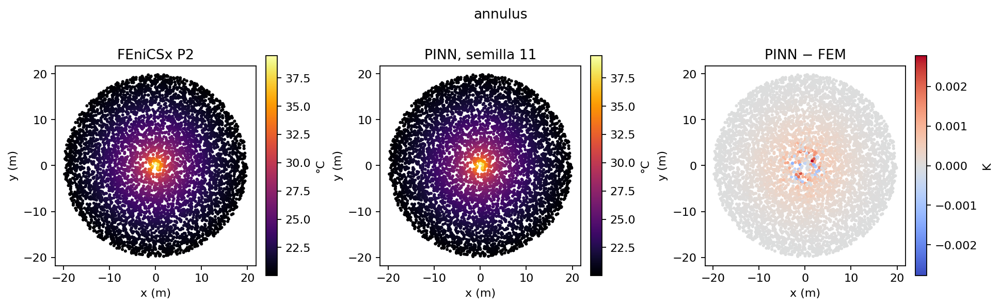

Fuente: elaboración propia, misma nube de evaluación; la figura usa la primera semilla guardada del directorio seleccionado.

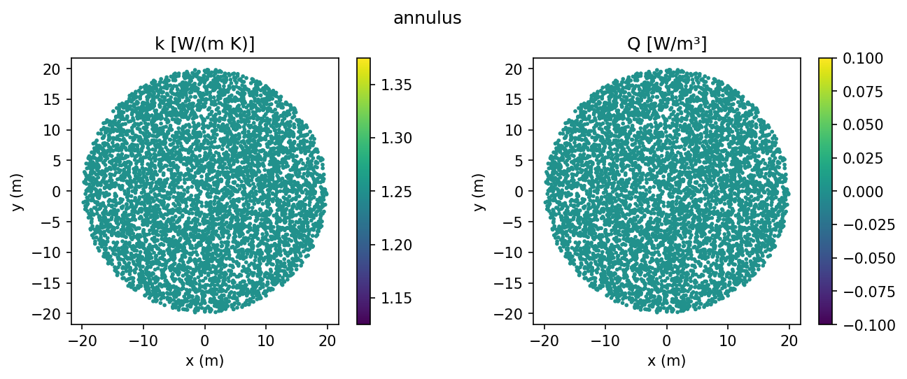

Fuente: elaboración propia a partir del JSON; en los casos de cables la generación se aplica en las fronteras, no en el volumen de suelo.

Campos y mallas: `results/annulus/fem_l*.npz`. Pesos e historiales: `verification_final\annulus/pinn_seed*.pt` y `training_seed*.json`. Las tablas completas están en [all_runs.csv](summary/all_runs.csv).

## Caso `aras_flat`

El entrenamiento mediante residuos y diferenciación automática se fundamenta en la versión consultada de Raissi et al. (2017: 4–5). La verificación del cálculo térmico sigue la distinción entre verificación y validación de CIGRÉ Working Group B1.87 (2025: 93–99). La comparación de pesos responde a dificultades de optimización documentadas por Wang et al. (2020: 9–10); no se implementa ni se atribuye a la campaña su algoritmo adaptativo. La implementación FEM utiliza DOLFINx, cuyo entorno de solución y relación con FEniCSx describen Baratta et al. (2023: 1–3). Las versiones de software efectivamente ejecutadas se registran aparte. La separación entre capacidad, muestreo y optimización sigue De Ryck y Mishra (2024: 24–27, 51–57). Las cotas que relacionan error, estabilidad y cuadratura requieren hipótesis específicas (Mishra y Molinaro, 2020: 7–8); las pendientes observadas en esta batería no se presentan como órdenes teóricos de PINN. Las dimensiones del cable proceden de Aras et al. (2005: 1390). El dominio, la conductividad de base y las pérdidas del caso común son adaptaciones declaradas. La resistencia DC se actualiza con la temperatura individual del conductor, siguiendo la ley lineal y el coeficiente del cobre documentados en CIGRÉ Working Group B1.56 (2022: 132). Las pérdidas AC adicionales de esa fuente quedan fuera del modelo DC ejecutado.

Datos completos: [JSON](cases/aras_flat.json). Revisión ejecutable: [cuaderno](notebooks/aras_flat.ipynb). Directorio seleccionado: `coupled_final\aras_flat`.

### Datos y formulación

Familia: `cable`. Ambiente: 20.0 °C. Conductividad: `1.0`.

Dominio: [-4.0, 4.0, -4.0, 0.0] m; 3 cable(s); radio exterior 0.05335 m; corriente base 1110.0 A; R20=1.51e-05 Ω/m; potencia de referencia a 20 °C por cable 18.60471 W/m.

Centros: `[[-0.33, -1.2], [0.0, -1.2], [0.33, -1.2]]`. Capas `[ri,ro,k]`: `[[0, 0.01885, 400], [0.01885, 0.04085, 0.2857], [0.04085, 0.04935, 384.6], [0.04935, 0.05335, 0.45]]`.

Región continua: `None`. Estratos heredados: `[]`. Control pareado: `None`.

Dominio controlado 8 x 4 m; Dirichlet 20 C; pérdidas DC a 20 C; flujo circular uniforme. Kim usa nueve capas de la ficha corregida de 2025.

### Convergencia FEniCSx

| Nivel | Grados de libertad | Tmax °C | Balance % | Tiempo observado s |
| --- | --- | --- | --- | --- |
| 0 | 1204 | 50.423538 | 1.701104 | 2.426 |
| 1 | 4350 | 50.435340 | 0.583356 | 3.231 |
| 2 | 15963 | 50.436170 | 0.194895 | 7.313 |

### Todos los entrenamientos evaluados

| Campaña | Semilla | Ancho×capas | RMSE K | NRMSE % | Máx. error campo K | Error Tmax K | Balance % | Pasa |
| --- | --- | --- | --- | --- | --- | --- | --- | --- |
| ampacity_final | 11 | 32×3 | 0.019304 | 0.0276 | 0.08475 | -0.01353 | 0.00305 | Sí |
| ampacity_final | 23 | 32×3 | 0.016912 | 0.0242 | 0.09907 | -0.01383 | 0.00365 | Sí |
| ampacity_final | 37 | 32×3 | 0.024402 | 0.0349 | 0.10763 | -0.01340 | 0.00472 | Sí |
| comparisons/final_multipole | 11 | 32×3 | 0.013633 | 0.0448 | 0.06687 | 0.00423 | 0.00353 | Sí |
| comparisons/final_multipole | 23 | 32×3 | 0.014454 | 0.0475 | 0.05569 | 0.00979 | 0.00214 | Sí |
| comparisons/final_multipole | 37 | 32×3 | 0.014505 | 0.0477 | 0.05936 | -0.00796 | 0.00297 | Sí |
| coupled_final | 11 | 32×3 | 0.012687 | 0.0368 | 0.05028 | 0.00483 | 0.00376 | Sí |
| coupled_final | 23 | 32×3 | 0.011426 | 0.0332 | 0.06089 | 0.00053 | 0.00262 | Sí |
| coupled_final | 37 | 32×3 | 0.012148 | 0.0353 | 0.05893 | 0.00250 | 0.00359 | Sí |
| results | 11 | 32×3 | 3.613228 | 11.8715 | 9.18181 | -1.97529 | 57.35701 | No |
| results | 23 | 32×3 | 3.841375 | 12.6211 | 9.68906 | -2.85173 | 50.99423 | No |
| results | 37 | 32×3 | 4.007860 | 13.1681 | 9.71798 | -1.39498 | 75.26374 | No |

### Ventajas, limitaciones y decisión

La configuración seleccionada supera la puerta térmica en 3 de 3 semillas. Su RMSE mediano es 0.01215 K; la desviación entre semillas es 0.00063 K.

### Operación y ampacidad con R(T) individual

La tabla FEM anterior corresponde al control a R20 fija. Las siguientes soluciones usan pérdidas actualizadas y constituyen las referencias operativas. Cada potencia se expresa en W/m y cada temperatura corresponde al mismo conductor, en el orden del JSON.

**Nominal, malla fina:** Tc = [51.901137, 54.446953, 51.901136] °C; P = [20.93721, 21.123351, 20.93721] W/m. Metadatos: [fem_l2.json](coupled_results/aras_flat/fem_l2.json).

**Ampacidad, malla fina:** Tc = [84.596419, 89.999904, 84.596417] °C; P = [42.329848, 43.046755, 42.329848] W/m. Metadatos: [fem_ampacity_l2.json](coupled_results/aras_flat/fem_ampacity_l2.json).

| Modo FEM | Malla | Corriente A | Tmax °C | Balance % | Residuo eléctrico % |
| --- | --- | --- | --- | --- | --- |
| Nominal | 0 | 1110.0000 | 54.43071 | 1.70080 | 6.19e-12 |
| Nominal | 1 | 1110.0000 | 54.44589 | 0.58322 | 3.19e-11 |
| Nominal | 2 | 1110.0000 | 54.44695 | 0.19491 | 1.22e-11 |
| Ampacidad | 0 | 1495.5491 | 89.99998 | 1.70052 | 1.14e-11 |
| Ampacidad | 1 | 1495.2569 | 89.99999 | 0.58310 | 5.85e-11 |
| Ampacidad | 2 | 1495.2358 | 89.99990 | 0.19492 | 2.24e-11 |

| Campaña | Semilla | Modo | Corriente A | Error I % | Residuo eléctrico % | Distancia a 90 °C K | Pasa corriente |
| --- | --- | --- | --- | --- | --- | --- | --- |
| ampacity_final | 11 | ampacity | 1495.1043 | 0.00879 | 0.00433 | 0.01362 | True |
| ampacity_final | 23 | ampacity | 1495.0070 | 0.01530 | 0.00442 | 0.01392 | True |
| ampacity_final | 37 | ampacity | 1494.9810 | 0.01704 | 0.00446 | 0.01349 | True |
| coupled_final | 11 | coupled | 1110.0000 | — | 0.00240 | — | No aplica |
| coupled_final | 23 | coupled | 1110.0000 | — | 0.00232 | — | No aplica |
| coupled_final | 37 | coupled | 1110.0000 | — | 0.00268 | — | No aplica |

### Balance por conductor y flujo local

Diagnóstico adicional para detectar compensaciones entre fronteras. No se añadió retrospectivamente a la puerta de aceptación. La integración FEM usa el gradiente de la solución P2; el flujo local PINN se evalúa sobre 512 puntos por circunferencia.

| Método/semilla | Frontera | P impuesta W/m | P integrada W/m | Error potencia % | RMSE flujo W/m² |
| --- | --- | --- | --- | --- | --- |
| FEM nominal | cable0 | 20.93721 | 20.88952 | 0.22776 | — |
| FEM nominal | cable1 | 21.12335 | 21.07532 | 0.22739 | — |
| FEM nominal | cable2 | 20.93721 | 20.89638 | 0.19499 | — |
| pinn_seed11 | cable0 | 20.93815 | 20.93813 | 0.00009 | 0.03334 |
| pinn_seed11 | cable1 | 21.12421 | 21.12427 | 0.00027 | 0.07015 |
| pinn_seed11 | cable2 | 20.93779 | 20.93784 | 0.00024 | 0.03334 |
| pinn_seed23 | cable0 | 20.93761 | 20.93762 | 0.00004 | 0.03334 |
| pinn_seed23 | cable1 | 21.12388 | 21.12391 | 0.00017 | 0.07015 |
| pinn_seed23 | cable2 | 20.93764 | 20.93763 | 0.00006 | 0.03334 |
| pinn_seed37 | cable0 | 20.93816 | 20.93819 | 0.00013 | 0.03334 |
| pinn_seed37 | cable1 | 21.12410 | 21.12410 | 0.00002 | 0.07015 |
| pinn_seed37 | cable2 | 20.93768 | 20.93767 | 0.00007 | 0.03334 |

**Ventaja:** ambos métodos comparten geometría, pérdidas, materiales y reconstrucción del conductor. **Limitación:** la frontera de flujo uniforme y las resistencias radiales reducen la física de las capas; las pérdidas son DC y no se reconstruye el ensayo publicado.

Las interacciones entre cables exigen capacidad local adicional. El enriquecimiento multipolar conserva la potencia de la fuente y permite ajustar variaciones angulares; los residuos locales y máximos deben revisarse además del promedio espacial.

### Gráficos y archivos de auditoría

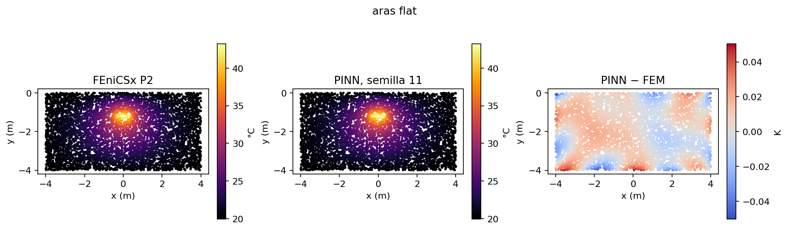

Fuente: elaboración propia, misma nube de evaluación; la figura usa la primera semilla guardada del directorio seleccionado.

Fuente: elaboración propia a partir del JSON; en los casos de cables la generación se aplica en las fronteras, no en el volumen de suelo.

Campos y mallas: `results/aras_flat/fem_l*.npz`. Pesos e historiales: `coupled_final\aras_flat/pinn_seed*.pt` y `training_seed*.json`. Las tablas completas están en [all_runs.csv](summary/all_runs.csv).

## Caso `aras_single`

El entrenamiento mediante residuos y diferenciación automática se fundamenta en la versión consultada de Raissi et al. (2017: 4–5). La verificación del cálculo térmico sigue la distinción entre verificación y validación de CIGRÉ Working Group B1.87 (2025: 93–99). La comparación de pesos responde a dificultades de optimización documentadas por Wang et al. (2020: 9–10); no se implementa ni se atribuye a la campaña su algoritmo adaptativo. La implementación FEM utiliza DOLFINx, cuyo entorno de solución y relación con FEniCSx describen Baratta et al. (2023: 1–3). Las versiones de software efectivamente ejecutadas se registran aparte. La separación entre capacidad, muestreo y optimización sigue De Ryck y Mishra (2024: 24–27, 51–57). Las cotas que relacionan error, estabilidad y cuadratura requieren hipótesis específicas (Mishra y Molinaro, 2020: 7–8); las pendientes observadas en esta batería no se presentan como órdenes teóricos de PINN. Las dimensiones del cable proceden de Aras et al. (2005: 1390). El dominio, la conductividad de base y las pérdidas del caso común son adaptaciones declaradas. La resistencia DC se actualiza con la temperatura individual del conductor, siguiendo la ley lineal y el coeficiente del cobre documentados en CIGRÉ Working Group B1.56 (2022: 132). Las pérdidas AC adicionales de esa fuente quedan fuera del modelo DC ejecutado.

Datos completos: [JSON](cases/aras_single.json). Revisión ejecutable: [cuaderno](notebooks/aras_single.ipynb). Directorio seleccionado: `coupled_final\aras_single`.

### Datos y formulación

Familia: `cable`. Ambiente: 20.0 °C. Conductividad: `1.0`.

Dominio: [-4.0, 4.0, -4.0, 0.0] m; 1 cable(s); radio exterior 0.05335 m; corriente base 1657.0 A; R20=1.51e-05 Ω/m; potencia de referencia a 20 °C por cable 41.4593 W/m.

Centros: `[[0.0, -1.2]]`. Capas `[ri,ro,k]`: `[[0, 0.01885, 400], [0.01885, 0.04085, 0.2857], [0.04085, 0.04935, 384.6], [0.04935, 0.05335, 0.45]]`.

Región continua: `None`. Estratos heredados: `[]`. Control pareado: `None`.

Dominio controlado 8 x 4 m; Dirichlet 20 C; pérdidas DC a 20 C; flujo circular uniforme. Kim usa nueve capas de la ficha corregida de 2025.

### Convergencia FEniCSx

| Nivel | Grados de libertad | Tmax °C | Balance % | Tiempo observado s |
| --- | --- | --- | --- | --- |
| 0 | 738 | 63.051278 | 1.669845 | 1.125 |
| 1 | 2680 | 63.078958 | 0.471898 | 2.620 |
| 2 | 10155 | 63.080841 | 0.193675 | 4.284 |

### Todos los entrenamientos evaluados

| Campaña | Semilla | Ancho×capas | RMSE K | NRMSE % | Máx. error campo K | Error Tmax K | Balance % | Pasa |
| --- | --- | --- | --- | --- | --- | --- | --- | --- |
| ampacity_final | 11 | 32×3 | 0.008295 | 0.0119 | 0.04097 | -0.02139 | 0.00272 | Sí |
| ampacity_final | 23 | 32×3 | 0.010560 | 0.0151 | 0.04640 | -0.02139 | 0.00280 | Sí |
| ampacity_final | 37 | 32×3 | 0.011219 | 0.0160 | 0.05022 | -0.02145 | 0.00254 | Sí |
| comparisons/final_w16 | 11 | 16×3 | 0.063197 | 0.1467 | 0.16174 | -0.02722 | 0.00778 | Sí |
| comparisons/final_w16 | 23 | 16×3 | 0.061718 | 0.1433 | 0.15502 | -0.02572 | 0.00773 | Sí |
| comparisons/final_w16 | 37 | 16×3 | 0.066753 | 0.1549 | 0.15852 | -0.02927 | 0.00611 | Sí |
| coupled_final | 11 | 32×3 | 0.009795 | 0.0189 | 0.03581 | 0.01247 | 0.00264 | Sí |
| coupled_final | 23 | 32×3 | 0.008024 | 0.0155 | 0.03142 | 0.00633 | 0.00257 | Sí |
| coupled_final | 37 | 32×3 | 0.007901 | 0.0152 | 0.03497 | 0.00005 | 0.00301 | Sí |
| results | 11 | 32×3 | 0.942312 | 2.1873 | 2.18625 | -1.19393 | 50.77134 | No |
| results | 23 | 32×3 | 0.909570 | 2.1113 | 2.06852 | -1.17071 | 45.96808 | No |
| results | 37 | 32×3 | 0.926858 | 2.1514 | 2.18822 | -1.18681 | 49.11444 | No |

### Ventajas, limitaciones y decisión

La configuración seleccionada supera la puerta térmica en 3 de 3 semillas. Su RMSE mediano es 0.00802 K; la desviación entre semillas es 0.00106 K.

### Operación y ampacidad con R(T) individual

La tabla FEM anterior corresponde al control a R20 fija. Las siguientes soluciones usan pérdidas actualizadas y constituyen las referencias operativas. Cada potencia se expresa en W/m y cada temperatura corresponde al mismo conductor, en el orden del JSON.

**Nominal, malla fina:** Tc = [71.861371] °C; P = [49.909335] W/m. Metadatos: [fem_l2.json](coupled_results/aras_single/fem_l2.json).

**Ampacidad, malla fina:** Tc = [89.99998] °C; P = [67.365217] W/m. Metadatos: [fem_ampacity_l2.json](coupled_results/aras_single/fem_ampacity_l2.json).

| Modo FEM | Malla | Corriente A | Tmax °C | Balance % | Residuo eléctrico % |
| --- | --- | --- | --- | --- | --- |
| Nominal | 0 | 1657.0000 | 71.81853 | 1.66985 | 2.85e-13 |
| Nominal | 1 | 1657.0000 | 71.85864 | 0.47190 | 7.63e-12 |
| Nominal | 2 | 1657.0000 | 71.86137 | 0.19367 | 7.26e-12 |
| Ampacidad | 0 | 1871.1413 | 90.00008 | 1.66985 | 3.79e-13 |
| Ampacidad | 1 | 1870.5392 | 90.00000 | 0.47190 | 9.77e-12 |
| Ampacidad | 2 | 1870.4981 | 89.99998 | 0.19367 | 9.3e-12 |

| Campaña | Semilla | Modo | Corriente A | Error I % | Residuo eléctrico % | Distancia a 90 °C K | Pasa corriente |
| --- | --- | --- | --- | --- | --- | --- | --- |
| ampacity_final | 11 | ampacity | 1870.2142 | 0.01518 | 0.00658 | 0.02140 | True |
| ampacity_final | 23 | ampacity | 1870.2506 | 0.01323 | 0.00660 | 0.02141 | True |
| ampacity_final | 37 | ampacity | 1870.2288 | 0.01440 | 0.00660 | 0.02147 | True |
| coupled_final | 11 | coupled | 1657.0000 | — | 0.00518 | — | No aplica |
| coupled_final | 23 | coupled | 1657.0000 | — | 0.00524 | — | No aplica |
| coupled_final | 37 | coupled | 1657.0000 | — | 0.00522 | — | No aplica |

### Balance por conductor y flujo local

Diagnóstico adicional para detectar compensaciones entre fronteras. No se añadió retrospectivamente a la puerta de aceptación. La integración FEM usa el gradiente de la solución P2; el flujo local PINN se evalúa sobre 512 puntos por circunferencia.

| Método/semilla | Frontera | P impuesta W/m | P integrada W/m | Error potencia % | RMSE flujo W/m² |
| --- | --- | --- | --- | --- | --- |
| FEM nominal | cable0 | 49.90933 | 49.80155 | 0.21595 | — |
| pinn_seed11 | cable0 | 49.91395 | 49.91393 | 0.00004 | 0.00008 |
| pinn_seed23 | cable0 | 49.91298 | 49.91298 | 0.00001 | 0.00021 |
| pinn_seed37 | cable0 | 49.91195 | 49.91198 | 0.00006 | 0.00028 |

**Ventaja:** ambos métodos comparten geometría, pérdidas, materiales y reconstrucción del conductor. **Limitación:** la frontera de flujo uniforme y las resistencias radiales reducen la física de las capas; las pérdidas son DC y no se reconstruye el ensayo publicado.

### Gráficos y archivos de auditoría

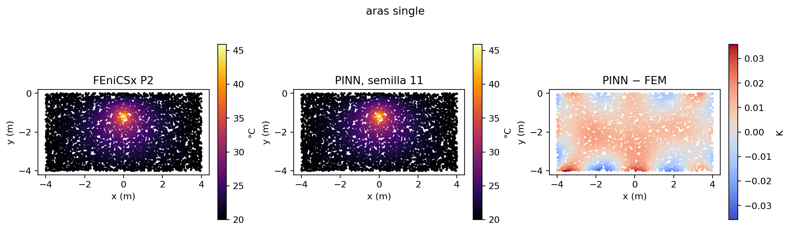

Fuente: elaboración propia, misma nube de evaluación; la figura usa la primera semilla guardada del directorio seleccionado.

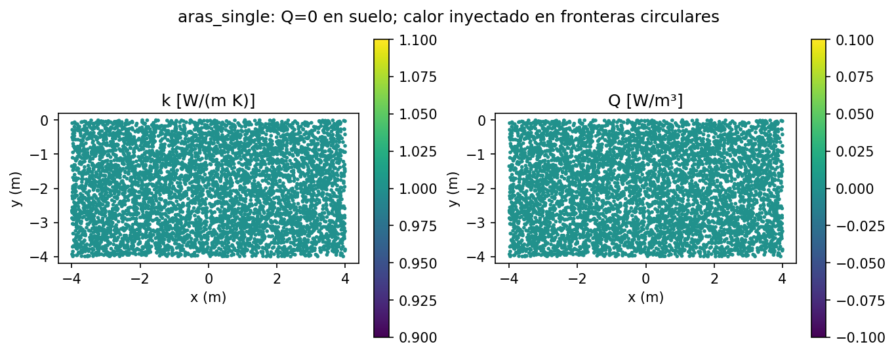

Fuente: elaboración propia a partir del JSON; en los casos de cables la generación se aplica en las fronteras, no en el volumen de suelo.

Campos y mallas: `results/aras_single/fem_l*.npz`. Pesos e historiales: `coupled_final\aras_single/pinn_seed*.pt` y `training_seed*.json`. Las tablas completas están en [all_runs.csv](summary/all_runs.csv).

## Caso `kim_layered`

El entrenamiento mediante residuos y diferenciación automática se fundamenta en la versión consultada de Raissi et al. (2017: 4–5). La verificación del cálculo térmico sigue la distinción entre verificación y validación de CIGRÉ Working Group B1.87 (2025: 93–99). La comparación de pesos responde a dificultades de optimización documentadas por Wang et al. (2020: 9–10); no se implementa ni se atribuye a la campaña su algoritmo adaptativo. La implementación FEM utiliza DOLFINx, cuyo entorno de solución y relación con FEniCSx describen Baratta et al. (2023: 1–3). Las versiones de software efectivamente ejecutadas se registran aparte. La separación entre capacidad, muestreo y optimización sigue De Ryck y Mishra (2024: 24–27, 51–57). Las cotas que relacionan error, estabilidad y cuadratura requieren hipótesis específicas (Mishra y Molinaro, 2020: 7–8); las pendientes observadas en esta batería no se presentan como órdenes teóricos de PINN. Los datos geométricos y eléctricos se contrastan con Kim et al. (2025: 3–5), y las propiedades de relleno con su discusión de materiales (2025: 10–12). La referencia FEM de este cuaderno resuelve la adaptación común, no reproduce las temperaturas publicadas. La resistencia DC se actualiza con la temperatura individual del conductor, siguiendo la ley lineal y el coeficiente del cobre documentados en CIGRÉ Working Group B1.56 (2022: 132). Las pérdidas AC adicionales de esa fuente quedan fuera del modelo DC ejecutado. La comparación de renovación aleatoria y distribución por residuo se fundamenta en Wu et al. (2022: 6–8). El muestreo mixto con anclajes geométricos y el indicador de gradiente térmico son adaptaciones propias, no una reproducción exacta de RAD.

Datos completos: [JSON](cases/kim_layered.json). Revisión ejecutable: [cuaderno](notebooks/kim_layered.ipynb). Directorio seleccionado: `comparisons\adaptive_nominal_uniform\kim_layered`.

### Datos y formulación

Familia: `cable`. Ambiente: 20.0 °C. Conductividad: `1.365`.

Dominio: [-4.0, 4.0, -4.0, 0.0] m; 6 cable(s); radio exterior 0.11 m; corriente base 1026.0 A; R20=1.51e-05 Ω/m; potencia de referencia a 20 °C por cable 15.89541 W/m.

Centros: `[[-0.4, -1.6], [0.0, -1.6], [0.4, -1.6], [-0.4, -1.2], [0.0, -1.2], [0.4, -1.2]]`. Capas `[ri,ro,k]`: `[[0, 0.0212, 400], [0.0212, 0.0232, 0.2857], [0.0232, 0.0402, 0.2857], [0.0402, 0.0415, 0.2857], [0.0415, 0.0425, 0.167], [0.0425, 0.045, 237], [0.045, 0.05, 0.2857], [0.05, 0.1, 2.15], [0.1, 0.11, 0.2857]]`.

Región continua: `[0.0, -1.4, 1.3, 0.9, 2.094, 0.1]`. Estratos heredados: `[[-0.56, 1.804, 1.351], [-1.76, 1.351, 1.517]]`. Control pareado: `None`.

Dominio controlado 8 x 4 m; Dirichlet 20 C; pérdidas DC a 20 C; flujo circular uniforme. Kim usa nueve capas de la ficha corregida de 2025.

### Convergencia FEniCSx

| Nivel | Grados de libertad | Tmax °C | Balance % | Tiempo observado s |
| --- | --- | --- | --- | --- |
| 0 | 1375 | 47.598418 | 1.287649 | 1.833 |
| 1 | 4971 | 47.610690 | 0.582170 | 3.726 |
| 2 | 17883 | 47.611591 | 0.242343 | 8.592 |

### Todos los entrenamientos evaluados

| Campaña | Semilla | Ancho×capas | RMSE K | NRMSE % | Máx. error campo K | Error Tmax K | Balance % | Pasa |
| --- | --- | --- | --- | --- | --- | --- | --- | --- |
| ampacity_final | 11 | 32×3 | 2.140292 | 3.0576 | 5.31996 | -0.29646 | 0.08072 | No |
| ampacity_final | 23 | 32×3 | 2.205079 | 3.1501 | 4.45557 | -0.37493 | 0.18184 | Sí |
| ampacity_final | 37 | 32×3 | 2.024379 | 2.8920 | 5.22166 | -0.29340 | 0.00513 | Sí |
| comparisons/adaptive_nominal_gradient | 11 | 32×3 | 0.544025 | 1.7649 | 1.56421 | -1.53596 | 0.08597 | Sí |
| comparisons/adaptive_nominal_gradient | 23 | 32×3 | 0.546044 | 1.7714 | 1.46675 | -0.60528 | 0.04852 | No |
| comparisons/adaptive_nominal_gradient | 37 | 32×3 | 0.417435 | 1.3542 | 1.37699 | -1.29745 | 0.24054 | No |
| comparisons/adaptive_nominal_residual | 11 | 32×3 | 0.616240 | 1.9991 | 1.57298 | -0.67473 | 0.02259 | Sí |
| comparisons/adaptive_nominal_residual | 23 | 32×3 | 1.181226 | 3.8320 | 4.22420 | -1.78679 | 0.58639 | No |
| comparisons/adaptive_nominal_residual | 37 | 32×3 | 0.705341 | 2.2882 | 2.42450 | -1.59331 | 0.17389 | No |
| comparisons/adaptive_nominal_uniform | 11 | 32×3 | 0.503557 | 1.6336 | 1.51438 | -1.46156 | 0.14440 | Sí |
| comparisons/adaptive_nominal_uniform | 23 | 32×3 | 0.761487 | 2.4703 | 1.66650 | -1.49255 | 0.38509 | No |
| comparisons/adaptive_nominal_uniform | 37 | 32×3 | 0.474241 | 1.5385 | 1.08386 | -0.96248 | 0.30649 | No |
| comparisons/ampacity_constraints1000 | 11 | 32×3 | 4.141081 | 5.9158 | 8.74171 | -0.03964 | 0.10683 | No |
| comparisons/ampacity_constraints1000 | 23 | 32×3 | 3.011684 | 4.3024 | 6.29128 | -0.05723 | 0.21544 | Sí |
| comparisons/ampacity_constraints1000 | 37 | 32×3 | 2.567244 | 3.6675 | 4.75701 | -0.04674 | 0.02536 | Sí |
| comparisons/coupled_budget_control | 5 | 32×3 | 0.446097 | 1.4472 | 1.58306 | -0.88629 | 0.10017 | Sí |
| comparisons/coupled_refined | 11 | 32×3 | 0.550670 | 1.7864 | 1.46996 | -1.48584 | 0.18910 | Sí |
| comparisons/coupled_refined | 23 | 32×3 | 1.332337 | 4.3222 | 4.27090 | -2.88624 | 0.17980 | No |
| comparisons/coupled_refined | 37 | 32×3 | 0.643094 | 2.0863 | 1.63013 | -1.55138 | 0.11009 | No |
| comparisons/coupled_weight1000 | 5 | 32×3 | 0.494649 | 1.6047 | 1.35641 | -1.26887 | 0.16593 | Sí |
| comparisons/coupled_width64 | 11 | 64×3 | 0.474197 | 1.5383 | 2.17773 | -1.27631 | 0.00731 | Sí |
| comparisons/coupled_width64 | 23 | 64×3 | 0.618656 | 2.0070 | 1.50642 | -1.23340 | 0.21184 | No |
| comparisons/coupled_width64 | 37 | 64×3 | 0.722134 | 2.3427 | 2.05279 | -1.56066 | 0.01436 | No |
| comparisons/final_multipole | 11 | 32×3 | 0.337144 | 1.2210 | 0.97213 | -0.52713 | 0.20819 | Sí |
| comparisons/final_multipole | 23 | 32×3 | 0.344337 | 1.2471 | 1.16708 | -0.92276 | 0.00211 | Sí |
| comparisons/final_multipole | 37 | 32×3 | 1.315325 | 4.7637 | 4.06468 | -2.12411 | 0.20329 | No |
| coupled_final | 11 | 32×3 | 0.379296 | 1.2305 | 1.18706 | -0.50811 | 0.02303 | Sí |
| coupled_final | 23 | 32×3 | 0.795797 | 2.5816 | 2.29137 | -2.17028 | 0.23944 | No |
| coupled_final | 37 | 32×3 | 0.503588 | 1.6337 | 1.58826 | -1.59350 | 0.04525 | No |
| results | 11 | 32×3 | 3.109221 | 11.2606 | 14.68197 | -13.29366 | 59.86776 | No |
| results | 23 | 32×3 | 3.072516 | 11.1276 | 14.36522 | -13.02855 | 59.59337 | No |
| results | 37 | 32×3 | 3.184270 | 11.5324 | 14.60275 | -13.24501 | 82.60155 | No |

### Ventajas, limitaciones y decisión

La configuración seleccionada supera la puerta térmica en 1 de 3 semillas. Su RMSE mediano es 0.50356 K; la desviación entre semillas es 0.15806 K.

### Operación y ampacidad con R(T) individual

La tabla FEM anterior corresponde al control a R20 fija. Las siguientes soluciones usan pérdidas actualizadas y constituyen las referencias operativas. Cada potencia se expresa en W/m y cada temperatura corresponde al mismo conductor, en el orden del JSON.

**Nominal, malla fina:** Tc = [48.48053, 50.825327, 48.480533, 47.452923, 49.755675, 47.452925] °C; P = [17.674556, 17.821033, 17.674557, 17.610363, 17.754213, 17.610363] W/m. Metadatos: [fem_l2.json](coupled_results/kim_layered/fem_l2.json).

**Ampacidad, malla fina:** Tc = [84.446455, 90.000084, 84.446462, 82.004367, 87.454577, 82.004374] °C; P = [39.960905, 40.656824, 39.960906, 39.65489, 40.337849, 39.654891] W/m. Metadatos: [fem_ampacity_l2.json](coupled_results/kim_layered/fem_ampacity_l2.json).

| Modo FEM | Malla | Corriente A | Tmax °C | Balance % | Residuo eléctrico % |
| --- | --- | --- | --- | --- | --- |
| Nominal | 0 | 1026.0000 | 50.80903 | 1.28677 | 9.43e-12 |
| Nominal | 1 | 1026.0000 | 50.82421 | 0.58200 | 2.92e-11 |
| Nominal | 2 | 1026.0000 | 50.82533 | 0.24236 | 1.79e-11 |
| Ampacidad | 0 | 1453.4759 | 89.99994 | 1.28581 | 1.9e-11 |
| Ampacidad | 1 | 1453.1588 | 90.00009 | 0.58181 | 5.89e-11 |
| Ampacidad | 2 | 1453.1354 | 90.00008 | 0.24237 | 3.61e-11 |

| Campaña | Semilla | Modo | Corriente A | Error I % | Residuo eléctrico % | Distancia a 90 °C K | Pasa corriente |
| --- | --- | --- | --- | --- | --- | --- | --- |
| ampacity_final | 11 | ampacity | 1405.5521 | 3.27452 | 0.10917 | 0.29637 | False |
| ampacity_final | 23 | ampacity | 1414.2789 | 2.67397 | 0.01844 | 0.37484 | False |
| ampacity_final | 37 | ampacity | 1414.3055 | 2.67214 | 0.06604 | 0.29332 | False |
| comparisons/adaptive_nominal_gradient | 11 | coupled | 1026.0000 | — | 0.06927 | — | No aplica |
| comparisons/adaptive_nominal_gradient | 23 | coupled | 1026.0000 | — | 0.13478 | — | No aplica |
| comparisons/adaptive_nominal_gradient | 37 | coupled | 1026.0000 | — | 0.10807 | — | No aplica |
| comparisons/adaptive_nominal_residual | 11 | coupled | 1026.0000 | — | 0.08349 | — | No aplica |
| comparisons/adaptive_nominal_residual | 23 | coupled | 1026.0000 | — | 0.16023 | — | No aplica |
| comparisons/adaptive_nominal_residual | 37 | coupled | 1026.0000 | — | 0.14193 | — | No aplica |
| comparisons/adaptive_nominal_uniform | 11 | coupled | 1026.0000 | — | 0.06494 | — | No aplica |
| comparisons/adaptive_nominal_uniform | 23 | coupled | 1026.0000 | — | 0.20255 | — | No aplica |
| comparisons/adaptive_nominal_uniform | 37 | coupled | 1026.0000 | — | 0.13590 | — | No aplica |
| comparisons/ampacity_constraints1000 | 11 | ampacity | 1368.8387 | 5.80102 | 0.03095 | 0.03956 | False |
| comparisons/ampacity_constraints1000 | 23 | ampacity | 1396.1683 | 3.92029 | 0.00997 | 0.05715 | True |
| comparisons/ampacity_constraints1000 | 37 | ampacity | 1406.8510 | 3.18514 | 0.00492 | 0.04666 | True |
| comparisons/coupled_budget_control | 5 | coupled | 1026.0000 | — | 0.07182 | — | No aplica |
| comparisons/coupled_refined | 11 | coupled | 1026.0000 | — | 0.01656 | — | No aplica |
| comparisons/coupled_refined | 23 | coupled | 1026.0000 | — | 0.01115 | — | No aplica |
| comparisons/coupled_refined | 37 | coupled | 1026.0000 | — | 0.01130 | — | No aplica |
| comparisons/coupled_weight1000 | 5 | coupled | 1026.0000 | — | 0.02019 | — | No aplica |
| comparisons/coupled_width64 | 11 | coupled | 1026.0000 | — | 0.05844 | — | No aplica |
| comparisons/coupled_width64 | 23 | coupled | 1026.0000 | — | 0.12528 | — | No aplica |
| comparisons/coupled_width64 | 37 | coupled | 1026.0000 | — | 0.21336 | — | No aplica |
| coupled_final | 11 | coupled | 1026.0000 | — | 0.09234 | — | No aplica |
| coupled_final | 23 | coupled | 1026.0000 | — | 0.32365 | — | No aplica |
| coupled_final | 37 | coupled | 1026.0000 | — | 0.16541 | — | No aplica |

### Balance por conductor y flujo local

Diagnóstico adicional para detectar compensaciones entre fronteras. No se añadió retrospectivamente a la puerta de aceptación. La integración FEM usa el gradiente de la solución P2; el flujo local PINN se evalúa sobre 512 puntos por circunferencia.

| Método/semilla | Frontera | P impuesta W/m | P integrada W/m | Error potencia % | RMSE flujo W/m² |
| --- | --- | --- | --- | --- | --- |
| FEM nominal | cable0 | 17.67456 | 17.62820 | 0.26227 | — |
| FEM nominal | cable1 | 17.82103 | 17.77951 | 0.23300 | — |
| FEM nominal | cable2 | 17.67456 | 17.62113 | 0.30229 | — |
| FEM nominal | cable3 | 17.61036 | 17.56618 | 0.25089 | — |
| FEM nominal | cable4 | 17.75421 | 17.70678 | 0.26719 | — |
| FEM nominal | cable5 | 17.61036 | 17.56466 | 0.25952 | — |
| pinn_seed11 | cable0 | 17.57782 | 17.85187 | 1.55905 | 0.49764 |
| pinn_seed11 | cable1 | 17.72040 | 17.79210 | 0.40465 | 0.50795 |
| pinn_seed11 | cable2 | 17.58857 | 17.92560 | 1.91620 | 0.57698 |
| pinn_seed11 | cable3 | 17.51929 | 17.84327 | 1.84931 | 0.53156 |
| pinn_seed11 | cable4 | 17.65542 | 17.27892 | 2.13249 | 0.70431 |
| pinn_seed11 | cable5 | 17.52719 | 17.81464 | 1.64004 | 0.48550 |
| pinn_seed23 | cable0 | 17.54361 | 17.53153 | 0.06884 | 0.30217 |
| pinn_seed23 | cable1 | 17.71854 | 17.72156 | 0.01707 | 0.50199 |
| pinn_seed23 | cable2 | 17.59058 | 17.71830 | 0.72602 | 0.35592 |
| pinn_seed23 | cable3 | 17.49542 | 17.69173 | 1.12206 | 0.38275 |
| pinn_seed23 | cable4 | 17.65711 | 17.79444 | 0.77778 | 0.50814 |
| pinn_seed23 | cable5 | 17.49615 | 17.59779 | 0.58090 | 0.29451 |
| pinn_seed37 | cable0 | 17.62102 | 17.74192 | 0.68611 | 0.33655 |
| pinn_seed37 | cable1 | 17.75243 | 17.91392 | 0.90971 | 0.55577 |
| pinn_seed37 | cable2 | 17.62972 | 17.67197 | 0.23964 | 0.30426 |
| pinn_seed37 | cable3 | 17.53703 | 17.68649 | 0.85229 | 0.31548 |
| pinn_seed37 | cable4 | 17.66726 | 17.49839 | 0.95583 | 0.52200 |
| pinn_seed37 | cable5 | 17.54219 | 17.79086 | 1.41754 | 0.43849 |

**Ventaja:** ambos métodos comparten geometría, pérdidas, materiales y reconstrucción del conductor. **Limitación:** la frontera de flujo uniforme y las resistencias radiales reducen la física de las capas; las pérdidas son DC y no se reconstruye el ensayo publicado.

Las interacciones entre cables exigen capacidad local adicional. El enriquecimiento multipolar conserva la potencia de la fuente y permite ajustar variaciones angulares; los residuos locales y máximos deben revisarse además del promedio espacial.

### Gráficos y archivos de auditoría

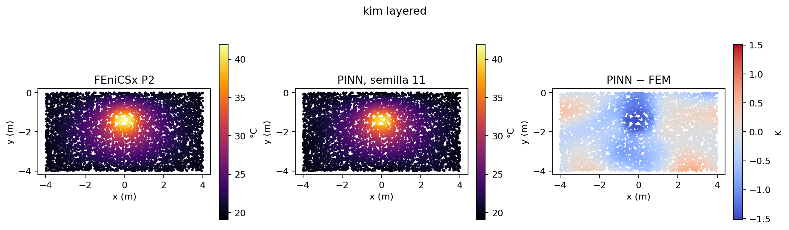

Fuente: elaboración propia, misma nube de evaluación; la figura usa la primera semilla guardada del directorio seleccionado.

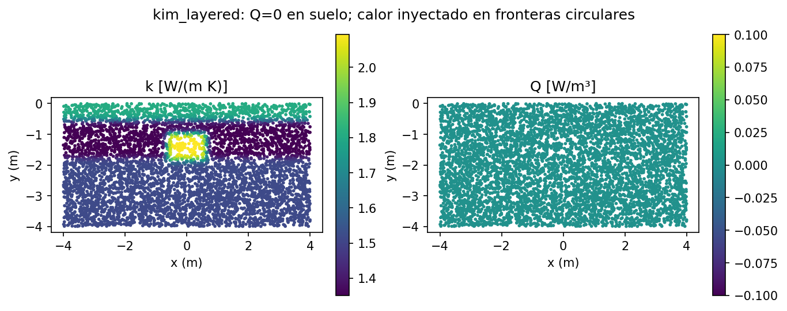

Fuente: elaboración propia a partir del JSON; en los casos de cables la generación se aplica en las fronteras, no en el volumen de suelo.

Campos y mallas: `results/kim_layered/fem_l*.npz`. Pesos e historiales: `comparisons\adaptive_nominal_uniform\kim_layered/pinn_seed*.pt` y `training_seed*.json`. Las tablas completas están en [all_runs.csv](summary/all_runs.csv).

## Caso `kim_pac`

El entrenamiento mediante residuos y diferenciación automática se fundamenta en la versión consultada de Raissi et al. (2017: 4–5). La verificación del cálculo térmico sigue la distinción entre verificación y validación de CIGRÉ Working Group B1.87 (2025: 93–99). La comparación de pesos responde a dificultades de optimización documentadas por Wang et al. (2020: 9–10); no se implementa ni se atribuye a la campaña su algoritmo adaptativo. La implementación FEM utiliza DOLFINx, cuyo entorno de solución y relación con FEniCSx describen Baratta et al. (2023: 1–3). Las versiones de software efectivamente ejecutadas se registran aparte. La separación entre capacidad, muestreo y optimización sigue De Ryck y Mishra (2024: 24–27, 51–57). Las cotas que relacionan error, estabilidad y cuadratura requieren hipótesis específicas (Mishra y Molinaro, 2020: 7–8); las pendientes observadas en esta batería no se presentan como órdenes teóricos de PINN. Los datos geométricos y eléctricos se contrastan con Kim et al. (2025: 3–5), y las propiedades de relleno con su discusión de materiales (2025: 10–12). La referencia FEM de este cuaderno resuelve la adaptación común, no reproduce las temperaturas publicadas. La resistencia DC se actualiza con la temperatura individual del conductor, siguiendo la ley lineal y el coeficiente del cobre documentados en CIGRÉ Working Group B1.56 (2022: 132). Las pérdidas AC adicionales de esa fuente quedan fuera del modelo DC ejecutado.

Datos completos: [JSON](cases/kim_pac.json). Revisión ejecutable: [cuaderno](notebooks/kim_pac.ipynb). Directorio seleccionado: `coupled_final\kim_pac`.

### Datos y formulación

Familia: `cable`. Ambiente: 20.0 °C. Conductividad: `1.365`.

Dominio: [-4.0, 4.0, -4.0, 0.0] m; 6 cable(s); radio exterior 0.11 m; corriente base 1026.0 A; R20=1.51e-05 Ω/m; potencia de referencia a 20 °C por cable 15.89541 W/m.

Centros: `[[-0.4, -1.6], [0.0, -1.6], [0.4, -1.6], [-0.4, -1.2], [0.0, -1.2], [0.4, -1.2]]`. Capas `[ri,ro,k]`: `[[0, 0.0212, 400], [0.0212, 0.0232, 0.2857], [0.0232, 0.0402, 0.2857], [0.0402, 0.0415, 0.2857], [0.0415, 0.0425, 0.167], [0.0425, 0.045, 237], [0.045, 0.05, 0.2857], [0.05, 0.1, 2.15], [0.1, 0.11, 0.2857]]`.

Región continua: `[0.0, -1.4, 1.3, 0.9, 2.094, 0.1]`. Estratos heredados: `[]`. Control pareado: `kim_sand`.

Dominio controlado 8 x 4 m; Dirichlet 20 C; pérdidas DC a 20 C; flujo circular uniforme. Kim usa nueve capas de la ficha corregida de 2025.

### Convergencia FEniCSx

| Nivel | Grados de libertad | Tmax °C | Balance % | Tiempo observado s |
| --- | --- | --- | --- | --- |
| 0 | 1375 | 48.959686 | 1.744797 | 2.242 |
| 1 | 4971 | 48.970946 | 0.589035 | 3.435 |
| 2 | 17883 | 48.971712 | 0.241384 | 7.366 |

### Todos los entrenamientos evaluados

| Campaña | Semilla | Ancho×capas | RMSE K | NRMSE % | Máx. error campo K | Error Tmax K | Balance % | Pasa |
| --- | --- | --- | --- | --- | --- | --- | --- | --- |
| ampacity_final | 11 | 32×3 | 2.278466 | 3.2550 | 4.89910 | -0.44671 | 0.12126 | No |
| ampacity_final | 23 | 32×3 | 2.633317 | 3.7619 | 5.90763 | -0.26497 | 0.28966 | No |
| ampacity_final | 37 | 32×3 | 1.535267 | 2.1932 | 4.00935 | -0.08211 | 0.11482 | Sí |
| comparisons/ampacity_constraints1000 | 11 | 32×3 | 3.656594 | 5.2237 | 8.91432 | -0.06080 | 0.17434 | No |
| comparisons/ampacity_constraints1000 | 23 | 32×3 | 3.134249 | 4.4775 | 6.99337 | -0.05555 | 0.24739 | Sí |
| comparisons/ampacity_constraints1000 | 37 | 32×3 | 1.969918 | 2.8142 | 5.53938 | -0.03793 | 0.00759 | Sí |
| comparisons/conservative | 11 | 32×3 | 2.551206 | 8.8059 | 11.96770 | -10.81997 | 0.18268 | No |
| comparisons/conservative | 23 | 32×3 | 2.611918 | 9.0154 | 12.00160 | -10.84231 | 0.20803 | No |
| comparisons/conservative | 37 | 32×3 | 2.685165 | 9.2682 | 12.17337 | -11.01958 | 0.12128 | No |
| comparisons/control_multipole_budget | 5 | 32×3 | 2.183905 | 7.5381 | 11.11623 | -10.02095 | 0.40813 | No |
| comparisons/coupled_refined | 11 | 32×3 | 0.704455 | 2.1656 | 2.23192 | -1.99819 | 0.02335 | No |
| comparisons/coupled_refined | 23 | 32×3 | 0.874668 | 2.6889 | 2.25082 | -2.15539 | 0.07316 | No |
| comparisons/coupled_refined | 37 | 32×3 | 0.364861 | 1.1216 | 1.17724 | -1.09627 | 0.09211 | Sí |
| comparisons/coupled_width64 | 11 | 64×3 | 0.832024 | 2.5578 | 2.47257 | -1.06024 | 0.01554 | No |
| comparisons/coupled_width64 | 23 | 64×3 | 0.565955 | 1.7398 | 1.37581 | -1.29377 | 0.21112 | No |
| comparisons/coupled_width64 | 37 | 64×3 | 0.669421 | 2.0579 | 2.35853 | -1.76138 | 0.06873 | No |
| comparisons/final_multipole | 11 | 32×3 | 0.497178 | 1.7161 | 1.75680 | -0.59174 | 0.20165 | Sí |
| comparisons/final_multipole | 23 | 32×3 | 0.508954 | 1.7567 | 1.31912 | -0.15393 | 0.01210 | Sí |
| comparisons/final_multipole | 37 | 32×3 | 0.463906 | 1.6012 | 1.91048 | -0.98445 | 0.13591 | Sí |
| comparisons/pilot_multipole | 5 | 32×3 | 0.640402 | 2.2104 | 1.72379 | -0.91458 | 0.20851 | Sí |
| comparisons/pilot_w64_d4 | 5 | 64×4 | 2.561729 | 8.8422 | 12.25275 | -9.52533 | 0.06848 | No |
| coupled_final | 11 | 32×3 | 0.570408 | 1.7535 | 1.56980 | -1.27925 | 0.02644 | Sí |
| coupled_final | 23 | 32×3 | 0.706427 | 2.1717 | 2.61074 | -1.92165 | 0.17540 | No |
| coupled_final | 37 | 32×3 | 0.675756 | 2.0774 | 2.51498 | -1.81827 | 0.02385 | No |
| results | 11 | 32×3 | 3.372011 | 11.6390 | 15.47452 | -14.11787 | 56.43885 | No |
| results | 23 | 32×3 | 3.226357 | 11.1362 | 14.83657 | -13.51089 | 50.73089 | No |
| results | 37 | 32×3 | 3.075009 | 10.6138 | 14.62262 | -13.29803 | 53.49453 | No |

### Ventajas, limitaciones y decisión

La configuración seleccionada supera la puerta térmica en 1 de 3 semillas. Su RMSE mediano es 0.67576 K; la desviación entre semillas es 0.07134 K.

### Operación y ampacidad con R(T) individual

La tabla FEM anterior corresponde al control a R20 fija. Las siguientes soluciones usan pérdidas actualizadas y constituyen las referencias operativas. Cada potencia se expresa en W/m y cada temperatura corresponde al mismo conductor, en el orden del JSON.

**Nominal, malla fina:** Tc = [50.087569, 52.528984, 50.087572, 49.063039, 51.457796, 49.063041] °C; P = [17.774946, 17.927459, 17.774947, 17.710945, 17.860543, 17.710945] W/m. Metadatos: [fem_l2.json](coupled_results/kim_pac/fem_l2.json).

**Ampacidad, malla fina:** Tc = [84.541648, 89.999933, 84.541654, 82.243854, 87.594311, 82.243857] °C; P = [38.097478, 38.749361, 38.097479, 37.823053, 38.462058, 37.823054] W/m. Metadatos: [fem_ampacity_l2.json](coupled_results/kim_pac/fem_ampacity_l2.json).

| Modo FEM | Malla | Corriente A | Tmax °C | Balance % | Residuo eléctrico % |
| --- | --- | --- | --- | --- | --- |
| Nominal | 0 | 1026.0000 | 52.51398 | 1.74380 | 1e-11 |
| Nominal | 1 | 1026.0000 | 52.52803 | 0.58885 | 2.29e-11 |
| Nominal | 2 | 1026.0000 | 52.52898 | 0.24140 | 4.25e-11 |
| Ampacidad | 0 | 1418.9281 | 90.00004 | 1.74281 | 1.93e-11 |
| Ampacidad | 1 | 1418.6580 | 90.00008 | 0.58867 | 4.42e-11 |
| Ampacidad | 2 | 1418.6384 | 89.99993 | 0.24141 | 8.16e-11 |

| Campaña | Semilla | Modo | Corriente A | Error I % | Residuo eléctrico % | Distancia a 90 °C K | Pasa corriente |
| --- | --- | --- | --- | --- | --- | --- | --- |
| ampacity_final | 11 | ampacity | 1369.9055 | 3.43519 | 0.12831 | 0.44678 | False |
| ampacity_final | 23 | ampacity | 1377.0937 | 2.92849 | 0.14373 | 0.26504 | False |
| ampacity_final | 37 | ampacity | 1403.1069 | 1.09482 | 0.02836 | 0.08218 | True |
| comparisons/ampacity_constraints1000 | 11 | ampacity | 1343.6398 | 5.28666 | 0.00958 | 0.06087 | False |
| comparisons/ampacity_constraints1000 | 23 | ampacity | 1364.8480 | 3.79170 | 0.01824 | 0.05562 | True |
| comparisons/ampacity_constraints1000 | 37 | ampacity | 1400.6865 | 1.26543 | 0.01398 | 0.03800 | True |
| comparisons/coupled_refined | 11 | coupled | 1026.0000 | — | 0.01899 | — | No aplica |
| comparisons/coupled_refined | 23 | coupled | 1026.0000 | — | 0.01704 | — | No aplica |
| comparisons/coupled_refined | 37 | coupled | 1026.0000 | — | 0.02181 | — | No aplica |
| comparisons/coupled_width64 | 11 | coupled | 1026.0000 | — | 0.13266 | — | No aplica |
| comparisons/coupled_width64 | 23 | coupled | 1026.0000 | — | 0.18791 | — | No aplica |
| comparisons/coupled_width64 | 37 | coupled | 1026.0000 | — | 0.12827 | — | No aplica |
| coupled_final | 11 | coupled | 1026.0000 | — | 0.07658 | — | No aplica |
| coupled_final | 23 | coupled | 1026.0000 | — | 0.16580 | — | No aplica |
| coupled_final | 37 | coupled | 1026.0000 | — | 0.10089 | — | No aplica |

### Balance por conductor y flujo local

Diagnóstico adicional para detectar compensaciones entre fronteras. No se añadió retrospectivamente a la puerta de aceptación. La integración FEM usa el gradiente de la solución P2; el flujo local PINN se evalúa sobre 512 puntos por circunferencia.

| Método/semilla | Frontera | P impuesta W/m | P integrada W/m | Error potencia % | RMSE flujo W/m² |
| --- | --- | --- | --- | --- | --- |
| FEM nominal | cable0 | 17.77495 | 17.72822 | 0.26287 | — |
| FEM nominal | cable1 | 17.92746 | 17.88560 | 0.23348 | — |
| FEM nominal | cable2 | 17.77495 | 17.72091 | 0.30403 | — |
| FEM nominal | cable3 | 17.71095 | 17.66657 | 0.25054 | — |
| FEM nominal | cable4 | 17.86054 | 17.81293 | 0.26658 | — |
| FEM nominal | cable5 | 17.71095 | 17.66498 | 0.25954 | — |
| pinn_seed11 | cable0 | 17.68718 | 18.01994 | 1.88140 | 0.56802 |
| pinn_seed11 | cable1 | 17.84389 | 17.96307 | 0.66789 | 0.53609 |
| pinn_seed11 | cable2 | 17.70468 | 17.95895 | 1.43615 | 0.48353 |
| pinn_seed11 | cable3 | 17.62256 | 17.78020 | 0.89459 | 0.33597 |
| pinn_seed11 | cable4 | 17.75098 | 17.32931 | 2.37547 | 0.75823 |
| pinn_seed11 | cable5 | 17.63547 | 18.07171 | 2.47364 | 0.67975 |
| pinn_seed23 | cable0 | 17.67032 | 18.01455 | 1.94806 | 0.58527 |
| pinn_seed23 | cable1 | 17.77789 | 17.93862 | 0.90408 | 0.55841 |
| pinn_seed23 | cable2 | 17.63544 | 17.63560 | 0.00094 | 0.30205 |
| pinn_seed23 | cable3 | 17.57450 | 17.71119 | 0.77778 | 0.32019 |
| pinn_seed23 | cable4 | 17.73141 | 17.47742 | 1.43243 | 0.58379 |
| pinn_seed23 | cable5 | 17.55886 | 17.83772 | 1.58817 | 0.47096 |
| pinn_seed37 | cable0 | 17.66805 | 17.84144 | 0.98132 | 0.39813 |
| pinn_seed37 | cable1 | 17.80764 | 18.01775 | 1.17993 | 0.59124 |
| pinn_seed37 | cable2 | 17.65946 | 18.05869 | 2.26072 | 0.65423 |
| pinn_seed37 | cable3 | 17.59832 | 17.80600 | 1.18008 | 0.39152 |
| pinn_seed37 | cable4 | 17.73567 | 17.45265 | 1.59573 | 0.60762 |
| pinn_seed37 | cable5 | 17.56881 | 17.69907 | 0.74144 | 0.30749 |

**Ventaja:** ambos métodos comparten geometría, pérdidas, materiales y reconstrucción del conductor. **Limitación:** la frontera de flujo uniforme y las resistencias radiales reducen la física de las capas; las pérdidas son DC y no se reconstruye el ensayo publicado.

Las interacciones entre cables exigen capacidad local adicional. El enriquecimiento multipolar conserva la potencia de la fuente y permite ajustar variaciones angulares; los residuos locales y máximos deben revisarse además del promedio espacial.

La interpretación del efecto material debe compararse con `kim_sand`, conservando corriente, dominio y contornos.

### Gráficos y archivos de auditoría

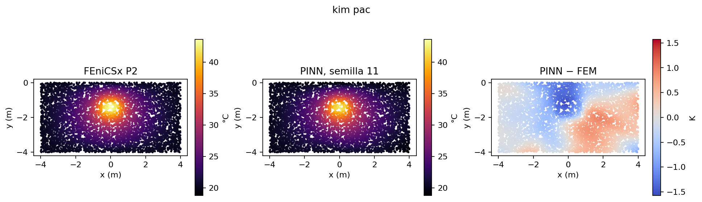

Fuente: elaboración propia, misma nube de evaluación; la figura usa la primera semilla guardada del directorio seleccionado.

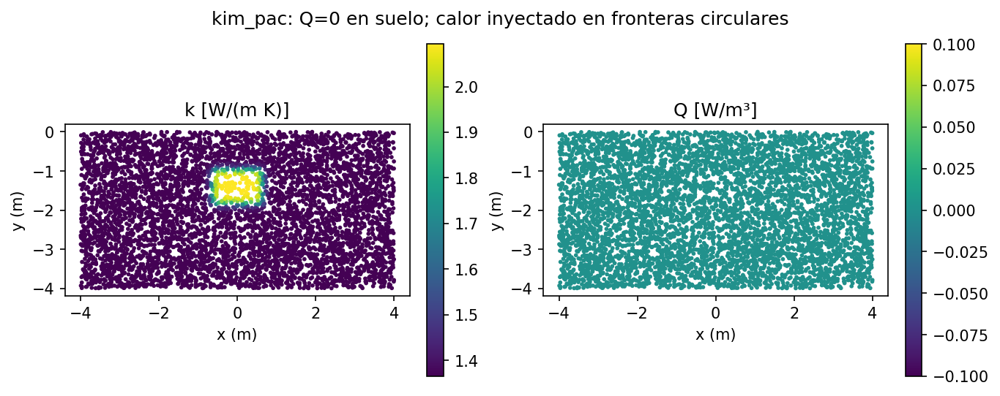

Fuente: elaboración propia a partir del JSON; en los casos de cables la generación se aplica en las fronteras, no en el volumen de suelo.

Campos y mallas: `results/kim_pac/fem_l*.npz`. Pesos e historiales: `coupled_final\kim_pac/pinn_seed*.pt` y `training_seed*.json`. Las tablas completas están en [all_runs.csv](summary/all_runs.csv).

## Caso `kim_sand`

El entrenamiento mediante residuos y diferenciación automática se fundamenta en la versión consultada de Raissi et al. (2017: 4–5). La verificación del cálculo térmico sigue la distinción entre verificación y validación de CIGRÉ Working Group B1.87 (2025: 93–99). La comparación de pesos responde a dificultades de optimización documentadas por Wang et al. (2020: 9–10); no se implementa ni se atribuye a la campaña su algoritmo adaptativo. La implementación FEM utiliza DOLFINx, cuyo entorno de solución y relación con FEniCSx describen Baratta et al. (2023: 1–3). Las versiones de software efectivamente ejecutadas se registran aparte. La separación entre capacidad, muestreo y optimización sigue De Ryck y Mishra (2024: 24–27, 51–57). Las cotas que relacionan error, estabilidad y cuadratura requieren hipótesis específicas (Mishra y Molinaro, 2020: 7–8); las pendientes observadas en esta batería no se presentan como órdenes teóricos de PINN. Los datos geométricos y eléctricos se contrastan con Kim et al. (2025: 3–5), y las propiedades de relleno con su discusión de materiales (2025: 10–12). La referencia FEM de este cuaderno resuelve la adaptación común, no reproduce las temperaturas publicadas. La resistencia DC se actualiza con la temperatura individual del conductor, siguiendo la ley lineal y el coeficiente del cobre documentados en CIGRÉ Working Group B1.56 (2022: 132). Las pérdidas AC adicionales de esa fuente quedan fuera del modelo DC ejecutado.

Datos completos: [JSON](cases/kim_sand.json). Revisión ejecutable: [cuaderno](notebooks/kim_sand.ipynb). Directorio seleccionado: `coupled_final\kim_sand`.

### Datos y formulación

Familia: `cable`. Ambiente: 20.0 °C. Conductividad: `1.365`.

Dominio: [-4.0, 4.0, -4.0, 0.0] m; 6 cable(s); radio exterior 0.11 m; corriente base 1026.0 A; R20=1.51e-05 Ω/m; potencia de referencia a 20 °C por cable 15.89541 W/m.

Centros: `[[-0.4, -1.6], [0.0, -1.6], [0.4, -1.6], [-0.4, -1.2], [0.0, -1.2], [0.4, -1.2]]`. Capas `[ri,ro,k]`: `[[0, 0.0212, 400], [0.0212, 0.0232, 0.2857], [0.0232, 0.0402, 0.2857], [0.0402, 0.0415, 0.2857], [0.0415, 0.0425, 0.167], [0.0425, 0.045, 237], [0.045, 0.05, 0.2857], [0.05, 0.1, 2.15], [0.1, 0.11, 0.2857]]`.

Región continua: `None`. Estratos heredados: `[]`. Control pareado: `None`.

Dominio controlado 8 x 4 m; Dirichlet 20 C; pérdidas DC a 20 C; flujo circular uniforme. Kim usa nueve capas de la ficha corregida de 2025.

### Convergencia FEniCSx

| Nivel | Grados de libertad | Tmax °C | Balance % | Tiempo observado s |
| --- | --- | --- | --- | --- |
| 0 | 1375 | 51.685401 | 1.568152 | 1.927 |
| 1 | 4971 | 51.699637 | 0.555702 | 3.495 |
| 2 | 17883 | 51.700608 | 0.231552 | 7.916 |

### Todos los entrenamientos evaluados

| Campaña | Semilla | Ancho×capas | RMSE K | NRMSE % | Máx. error campo K | Error Tmax K | Balance % | Pasa |
| --- | --- | --- | --- | --- | --- | --- | --- | --- |
| ampacity_final | 11 | 32×3 | 0.162217 | 0.2317 | 0.37160 | -0.02769 | 0.00692 | Sí |
| ampacity_final | 23 | 32×3 | 0.134913 | 0.1927 | 0.31483 | -0.02726 | 0.01048 | Sí |
| ampacity_final | 37 | 32×3 | 0.165500 | 0.2364 | 0.33765 | -0.02875 | 0.00500 | Sí |
| comparisons/control_multipole_budget | 5 | 32×3 | 1.862862 | 5.8764 | 11.27702 | -9.69051 | 0.76954 | No |
| comparisons/final_multipole | 11 | 32×3 | 0.017012 | 0.0537 | 0.09259 | 0.00176 | 0.00366 | Sí |
| comparisons/final_multipole | 23 | 32×3 | 0.030849 | 0.0973 | 0.13251 | 0.00287 | 0.01645 | Sí |
| comparisons/final_multipole | 37 | 32×3 | 0.019743 | 0.0623 | 0.07736 | -0.01577 | 0.00236 | Sí |
| comparisons/pilot_multipole | 5 | 32×3 | 0.018607 | 0.0587 | 0.09707 | -0.00274 | 0.00493 | Sí |
| coupled_final | 11 | 32×3 | 0.044979 | 0.1251 | 0.14818 | -0.04013 | 0.01315 | Sí |
| coupled_final | 23 | 32×3 | 0.053846 | 0.1498 | 0.12106 | -0.06961 | 0.00237 | Sí |
| coupled_final | 37 | 32×3 | 0.050365 | 0.1401 | 0.21175 | -0.00647 | 0.01458 | Sí |
| coupled_pilot | 5 | 32×3 | 0.038030 | 0.1058 | 0.17343 | -0.06635 | 0.01022 | Sí |
| results | 11 | 32×3 | 2.691218 | 8.4895 | 15.25687 | -13.05958 | 28.85657 | No |
| results | 23 | 32×3 | 2.367280 | 7.4676 | 14.21816 | -11.91469 | 25.68636 | No |
| results | 37 | 32×3 | 2.399893 | 7.5705 | 14.51432 | -12.14341 | 21.56296 | No |

### Ventajas, limitaciones y decisión

La configuración seleccionada supera la puerta térmica en 3 de 3 semillas. Su RMSE mediano es 0.05036 K; la desviación entre semillas es 0.00447 K.

### Operación y ampacidad con R(T) individual

La tabla FEM anterior corresponde al control a R20 fija. Las siguientes soluciones usan pérdidas actualizadas y constituyen las referencias operativas. Cada potencia se expresa en W/m y cada temperatura corresponde al mismo conductor, en el orden del JSON.

**Nominal, malla fina:** Tc = [52.427697, 55.956784, 52.4277, 51.170727, 54.602516, 51.170729] °C; P = [17.921132, 18.14159, 17.921132, 17.84261, 18.056991, 17.84261] W/m. Metadatos: [fem_l2.json](coupled_results/kim_sand/fem_l2.json).

**Ampacidad, malla fina:** Tc = [82.897648, 90.000047, 82.897656, 80.360004, 87.261775, 80.360007] °C; P = [34.717808, 35.494802, 34.717809, 34.440192, 35.195239, 34.440193] W/m. Metadatos: [fem_ampacity_l2.json](coupled_results/kim_sand/fem_ampacity_l2.json).

| Modo FEM | Malla | Corriente A | Tmax °C | Balance % | Residuo eléctrico % |
| --- | --- | --- | --- | --- | --- |
| Nominal | 0 | 1026.0000 | 55.93744 | 1.56677 | 1.13e-11 |
| Nominal | 1 | 1026.0000 | 55.95555 | 0.55546 | 2.01e-11 |
| Nominal | 2 | 1026.0000 | 55.95678 | 0.23156 | 1.67e-11 |
| Ampacidad | 0 | 1358.0751 | 90.00001 | 1.56565 | 1.99e-11 |
| Ampacidad | 1 | 1357.7756 | 89.99994 | 0.55527 | 3.54e-11 |
| Ampacidad | 2 | 1357.7561 | 90.00005 | 0.23157 | 2.93e-11 |

| Campaña | Semilla | Modo | Corriente A | Error I % | Residuo eléctrico % | Distancia a 90 °C K | Pasa corriente |
| --- | --- | --- | --- | --- | --- | --- | --- |
| ampacity_final | 11 | ampacity | 1353.9383 | 0.28118 | 0.00524 | 0.02764 | True |
| ampacity_final | 23 | ampacity | 1354.7732 | 0.21969 | 0.00460 | 0.02722 | True |
| ampacity_final | 37 | ampacity | 1353.7539 | 0.29476 | 0.00604 | 0.02871 | True |
| coupled_final | 11 | coupled | 1026.0000 | — | 0.00301 | — | No aplica |
| coupled_final | 23 | coupled | 1026.0000 | — | 0.00504 | — | No aplica |
| coupled_final | 37 | coupled | 1026.0000 | — | 0.00153 | — | No aplica |
| coupled_pilot | 5 | coupled | 1026.0000 | — | 0.00319 | — | No aplica |

### Balance por conductor y flujo local

Diagnóstico adicional para detectar compensaciones entre fronteras. No se añadió retrospectivamente a la puerta de aceptación. La integración FEM usa el gradiente de la solución P2; el flujo local PINN se evalúa sobre 512 puntos por circunferencia.

| Método/semilla | Frontera | P impuesta W/m | P integrada W/m | Error potencia % | RMSE flujo W/m² |
| --- | --- | --- | --- | --- | --- |
| FEM nominal | cable0 | 17.92113 | 17.87506 | 0.25709 | — |
| FEM nominal | cable1 | 18.14159 | 18.10023 | 0.22798 | — |
| FEM nominal | cable2 | 17.92113 | 17.86875 | 0.29230 | — |
| FEM nominal | cable3 | 17.84261 | 17.80065 | 0.23519 | — |
| FEM nominal | cable4 | 18.05699 | 18.01032 | 0.25844 | — |
| FEM nominal | cable5 | 17.84261 | 17.79826 | 0.24854 | — |
| pinn_seed11 | cable0 | 17.91893 | 17.91914 | 0.00117 | 0.28837 |
| pinn_seed11 | cable1 | 18.13870 | 18.13859 | 0.00065 | 0.50225 |
| pinn_seed11 | cable2 | 17.91932 | 17.92045 | 0.00630 | 0.28835 |
| pinn_seed11 | cable3 | 17.84080 | 17.83994 | 0.00482 | 0.26716 |
| pinn_seed11 | cable4 | 18.05366 | 18.05270 | 0.00532 | 0.47665 |
| pinn_seed11 | cable5 | 17.84070 | 17.84157 | 0.00488 | 0.26730 |
| pinn_seed23 | cable0 | 17.91698 | 17.91876 | 0.00990 | 0.28821 |
| pinn_seed23 | cable1 | 18.13724 | 18.13888 | 0.00903 | 0.50244 |
| pinn_seed23 | cable2 | 17.91681 | 17.91785 | 0.00580 | 0.28832 |
| pinn_seed23 | cable3 | 17.83785 | 17.83895 | 0.00617 | 0.26730 |
| pinn_seed23 | cable4 | 18.05137 | 18.05192 | 0.00302 | 0.47687 |
| pinn_seed23 | cable5 | 17.83789 | 17.83800 | 0.00061 | 0.26706 |
| pinn_seed37 | cable0 | 17.92066 | 17.92327 | 0.01457 | 0.28852 |
| pinn_seed37 | cable1 | 18.14110 | 18.14420 | 0.01706 | 0.50268 |
| pinn_seed37 | cable2 | 17.92158 | 17.92515 | 0.01989 | 0.28864 |
| pinn_seed37 | cable3 | 17.84059 | 17.83953 | 0.00592 | 0.26702 |
| pinn_seed37 | cable4 | 18.05462 | 18.05415 | 0.00260 | 0.47662 |
| pinn_seed37 | cable5 | 17.84180 | 17.84291 | 0.00625 | 0.26730 |

**Ventaja:** ambos métodos comparten geometría, pérdidas, materiales y reconstrucción del conductor. **Limitación:** la frontera de flujo uniforme y las resistencias radiales reducen la física de las capas; las pérdidas son DC y no se reconstruye el ensayo publicado.

Las interacciones entre cables exigen capacidad local adicional. El enriquecimiento multipolar conserva la potencia de la fuente y permite ajustar variaciones angulares; los residuos locales y máximos deben revisarse además del promedio espacial.

### Gráficos y archivos de auditoría

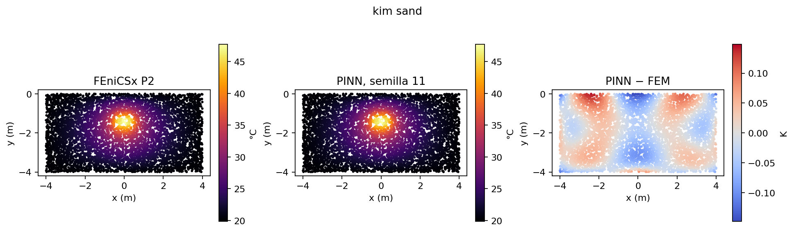

Fuente: elaboración propia, misma nube de evaluación; la figura usa la primera semilla guardada del directorio seleccionado.

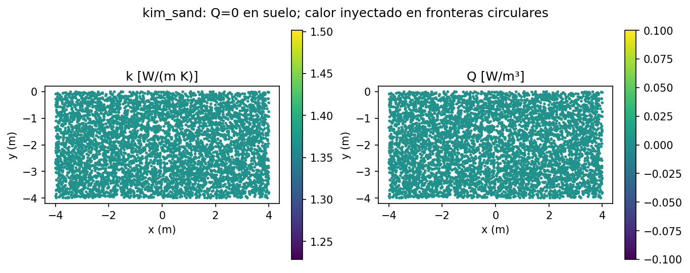

Fuente: elaboración propia a partir del JSON; en los casos de cables la generación se aplica en las fronteras, no en el volumen de suelo.

Campos y mallas: `results/kim_sand/fem_l*.npz`. Pesos e historiales: `coupled_final\kim_sand/pinn_seed*.pt` y `training_seed*.json`. Las tablas completas están en [all_runs.csv](summary/all_runs.csv).

## Caso `mms_constant`

El entrenamiento mediante residuos y diferenciación automática se fundamenta en la versión consultada de Raissi et al. (2017: 4–5). La verificación del cálculo térmico sigue la distinción entre verificación y validación de CIGRÉ Working Group B1.87 (2025: 93–99). La comparación de pesos responde a dificultades de optimización documentadas por Wang et al. (2020: 9–10); no se implementa ni se atribuye a la campaña su algoritmo adaptativo. La implementación FEM utiliza DOLFINx, cuyo entorno de solución y relación con FEniCSx describen Baratta et al. (2023: 1–3). Las versiones de software efectivamente ejecutadas se registran aparte. La separación entre capacidad, muestreo y optimización sigue De Ryck y Mishra (2024: 24–27, 51–57). Las cotas que relacionan error, estabilidad y cuadratura requieren hipótesis específicas (Mishra y Molinaro, 2020: 7–8); las pendientes observadas en esta batería no se presentan como órdenes teóricos de PINN. La solución manufacturada o el escenario XLPE específico es de elaboración propia; sus valores no se atribuyen a un experimento publicado.

Datos completos: [JSON](cases/mms_constant.json). Revisión ejecutable: [cuaderno](notebooks/mms_constant.ipynb). Directorio seleccionado: `verification_final\mms_constant`.

### Datos y formulación

Familia: `mms_constant`. Ambiente: 20.0 °C. Conductividad: `"preset manufacturado"`.

Caso de verificación con datos controlados.

### Convergencia FEniCSx

| Nivel | Grados de libertad | Tmax °C | Balance % | Tiempo observado s |
| --- | --- | --- | --- | --- |
| 0 | 1089 | 50.000432 | 0.476264 | 1.748 |
| 1 | 4225 | 50.000027 | 0.120124 | 3.073 |
| 2 | 16641 | 50.000002 | 0.030097 | 4.393 |

### Todos los entrenamientos evaluados

| Campaña | Semilla | Ancho×capas | RMSE K | NRMSE % | Máx. error campo K | Error Tmax K | Balance % | Pasa |
| --- | --- | --- | --- | --- | --- | --- | --- | --- |
| reproduced_entrypoint | 11 | 32×3 | 0.001987 | 0.0066 | 0.01197 | -0.00016 | 0.00225 | Sí |
| reproducibility_runs | 11 | 32×3 | 0.001987 | 0.0066 | 0.01197 | -0.00016 | 0.00225 | Sí |
| results | 11 | 32×3 | 0.001913 | 0.0064 | 0.01411 | -0.00004 | 0.00181 | Sí |
| results | 23 | 32×3 | 0.003149 | 0.0105 | 0.01709 | -0.00059 | 0.00310 | Sí |
| results | 37 | 32×3 | 0.002858 | 0.0095 | 0.01676 | 0.00096 | 0.00145 | Sí |
| verification_final | 11 | 32×3 | 0.001913 | 0.0064 | 0.01411 | -0.00004 | 0.00181 | Sí |
| verification_final | 23 | 32×3 | 0.003149 | 0.0105 | 0.01709 | -0.00059 | 0.00310 | Sí |
| verification_final | 37 | 32×3 | 0.002858 | 0.0095 | 0.01676 | 0.00096 | 0.00145 | Sí |

### Ventajas, limitaciones y decisión

La configuración seleccionada supera la puerta térmica en 3 de 3 semillas. Su RMSE mediano es 0.00286 K; la desviación entre semillas es 0.00065 K.

**Ventaja:** existe una solución exacta independiente y se pueden separar errores de fuente, derivadas y contornos. **Limitación:** la geometría regular y los campos prescritos no reproducen por sí mismos el problema completo del cable.

### Gráficos y archivos de auditoría

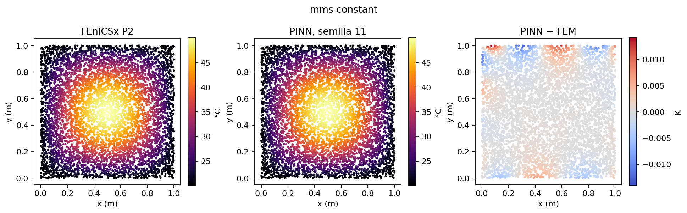

Fuente: elaboración propia, misma nube de evaluación; la figura usa la primera semilla guardada del directorio seleccionado.

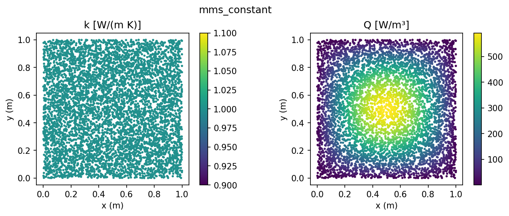

Fuente: elaboración propia a partir del JSON; en los casos de cables la generación se aplica en las fronteras, no en el volumen de suelo.

Campos y mallas: `results/mms_constant/fem_l*.npz`. Pesos e historiales: `verification_final\mms_constant/pinn_seed*.pt` y `training_seed*.json`. Las tablas completas están en [all_runs.csv](summary/all_runs.csv).

## Caso `mms_high_contrast`

El entrenamiento mediante residuos y diferenciación automática se fundamenta en la versión consultada de Raissi et al. (2017: 4–5). La verificación del cálculo térmico sigue la distinción entre verificación y validación de CIGRÉ Working Group B1.87 (2025: 93–99). La comparación de pesos responde a dificultades de optimización documentadas por Wang et al. (2020: 9–10); no se implementa ni se atribuye a la campaña su algoritmo adaptativo. La implementación FEM utiliza DOLFINx, cuyo entorno de solución y relación con FEniCSx describen Baratta et al. (2023: 1–3). Las versiones de software efectivamente ejecutadas se registran aparte. La separación entre capacidad, muestreo y optimización sigue De Ryck y Mishra (2024: 24–27, 51–57). Las cotas que relacionan error, estabilidad y cuadratura requieren hipótesis específicas (Mishra y Molinaro, 2020: 7–8); las pendientes observadas en esta batería no se presentan como órdenes teóricos de PINN. La solución manufacturada o el escenario XLPE específico es de elaboración propia; sus valores no se atribuyen a un experimento publicado.

Datos completos: [JSON](cases/mms_high_contrast.json). Revisión ejecutable: [cuaderno](notebooks/mms_high_contrast.ipynb). Directorio seleccionado: `verification_final\mms_high_contrast`.

### Datos y formulación

Familia: `mms_high_contrast`. Ambiente: 20.0 °C. Conductividad: `{"type": "expression", "expression": "exp(log(10)*(x+y)/2)"}`.

Solución exacta: `20 + 30*sin(pi*x)*sin(pi*y)`. Fuente: `manufactured`.

k=exp(ln(10)*(x+y)/2); rango 1 a 10 W/(m K); T*=20+30 sin(pi x) sin(pi y)

### Convergencia FEniCSx

| Nivel | Grados de libertad | Tmax °C | Balance % | Tiempo observado s |
| --- | --- | --- | --- | --- |
| 0 | 1089 | 50.000511 | 0.481540 | 1.355 |
| 1 | 4225 | 50.000032 | 0.120845 | 3.114 |
| 2 | 16641 | 50.000002 | 0.030192 | 4.920 |

### Todos los entrenamientos evaluados

| Campaña | Semilla | Ancho×capas | RMSE K | NRMSE % | Máx. error campo K | Error Tmax K | Balance % | Pasa |
| --- | --- | --- | --- | --- | --- | --- | --- | --- |
| results | 11 | 32×3 | 0.002941 | 0.0098 | 0.01875 | -0.00032 | 0.00830 | Sí |
| results | 23 | 32×3 | 0.001937 | 0.0065 | 0.01018 | -0.00034 | 0.00201 | Sí |
| results | 37 | 32×3 | 0.002972 | 0.0099 | 0.01638 | 0.00074 | 0.00027 | Sí |
| verification_final | 11 | 32×3 | 0.003239 | 0.0108 | 0.02286 | -0.00078 | 0.00705 | Sí |
| verification_final | 23 | 32×3 | 0.001696 | 0.0057 | 0.01087 | -0.00024 | 0.00239 | Sí |
| verification_final | 37 | 32×3 | 0.002750 | 0.0092 | 0.01913 | 0.00094 | 0.00176 | Sí |

### Ventajas, limitaciones y decisión

La configuración seleccionada supera la puerta térmica en 3 de 3 semillas. Su RMSE mediano es 0.00275 K; la desviación entre semillas es 0.00079 K.

**Ventaja:** existe una solución exacta independiente y se pueden separar errores de fuente, derivadas y contornos. **Limitación:** la geometría regular y los campos prescritos no reproducen por sí mismos el problema completo del cable.

La variación continua de k se evalúa conservando sus derivadas. Los resultados muestran el comportamiento de estos perfiles y contrastes; no demuestran exactitud para cualquier frecuencia espacial, anisotropía o dependencia k(T).

### Gráficos y archivos de auditoría

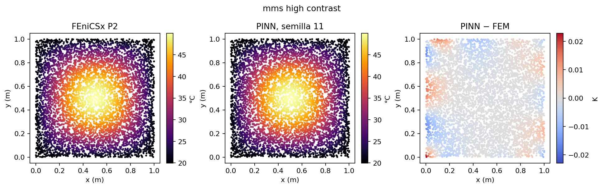

Fuente: elaboración propia, misma nube de evaluación; la figura usa la primera semilla guardada del directorio seleccionado.

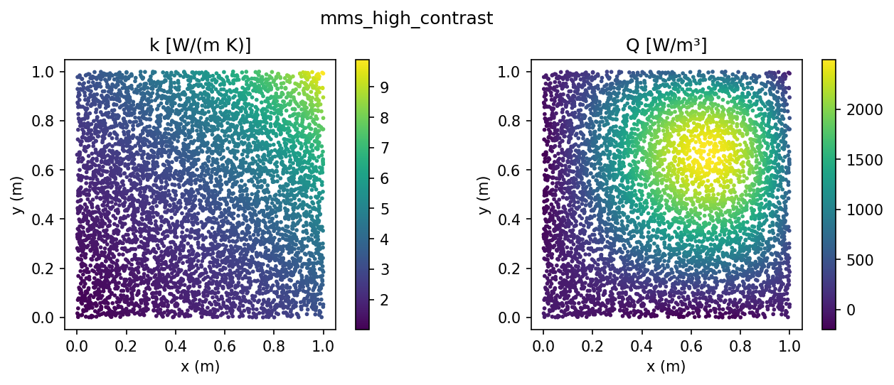

Fuente: elaboración propia a partir del JSON; en los casos de cables la generación se aplica en las fronteras, no en el volumen de suelo.

Campos y mallas: `results/mms_high_contrast/fem_l*.npz`. Pesos e historiales: `verification_final\mms_high_contrast/pinn_seed*.pt` y `training_seed*.json`. Las tablas completas están en [all_runs.csv](summary/all_runs.csv).

## Caso `mms_interface`

El entrenamiento mediante residuos y diferenciación automática se fundamenta en la versión consultada de Raissi et al. (2017: 4–5). La verificación del cálculo térmico sigue la distinción entre verificación y validación de CIGRÉ Working Group B1.87 (2025: 93–99). La comparación de pesos responde a dificultades de optimización documentadas por Wang et al. (2020: 9–10); no se implementa ni se atribuye a la campaña su algoritmo adaptativo. La implementación FEM utiliza DOLFINx, cuyo entorno de solución y relación con FEniCSx describen Baratta et al. (2023: 1–3). Las versiones de software efectivamente ejecutadas se registran aparte. La separación entre capacidad, muestreo y optimización sigue De Ryck y Mishra (2024: 24–27, 51–57). Las cotas que relacionan error, estabilidad y cuadratura requieren hipótesis específicas (Mishra y Molinaro, 2020: 7–8); las pendientes observadas en esta batería no se presentan como órdenes teóricos de PINN. La solución manufacturada o el escenario XLPE específico es de elaboración propia; sus valores no se atribuyen a un experimento publicado. La continuidad entre subredes se relaciona con Shukla et al. (2021: 1, 5–6, paginación de la versión arXiv consultada).

Datos completos: [JSON](cases/mms_interface.json). Revisión ejecutable: [cuaderno](notebooks/mms_interface.ipynb). Directorio seleccionado: `verification_final\mms_interface`.

### Datos y formulación

Familia: `mms_interface`. Ambiente: 20.0 °C. Conductividad: `"preset manufacturado"`.

Caso de verificación con datos controlados.

### Convergencia FEniCSx

| Nivel | Grados de libertad | Tmax °C | Balance % | Tiempo observado s |
| --- | --- | --- | --- | --- |
| 0 | 1089 | 32.500000 | 0.316325 | 1.041 |
| 1 | 4225 | 32.500000 | 0.079783 | 2.738 |
| 2 | 16641 | 32.500000 | 0.020018 | 4.245 |

### Todos los entrenamientos evaluados

| Campaña | Semilla | Ancho×capas | RMSE K | NRMSE % | Máx. error campo K | Error Tmax K | Balance % | Pasa |
| --- | --- | --- | --- | --- | --- | --- | --- | --- |
| comparisons/global_interface | 11 | 32×3 | 1.819113 | 14.5529 | 5.15158 | -0.86745 | 29.19730 | No |
| comparisons/global_interface | 23 | 32×3 | 1.755019 | 14.0402 | 3.81132 | -3.59261 | 9.64195 | No |
| comparisons/global_interface | 37 | 32×3 | 1.625713 | 13.0057 | 3.38831 | -3.35563 | 8.87309 | No |
| results | 11 | 32×3 | 0.002200 | 0.0176 | 0.01082 | -0.00466 | 0.00767 | Sí |
| results | 23 | 32×3 | 0.002307 | 0.0185 | 0.01104 | -0.00518 | 0.00389 | Sí |
| results | 37 | 32×3 | 0.002959 | 0.0237 | 0.01652 | -0.00387 | 0.00436 | Sí |
| verification_final | 11 | 32×3 | 0.002200 | 0.0176 | 0.01082 | -0.00466 | 0.00767 | Sí |
| verification_final | 23 | 32×3 | 0.002307 | 0.0185 | 0.01104 | -0.00518 | 0.00389 | Sí |
| verification_final | 37 | 32×3 | 0.002959 | 0.0237 | 0.01652 | -0.00387 | 0.00436 | Sí |

### Ventajas, limitaciones y decisión

La configuración seleccionada supera la puerta térmica en 3 de 3 semillas. Su RMSE mediano es 0.00231 K; la desviación entre semillas es 0.00041 K.

**Ventaja:** existe una solución exacta independiente y se pueden separar errores de fuente, derivadas y contornos. **Limitación:** la geometría regular y los campos prescritos no reproducen por sí mismos el problema completo del cable.

El salto exacto exige continuidad de temperatura y flujo; la red global se conserva como ablación en el caso vertical. La fuente manufacturada se deriva por región y no introduce una fuente superficial.

### Gráficos y archivos de auditoría

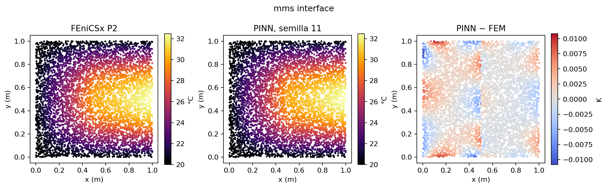

Fuente: elaboración propia, misma nube de evaluación; la figura usa la primera semilla guardada del directorio seleccionado.

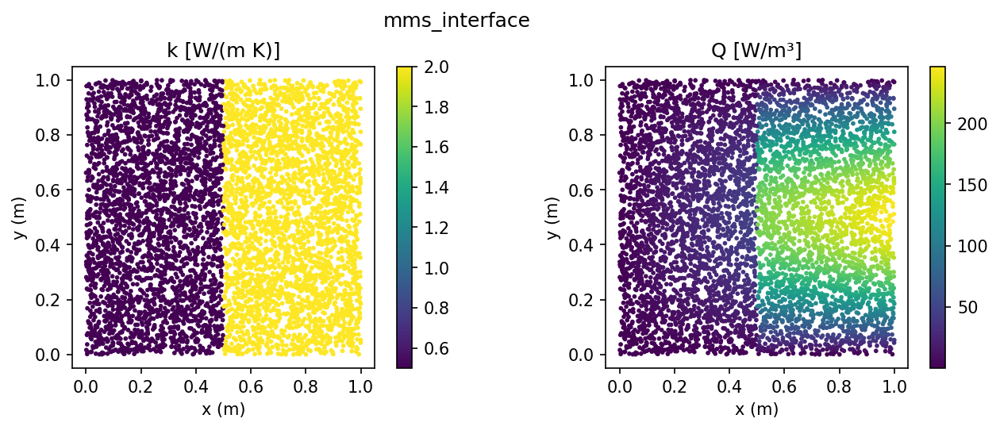

Fuente: elaboración propia a partir del JSON; en los casos de cables la generación se aplica en las fronteras, no en el volumen de suelo.

Campos y mallas: `results/mms_interface/fem_l*.npz`. Pesos e historiales: `verification_final\mms_interface/pinn_seed*.pt` y `training_seed*.json`. Las tablas completas están en [all_runs.csv](summary/all_runs.csv).

## Caso `mms_layered_y`

El entrenamiento mediante residuos y diferenciación automática se fundamenta en la versión consultada de Raissi et al. (2017: 4–5). La verificación del cálculo térmico sigue la distinción entre verificación y validación de CIGRÉ Working Group B1.87 (2025: 93–99). La comparación de pesos responde a dificultades de optimización documentadas por Wang et al. (2020: 9–10); no se implementa ni se atribuye a la campaña su algoritmo adaptativo. La implementación FEM utiliza DOLFINx, cuyo entorno de solución y relación con FEniCSx describen Baratta et al. (2023: 1–3). Las versiones de software efectivamente ejecutadas se registran aparte. La separación entre capacidad, muestreo y optimización sigue De Ryck y Mishra (2024: 24–27, 51–57). Las cotas que relacionan error, estabilidad y cuadratura requieren hipótesis específicas (Mishra y Molinaro, 2020: 7–8); las pendientes observadas en esta batería no se presentan como órdenes teóricos de PINN. La solución manufacturada o el escenario XLPE específico es de elaboración propia; sus valores no se atribuyen a un experimento publicado. La continuidad entre subredes se relaciona con Shukla et al. (2021: 1, 5–6, paginación de la versión arXiv consultada).

Datos completos: [JSON](cases/mms_layered_y.json). Revisión ejecutable: [cuaderno](notebooks/mms_layered_y.ipynb). Directorio seleccionado: `verification_final\mms_layered_y`.

### Datos y formulación

Familia: `mms_interface`. Ambiente: 20.0 °C. Conductividad: `{"type": "layers", "axis": "y", "interfaces": [0.5], "values": [0.5, 2.0], "smoothing": 0.0}`.

Solución exacta: `20 + where(y <= 0.5, 20*y, 10*(1+(y-0.5)/2))*sin(pi*x)`. Fuente: `manufactured`.

Dos materiales sin suavizado; continuidad exacta de temperatura y flujo; la fuente se deriva por región

### Convergencia FEniCSx

| Nivel | Grados de libertad | Tmax °C | Balance % | Tiempo observado s |
| --- | --- | --- | --- | --- |
| 0 | 1089 | 32.500000 | 0.316325 | 1.119 |
| 1 | 4225 | 32.500000 | 0.079783 | 2.452 |
| 2 | 16641 | 32.500000 | 0.020018 | 4.180 |

### Todos los entrenamientos evaluados

| Campaña | Semilla | Ancho×capas | RMSE K | NRMSE % | Máx. error campo K | Error Tmax K | Balance % | Pasa |
| --- | --- | --- | --- | --- | --- | --- | --- | --- |
| results | 11 | 32×3 | 0.004024 | 0.0322 | 0.01819 | -0.00910 | 0.00044 | Sí |
| results | 23 | 32×3 | 0.002579 | 0.0206 | 0.01515 | -0.00273 | 0.00666 | Sí |
| results | 37 | 32×3 | 0.002337 | 0.0187 | 0.01136 | -0.00160 | 0.00047 | Sí |
| verification_final | 11 | 32×3 | 0.004206 | 0.0336 | 0.01699 | -0.00891 | 0.00484 | Sí |
| verification_final | 23 | 32×3 | 0.002693 | 0.0215 | 0.01609 | -0.00243 | 0.00430 | Sí |
| verification_final | 37 | 32×3 | 0.002314 | 0.0185 | 0.01469 | -0.00235 | 0.00354 | Sí |

### Ventajas, limitaciones y decisión

La configuración seleccionada supera la puerta térmica en 3 de 3 semillas. Su RMSE mediano es 0.00269 K; la desviación entre semillas es 0.00100 K.

**Ventaja:** existe una solución exacta independiente y se pueden separar errores de fuente, derivadas y contornos. **Limitación:** la geometría regular y los campos prescritos no reproducen por sí mismos el problema completo del cable.

El salto exacto exige continuidad de temperatura y flujo; la red global se conserva como ablación en el caso vertical. La fuente manufacturada se deriva por región y no introduce una fuente superficial.

### Gráficos y archivos de auditoría

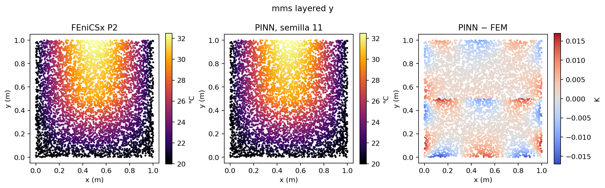

Fuente: elaboración propia, misma nube de evaluación; la figura usa la primera semilla guardada del directorio seleccionado.

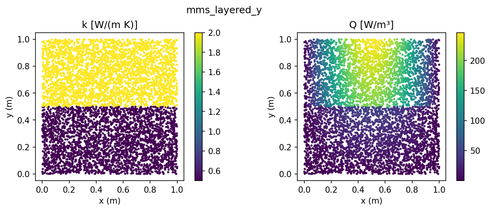

Fuente: elaboración propia a partir del JSON; en los casos de cables la generación se aplica en las fronteras, no en el volumen de suelo.

Campos y mallas: `results/mms_layered_y/fem_l*.npz`. Pesos e historiales: `verification_final\mms_layered_y/pinn_seed*.pt` y `training_seed*.json`. Las tablas completas están en [all_runs.csv](summary/all_runs.csv).

## Caso `mms_robin`

El entrenamiento mediante residuos y diferenciación automática se fundamenta en la versión consultada de Raissi et al. (2017: 4–5). La verificación del cálculo térmico sigue la distinción entre verificación y validación de CIGRÉ Working Group B1.87 (2025: 93–99). La comparación de pesos responde a dificultades de optimización documentadas por Wang et al. (2020: 9–10); no se implementa ni se atribuye a la campaña su algoritmo adaptativo. La implementación FEM utiliza DOLFINx, cuyo entorno de solución y relación con FEniCSx describen Baratta et al. (2023: 1–3). Las versiones de software efectivamente ejecutadas se registran aparte. La separación entre capacidad, muestreo y optimización sigue De Ryck y Mishra (2024: 24–27, 51–57). Las cotas que relacionan error, estabilidad y cuadratura requieren hipótesis específicas (Mishra y Molinaro, 2020: 7–8); las pendientes observadas en esta batería no se presentan como órdenes teóricos de PINN. La solución manufacturada o el escenario XLPE específico es de elaboración propia; sus valores no se atribuyen a un experimento publicado.

Datos completos: [JSON](cases/mms_robin.json). Revisión ejecutable: [cuaderno](notebooks/mms_robin.ipynb). Directorio seleccionado: `verification_final\mms_robin`.

### Datos y formulación

Familia: `mms_robin`. Ambiente: 20.0 °C. Conductividad: `"preset manufacturado"`.

Caso de verificación con datos controlados.

### Convergencia FEniCSx

| Nivel | Grados de libertad | Tmax °C | Balance % | Tiempo observado s |
| --- | --- | --- | --- | --- |
| 0 | 1089 | 35.000265 | 0.001517 | 1.241 |
| 1 | 4225 | 35.000034 | 0.000491 | 2.786 |
| 2 | 16641 | 35.000004 | 0.000137 | 3.289 |

### Todos los entrenamientos evaluados

| Campaña | Semilla | Ancho×capas | RMSE K | NRMSE % | Máx. error campo K | Error Tmax K | Balance % | Pasa |
| --- | --- | --- | --- | --- | --- | --- | --- | --- |
| results | 11 | 32×3 | 0.001182 | 0.0079 | 0.00567 | -0.00026 | 0.00039 | Sí |
| results | 23 | 32×3 | 0.000473 | 0.0032 | 0.00277 | -0.00011 | 0.00155 | Sí |
| results | 37 | 32×3 | 0.000773 | 0.0052 | 0.00408 | -0.00029 | 0.00011 | Sí |
| verification_final | 11 | 32×3 | 0.001182 | 0.0079 | 0.00567 | -0.00026 | 0.00039 | Sí |
| verification_final | 23 | 32×3 | 0.000473 | 0.0032 | 0.00277 | -0.00011 | 0.00155 | Sí |
| verification_final | 37 | 32×3 | 0.000773 | 0.0052 | 0.00408 | -0.00029 | 0.00011 | Sí |

### Ventajas, limitaciones y decisión

La configuración seleccionada supera la puerta térmica en 3 de 3 semillas. Su RMSE mediano es 0.00077 K; la desviación entre semillas es 0.00036 K.

**Ventaja:** existe una solución exacta independiente y se pueden separar errores de fuente, derivadas y contornos. **Limitación:** la geometría regular y los campos prescritos no reproducen por sí mismos el problema completo del cable.

### Gráficos y archivos de auditoría

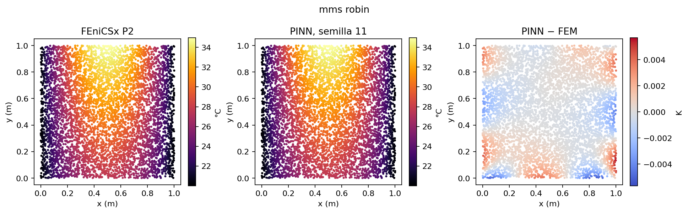

Fuente: elaboración propia, misma nube de evaluación; la figura usa la primera semilla guardada del directorio seleccionado.

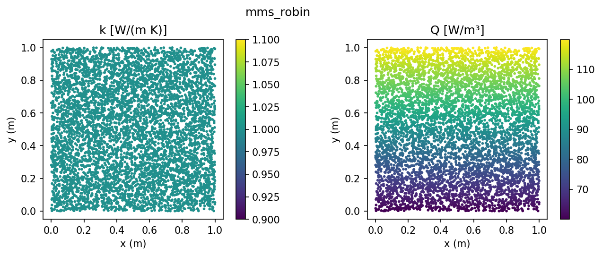

Fuente: elaboración propia a partir del JSON; en los casos de cables la generación se aplica en las fronteras, no en el volumen de suelo.

Campos y mallas: `results/mms_robin/fem_l*.npz`. Pesos e historiales: `verification_final\mms_robin/pinn_seed*.pt` y `training_seed*.json`. Las tablas completas están en [all_runs.csv](summary/all_runs.csv).

## Caso `mms_smooth_2d`

El entrenamiento mediante residuos y diferenciación automática se fundamenta en la versión consultada de Raissi et al. (2017: 4–5). La verificación del cálculo térmico sigue la distinción entre verificación y validación de CIGRÉ Working Group B1.87 (2025: 93–99). La comparación de pesos responde a dificultades de optimización documentadas por Wang et al. (2020: 9–10); no se implementa ni se atribuye a la campaña su algoritmo adaptativo. La implementación FEM utiliza DOLFINx, cuyo entorno de solución y relación con FEniCSx describen Baratta et al. (2023: 1–3). Las versiones de software efectivamente ejecutadas se registran aparte. La separación entre capacidad, muestreo y optimización sigue De Ryck y Mishra (2024: 24–27, 51–57). Las cotas que relacionan error, estabilidad y cuadratura requieren hipótesis específicas (Mishra y Molinaro, 2020: 7–8); las pendientes observadas en esta batería no se presentan como órdenes teóricos de PINN. La solución manufacturada o el escenario XLPE específico es de elaboración propia; sus valores no se atribuyen a un experimento publicado.

Datos completos: [JSON](cases/mms_smooth_2d.json). Revisión ejecutable: [cuaderno](notebooks/mms_smooth_2d.ipynb). Directorio seleccionado: `verification_final\mms_smooth_2d`.

### Datos y formulación

Familia: `mms_smooth_2d`. Ambiente: 20.0 °C. Conductividad: `{"type": "expression", "expression": "1 + 0.4*sin(2*pi*x)*cos(2*pi*y)"}`.

Solución exacta: `20 + 30*sin(pi*x)*sin(pi*y)`. Fuente: `manufactured`.

k=1+0.4 sin(2 pi x) cos(2 pi y); rango 0.6 a 1.4 W/(m K); T*=20+30 sin(pi x) sin(pi y)

### Convergencia FEniCSx

| Nivel | Grados de libertad | Tmax °C | Balance % | Tiempo observado s |
| --- | --- | --- | --- | --- |
| 0 | 1089 | 50.000465 | 0.475840 | 1.144 |
| 1 | 4225 | 50.000029 | 0.120096 | 2.343 |
| 2 | 16641 | 50.000002 | 0.030096 | 4.064 |

### Todos los entrenamientos evaluados

| Campaña | Semilla | Ancho×capas | RMSE K | NRMSE % | Máx. error campo K | Error Tmax K | Balance % | Pasa |
| --- | --- | --- | --- | --- | --- | --- | --- | --- |
| comparisons/resolution_B2 | 11 | 32×3 | 0.001736 | 0.0058 | 0.00971 | 0.00013 | 0.00420 | Sí |
| comparisons/resolution_B2 | 23 | 32×3 | 0.001796 | 0.0060 | 0.01242 | -0.00002 | 0.00270 | Sí |
| comparisons/resolution_B2 | 37 | 32×3 | 0.001210 | 0.0040 | 0.00709 | -0.00023 | 0.00096 | Sí |
| comparisons/resolution_N1536 | 11 | 32×3 | 0.001642 | 0.0055 | 0.01142 | -0.00016 | 0.00282 | Sí |
| comparisons/resolution_N1536 | 23 | 32×3 | 0.002251 | 0.0075 | 0.01282 | -0.00059 | 0.00203 | Sí |
| comparisons/resolution_N1536 | 37 | 32×3 | 0.002637 | 0.0088 | 0.02232 | -0.00015 | 0.00124 | Sí |
| comparisons/resolution_N384 | 11 | 32×3 | 0.003680 | 0.0123 | 0.01638 | 0.00044 | 0.01012 | Sí |
| comparisons/resolution_N384 | 23 | 32×3 | 0.003118 | 0.0104 | 0.02693 | -0.00003 | 0.00017 | Sí |
| comparisons/resolution_N384 | 37 | 32×3 | 0.005060 | 0.0169 | 0.02856 | -0.00138 | 0.00597 | Sí |
| comparisons/resolution_W16 | 11 | 16×3 | 0.006557 | 0.0219 | 0.04065 | -0.00239 | 0.01010 | Sí |
| comparisons/resolution_W16 | 23 | 16×3 | 0.005061 | 0.0169 | 0.02850 | 0.00219 | 0.00117 | Sí |
| comparisons/resolution_W16 | 37 | 16×3 | 0.015809 | 0.0527 | 0.09314 | -0.00004 | 0.00210 | Sí |
| comparisons/resolution_W32 | 11 | 32×3 | 0.002575 | 0.0086 | 0.01533 | -0.00033 | 0.00529 | Sí |
| comparisons/resolution_W32 | 23 | 32×3 | 0.002038 | 0.0068 | 0.01497 | 0.00081 | 0.00341 | Sí |
| comparisons/resolution_W32 | 37 | 32×3 | 0.004439 | 0.0148 | 0.03357 | 0.00005 | 0.00117 | Sí |
| comparisons/resolution_W64 | 11 | 64×3 | 0.002503 | 0.0083 | 0.01414 | -0.00104 | 0.00326 | Sí |
| comparisons/resolution_W64 | 23 | 64×3 | 0.002550 | 0.0085 | 0.02254 | 0.00037 | 0.00472 | Sí |
| comparisons/resolution_W64 | 37 | 64×3 | 0.001613 | 0.0054 | 0.00851 | -0.00091 | 0.00213 | Sí |
| results | 11 | 32×3 | 0.002575 | 0.0086 | 0.01533 | -0.00033 | 0.00529 | Sí |
| results | 23 | 32×3 | 0.002038 | 0.0068 | 0.01497 | 0.00081 | 0.00341 | Sí |
| results | 37 | 32×3 | 0.004439 | 0.0148 | 0.03357 | 0.00005 | 0.00117 | Sí |
| verification_final | 11 | 32×3 | 0.002143 | 0.0071 | 0.01346 | 0.00008 | 0.00467 | Sí |
| verification_final | 23 | 32×3 | 0.002343 | 0.0078 | 0.01730 | 0.00150 | 0.00384 | Sí |
| verification_final | 37 | 32×3 | 0.004105 | 0.0137 | 0.02896 | -0.00011 | 0.00003 | Sí |

### Ventajas, limitaciones y decisión

La configuración seleccionada supera la puerta térmica en 3 de 3 semillas. Su RMSE mediano es 0.00234 K; la desviación entre semillas es 0.00108 K.

**Ventaja:** existe una solución exacta independiente y se pueden separar errores de fuente, derivadas y contornos. **Limitación:** la geometría regular y los campos prescritos no reproducen por sí mismos el problema completo del cable.

La variación continua de k se evalúa conservando sus derivadas. Los resultados muestran el comportamiento de estos perfiles y contrastes; no demuestran exactitud para cualquier frecuencia espacial, anisotropía o dependencia k(T).

### Gráficos y archivos de auditoría

Fuente: elaboración propia, misma nube de evaluación; la figura usa la primera semilla guardada del directorio seleccionado.

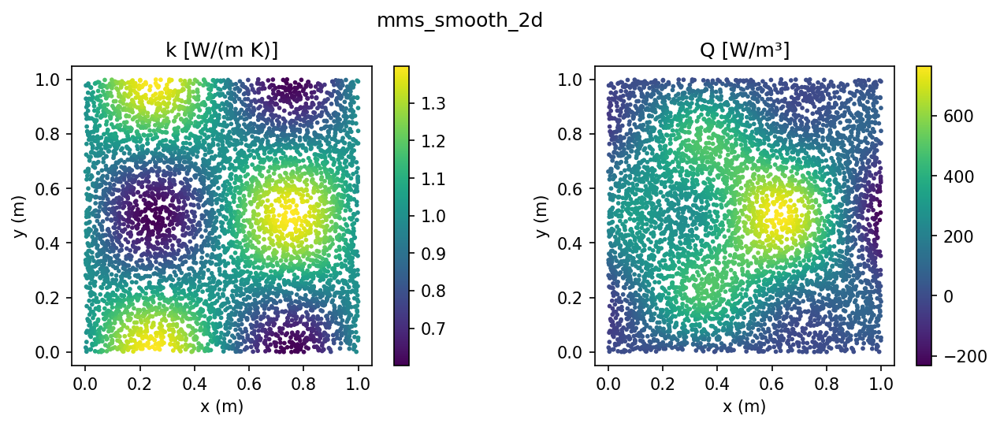

Fuente: elaboración propia a partir del JSON; en los casos de cables la generación se aplica en las fronteras, no en el volumen de suelo.

Campos y mallas: `results/mms_smooth_2d/fem_l*.npz`. Pesos e historiales: `verification_final\mms_smooth_2d/pinn_seed*.pt` y `training_seed*.json`. Las tablas completas están en [all_runs.csv](summary/all_runs.csv).

## Caso `mms_variable`

El entrenamiento mediante residuos y diferenciación automática se fundamenta en la versión consultada de Raissi et al. (2017: 4–5). La verificación del cálculo térmico sigue la distinción entre verificación y validación de CIGRÉ Working Group B1.87 (2025: 93–99). La comparación de pesos responde a dificultades de optimización documentadas por Wang et al. (2020: 9–10); no se implementa ni se atribuye a la campaña su algoritmo adaptativo. La implementación FEM utiliza DOLFINx, cuyo entorno de solución y relación con FEniCSx describen Baratta et al. (2023: 1–3). Las versiones de software efectivamente ejecutadas se registran aparte. La separación entre capacidad, muestreo y optimización sigue De Ryck y Mishra (2024: 24–27, 51–57). Las cotas que relacionan error, estabilidad y cuadratura requieren hipótesis específicas (Mishra y Molinaro, 2020: 7–8); las pendientes observadas en esta batería no se presentan como órdenes teóricos de PINN. La solución manufacturada o el escenario XLPE específico es de elaboración propia; sus valores no se atribuyen a un experimento publicado.

Datos completos: [JSON](cases/mms_variable.json). Revisión ejecutable: [cuaderno](notebooks/mms_variable.ipynb). Directorio seleccionado: `verification_final\mms_variable`.

### Datos y formulación

Familia: `mms_variable`. Ambiente: 20.0 °C. Conductividad: `"preset manufacturado"`.

Caso de verificación con datos controlados.

### Convergencia FEniCSx

| Nivel | Grados de libertad | Tmax °C | Balance % | Tiempo observado s |
| --- | --- | --- | --- | --- |
| 0 | 1089 | 50.000439 | 0.476192 | 1.011 |
| 1 | 4225 | 50.000027 | 0.120120 | 2.719 |
| 2 | 16641 | 50.000002 | 0.030097 | 3.867 |

### Todos los entrenamientos evaluados

| Campaña | Semilla | Ancho×capas | RMSE K | NRMSE % | Máx. error campo K | Error Tmax K | Balance % | Pasa |
| --- | --- | --- | --- | --- | --- | --- | --- | --- |
| results | 11 | 32×3 | 0.003109 | 0.0104 | 0.01784 | -0.00011 | 0.00270 | Sí |
| results | 23 | 32×3 | 0.002383 | 0.0079 | 0.01611 | 0.00007 | 0.00054 | Sí |
| results | 37 | 32×3 | 0.004417 | 0.0147 | 0.02938 | 0.00096 | 0.00302 | Sí |
| verification_final | 11 | 32×3 | 0.003109 | 0.0104 | 0.01784 | -0.00011 | 0.00270 | Sí |
| verification_final | 23 | 32×3 | 0.002383 | 0.0079 | 0.01611 | 0.00007 | 0.00054 | Sí |
| verification_final | 37 | 32×3 | 0.004417 | 0.0147 | 0.02938 | 0.00096 | 0.00302 | Sí |

### Ventajas, limitaciones y decisión

La configuración seleccionada supera la puerta térmica en 3 de 3 semillas. Su RMSE mediano es 0.00311 K; la desviación entre semillas es 0.00103 K.

**Ventaja:** existe una solución exacta independiente y se pueden separar errores de fuente, derivadas y contornos. **Limitación:** la geometría regular y los campos prescritos no reproducen por sí mismos el problema completo del cable.

La variación continua de k se evalúa conservando sus derivadas. Los resultados muestran el comportamiento de estos perfiles y contrastes; no demuestran exactitud para cualquier frecuencia espacial, anisotropía o dependencia k(T).

### Gráficos y archivos de auditoría

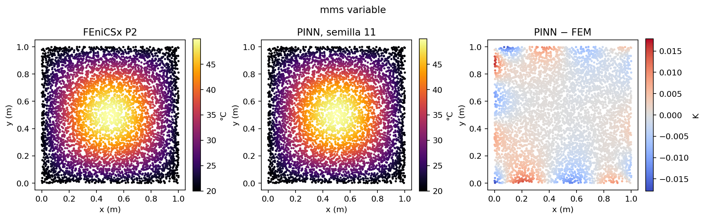

Fuente: elaboración propia, misma nube de evaluación; la figura usa la primera semilla guardada del directorio seleccionado.

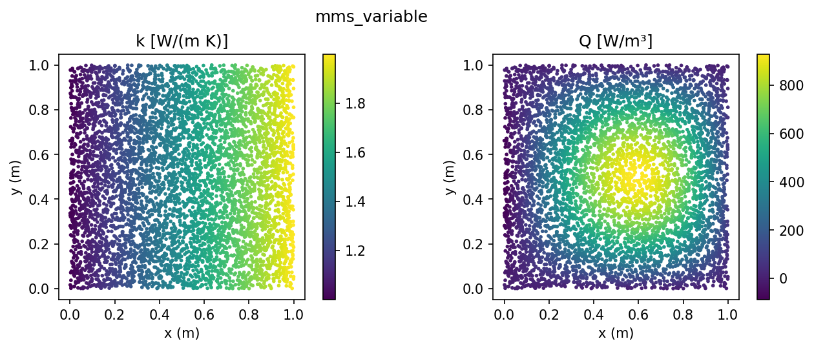

Fuente: elaboración propia a partir del JSON; en los casos de cables la generación se aplica en las fronteras, no en el volumen de suelo.

Campos y mallas: `results/mms_variable/fem_l*.npz`. Pesos e historiales: `verification_final\mms_variable/pinn_seed*.pt` y `training_seed*.json`. Las tablas completas están en [all_runs.csv](summary/all_runs.csv).

## Caso `xlpe_backfill`

El entrenamiento mediante residuos y diferenciación automática se fundamenta en la versión consultada de Raissi et al. (2017: 4–5). La verificación del cálculo térmico sigue la distinción entre verificación y validación de CIGRÉ Working Group B1.87 (2025: 93–99). La comparación de pesos responde a dificultades de optimización documentadas por Wang et al. (2020: 9–10); no se implementa ni se atribuye a la campaña su algoritmo adaptativo. La implementación FEM utiliza DOLFINx, cuyo entorno de solución y relación con FEniCSx describen Baratta et al. (2023: 1–3). Las versiones de software efectivamente ejecutadas se registran aparte. La separación entre capacidad, muestreo y optimización sigue De Ryck y Mishra (2024: 24–27, 51–57). Las cotas que relacionan error, estabilidad y cuadratura requieren hipótesis específicas (Mishra y Molinaro, 2020: 7–8); las pendientes observadas en esta batería no se presentan como órdenes teóricos de PINN. La solución manufacturada o el escenario XLPE específico es de elaboración propia; sus valores no se atribuyen a un experimento publicado. La resistencia DC se actualiza con la temperatura individual del conductor, siguiendo la ley lineal y el coeficiente del cobre documentados en CIGRÉ Working Group B1.56 (2022: 132). Las pérdidas AC adicionales de esa fuente quedan fuera del modelo DC ejecutado. La comparación de renovación aleatoria y distribución por residuo se fundamenta en Wu et al. (2022: 6–8). El muestreo mixto con anclajes geométricos y el indicador de gradiente térmico son adaptaciones propias, no una reproducción exacta de RAD.

Datos completos: [JSON](cases/xlpe_backfill.json). Revisión ejecutable: [cuaderno](notebooks/xlpe_backfill.ipynb). Directorio seleccionado: `coupled_final\xlpe_backfill`.

### Datos y formulación

Familia: `cable`. Ambiente: 20.0 °C. Conductividad: `1.0`.

Dominio: [-4.0, 4.0, -4.0, 0.0] m; 1 cable(s); radio exterior 0.015 m; corriente base 270.0 A; R20=0.000193 Ω/m; potencia de referencia a 20 °C por cable 14.0697 W/m.

Centros: `[[0.0, -0.7]]`. Capas `[ri,ro,k]`: `[[0, 0.0055, 400], [0.0055, 0.012, 0.286], [0.012, 0.013, 380], [0.013, 0.015, 0.45]]`.

Región continua: `[0, -0.7, 0.5, 0.5, 2.0, 0.08]`. Estratos heredados: `[]`. Control pareado: `xlpe_single`.

Dominio controlado 8 x 4 m; Dirichlet 20 C; pérdidas DC a 20 C; flujo circular uniforme. Kim usa nueve capas de la ficha corregida de 2025.

### Convergencia FEniCSx

| Nivel | Grados de libertad | Tmax °C | Balance % | Tiempo observado s |
| --- | --- | --- | --- | --- |
| 0 | 854 | 33.518340 | 2.917866 | 1.091 |
| 1 | 3183 | 33.527482 | 1.125679 | 2.074 |
| 2 | 11517 | 33.528071 | 0.269632 | 3.612 |

### Todos los entrenamientos evaluados

| Campaña | Semilla | Ancho×capas | RMSE K | NRMSE % | Máx. error campo K | Error Tmax K | Balance % | Pasa |
| --- | --- | --- | --- | --- | --- | --- | --- | --- |
| ampacity_final | 11 | 32×3 | 2.572460 | 3.6749 | 14.57507 | -0.35998 | 0.00146 | Sí |
| ampacity_final | 23 | 32×3 | 1.131396 | 1.6163 | 2.70778 | -0.13965 | 0.00251 | Sí |
| ampacity_final | 37 | 32×3 | 1.376455 | 1.9664 | 8.20060 | -0.20737 | 0.03357 | Sí |
| comparisons/adaptive_ampacity_gradient | 11 | 32×3 | 1.652835 | 2.3612 | 7.05609 | -0.03820 | 0.01323 | Sí |
| comparisons/adaptive_ampacity_gradient | 23 | 32×3 | 2.669447 | 3.8135 | 14.14936 | -0.05709 | 0.01745 | Sí |
| comparisons/adaptive_ampacity_gradient | 37 | 32×3 | 5.175790 | 7.3940 | 18.02802 | -0.06993 | 0.14550 | No |
| comparisons/adaptive_ampacity_residual | 11 | 32×3 | 2.433703 | 3.4767 | 13.92136 | -0.02315 | 0.00409 | Sí |
| comparisons/adaptive_ampacity_residual | 23 | 32×3 | 1.505653 | 2.1509 | 3.71490 | -0.02462 | 0.01398 | Sí |
| comparisons/adaptive_ampacity_residual | 37 | 32×3 | 6.597814 | 9.4254 | 22.28087 | -0.11061 | 0.01330 | No |
| comparisons/adaptive_ampacity_uniform | 11 | 32×3 | 4.106628 | 5.8666 | 21.03818 | -0.07358 | 0.07000 | No |
| comparisons/adaptive_ampacity_uniform | 23 | 32×3 | 2.552176 | 3.6460 | 9.10379 | -0.05779 | 0.00446 | Sí |
| comparisons/adaptive_ampacity_uniform | 37 | 32×3 | 6.213565 | 8.8765 | 20.12736 | -0.09890 | 0.01607 | No |
| comparisons/ampacity_constraints1000 | 11 | 32×3 | 5.513374 | 7.8762 | 21.84261 | -0.10373 | 0.17918 | No |
| comparisons/ampacity_constraints1000 | 23 | 32×3 | 4.001354 | 5.7162 | 17.63742 | -0.00254 | 0.13940 | No |
| comparisons/ampacity_constraints1000 | 37 | 32×3 | 3.962778 | 5.6611 | 20.34921 | -0.07157 | 0.03163 | No |
| comparisons/final_w16 | 11 | 16×3 | 0.200227 | 1.4801 | 1.08098 | -0.06387 | 0.09933 | Sí |
| comparisons/final_w16 | 23 | 16×3 | 0.136106 | 1.0061 | 1.14636 | 0.01877 | 0.01663 | Sí |
| comparisons/final_w16 | 37 | 16×3 | 0.247667 | 1.8308 | 0.78601 | -0.50948 | 0.05876 | Sí |
| coupled_final | 11 | 32×3 | 0.207534 | 1.4525 | 1.75986 | -0.10026 | 0.08837 | Sí |
| coupled_final | 23 | 32×3 | 0.305335 | 2.1371 | 1.47554 | -0.05452 | 0.03069 | Sí |
| coupled_final | 37 | 32×3 | 0.265713 | 1.8597 | 0.96077 | -0.44921 | 0.01252 | Sí |
| results | 11 | 32×3 | 0.824103 | 6.0918 | 3.56828 | 4.29597 | 114.69060 | No |
| results | 23 | 32×3 | 0.574932 | 4.2499 | 4.61089 | 5.34842 | 47.77145 | No |
| results | 37 | 32×3 | 0.426104 | 3.1498 | 4.12863 | 4.86066 | 76.27422 | No |

### Ventajas, limitaciones y decisión

La configuración seleccionada supera la puerta térmica en 3 de 3 semillas. Su RMSE mediano es 0.26571 K; la desviación entre semillas es 0.04919 K.

### Operación y ampacidad con R(T) individual

La tabla FEM anterior corresponde al control a R20 fija. Las siguientes soluciones usan pérdidas actualizadas y constituyen las referencias operativas. Cada potencia se expresa en W/m y cada temperatura corresponde al mismo conductor, en el orden del JSON.

**Nominal, malla fina:** Tc = [34.28768] °C; P = [14.859722] W/m. Metadatos: [fem_l2.json](coupled_results/xlpe_backfill/fem_l2.json).

**Ampacidad, malla fina:** Tc = [90.000007] °C; P = [72.802626] W/m. Metadatos: [fem_ampacity_l2.json](coupled_results/xlpe_backfill/fem_ampacity_l2.json).

| Modo FEM | Malla | Corriente A | Tmax °C | Balance % | Residuo eléctrico % |
| --- | --- | --- | --- | --- | --- |
| Nominal | 0 | 270.0000 | 34.27683 | 2.91787 | 7.77e-13 |
| Nominal | 1 | 270.0000 | 34.28702 | 1.12568 | 1.38e-11 |
| Nominal | 2 | 270.0000 | 34.28768 | 0.26963 | 7.61e-12 |
| Ampacidad | 0 | 544.1003 | 89.99999 | 2.91787 | 3.37e-12 |
| Ampacidad | 1 | 543.9165 | 90.00001 | 1.12568 | 5.9e-11 |
| Ampacidad | 2 | 543.9046 | 90.00001 | 0.26963 | 3.27e-11 |

| Campaña | Semilla | Modo | Corriente A | Error I % | Residuo eléctrico % | Distancia a 90 °C K | Pasa corriente |
| --- | --- | --- | --- | --- | --- | --- | --- |
| ampacity_final | 11 | ampacity | 515.0874 | 5.29822 | 0.00483 | 0.35997 | False |
| ampacity_final | 23 | ampacity | 534.7876 | 1.67622 | 0.00547 | 0.13964 | False |
| ampacity_final | 37 | ampacity | 527.1323 | 3.08370 | 0.00376 | 0.20736 | False |
| comparisons/adaptive_ampacity_gradient | 11 | ampacity | 527.0563 | 3.09767 | 0.00480 | 0.03819 | True |
| comparisons/adaptive_ampacity_gradient | 23 | ampacity | 516.4084 | 5.05534 | 0.00250 | 0.05708 | False |
| comparisons/adaptive_ampacity_gradient | 37 | ampacity | 503.0759 | 7.50660 | 0.00519 | 0.06992 | False |
| comparisons/adaptive_ampacity_residual | 11 | ampacity | 522.8493 | 3.87115 | 0.00861 | 0.02315 | True |
| comparisons/adaptive_ampacity_residual | 23 | ampacity | 538.4590 | 1.00120 | 0.00324 | 0.02461 | True |
| comparisons/adaptive_ampacity_residual | 37 | ampacity | 487.0636 | 10.45054 | 0.00757 | 0.11060 | False |
| comparisons/adaptive_ampacity_uniform | 11 | ampacity | 500.4290 | 7.99325 | 0.00710 | 0.07358 | False |
| comparisons/adaptive_ampacity_uniform | 23 | ampacity | 523.4525 | 3.76023 | 0.00834 | 0.05778 | True |
| comparisons/adaptive_ampacity_uniform | 37 | ampacity | 491.7882 | 9.58191 | 0.00203 | 0.09890 | False |
| comparisons/ampacity_constraints1000 | 11 | ampacity | 497.4292 | 8.54477 | 0.00617 | 0.10373 | False |
| comparisons/ampacity_constraints1000 | 23 | ampacity | 502.1318 | 7.68018 | 0.01610 | 0.00253 | False |
| comparisons/ampacity_constraints1000 | 37 | ampacity | 503.4362 | 7.44035 | 0.00529 | 0.07157 | False |
| coupled_final | 11 | coupled | 270.0000 | — | 0.05673 | — | No aplica |
| coupled_final | 23 | coupled | 270.0000 | — | 0.05871 | — | No aplica |
| coupled_final | 37 | coupled | 270.0000 | — | 0.08902 | — | No aplica |

### Balance por conductor y flujo local

Diagnóstico adicional para detectar compensaciones entre fronteras. No se añadió retrospectivamente a la puerta de aceptación. La integración FEM usa el gradiente de la solución P2; el flujo local PINN se evalúa sobre 512 puntos por circunferencia.

| Método/semilla | Frontera | P impuesta W/m | P integrada W/m | Error potencia % | RMSE flujo W/m² |
| --- | --- | --- | --- | --- | --- |
| FEM nominal | cable0 | 14.85972 | 14.82846 | 0.21035 | — |
| pinn_seed11 | cable0 | 14.84575 | 14.84611 | 0.00240 | 0.20998 |
| pinn_seed23 | cable0 | 14.84799 | 14.84922 | 0.00830 | 0.07277 |
| pinn_seed37 | cable0 | 14.82168 | 14.82241 | 0.00495 | 0.08382 |

**Ventaja:** ambos métodos comparten geometría, pérdidas, materiales y reconstrucción del conductor. **Limitación:** la frontera de flujo uniforme y las resistencias radiales reducen la física de las capas; las pérdidas son DC y no se reconstruye el ensayo publicado.

La interpretación del efecto material debe compararse con `xlpe_single`, conservando corriente, dominio y contornos.

### Gráficos y archivos de auditoría

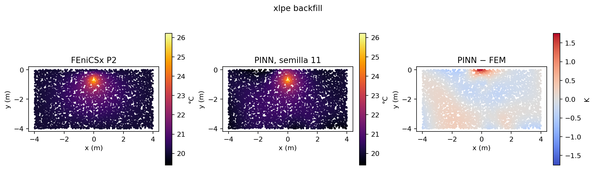

Fuente: elaboración propia, misma nube de evaluación; la figura usa la primera semilla guardada del directorio seleccionado.

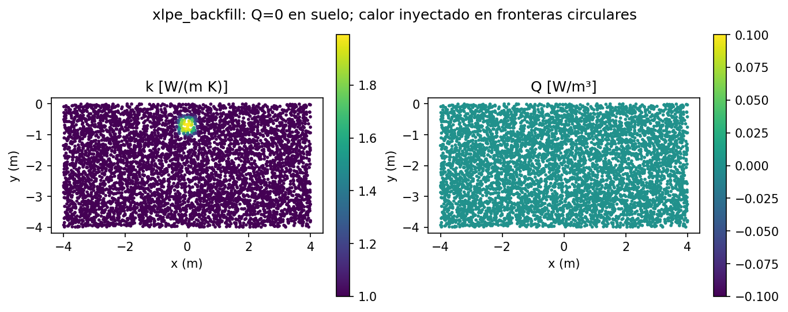

Fuente: elaboración propia a partir del JSON; en los casos de cables la generación se aplica en las fronteras, no en el volumen de suelo.

Campos y mallas: `results/xlpe_backfill/fem_l*.npz`. Pesos e historiales: `coupled_final\xlpe_backfill/pinn_seed*.pt` y `training_seed*.json`. Las tablas completas están en [all_runs.csv](summary/all_runs.csv).

## Caso `xlpe_discrete_layers`

El entrenamiento mediante residuos y diferenciación automática se fundamenta en la versión consultada de Raissi et al. (2017: 4–5). La verificación del cálculo térmico sigue la distinción entre verificación y validación de CIGRÉ Working Group B1.87 (2025: 93–99). La comparación de pesos responde a dificultades de optimización documentadas por Wang et al. (2020: 9–10); no se implementa ni se atribuye a la campaña su algoritmo adaptativo. La implementación FEM utiliza DOLFINx, cuyo entorno de solución y relación con FEniCSx describen Baratta et al. (2023: 1–3). Las versiones de software efectivamente ejecutadas se registran aparte. La separación entre capacidad, muestreo y optimización sigue De Ryck y Mishra (2024: 24–27, 51–57). Las cotas que relacionan error, estabilidad y cuadratura requieren hipótesis específicas (Mishra y Molinaro, 2020: 7–8); las pendientes observadas en esta batería no se presentan como órdenes teóricos de PINN. La solución manufacturada o el escenario XLPE específico es de elaboración propia; sus valores no se atribuyen a un experimento publicado. La resistencia DC se actualiza con la temperatura individual del conductor, siguiendo la ley lineal y el coeficiente del cobre documentados en CIGRÉ Working Group B1.56 (2022: 132). Las pérdidas AC adicionales de esa fuente quedan fuera del modelo DC ejecutado. La continuidad entre subredes se relaciona con Shukla et al. (2021: 1, 5–6, paginación de la versión arXiv consultada).

Datos completos: [JSON](cases/xlpe_discrete_layers.json). Revisión ejecutable: [cuaderno](notebooks/xlpe_discrete_layers.ipynb). Directorio seleccionado: `coupled_final\xlpe_discrete_layers`.

### Datos y formulación

Familia: `cable`. Ambiente: 20.0 °C. Conductividad: `{"type": "layers", "axis": "y", "interfaces": [-1.0], "values": [0.5, 1.0], "smoothing": 0.0}`.

Dominio: [-4.0, 4.0, -4.0, 0.0] m; 1 cable(s); radio exterior 0.015 m; corriente base 270.0 A; R20=0.000193 Ω/m; potencia de referencia a 20 °C por cable 14.0697 W/m.

Centros: `[[0.0, -0.7]]`. Capas `[ri,ro,k]`: `[[0, 0.0055, 400], [0.0055, 0.012, 0.286], [0.012, 0.013, 380], [0.013, 0.015, 0.45]]`.

Región continua: `None`. Estratos heredados: `[]`. Control pareado: `xlpe_single`.

Dos estratos exactos de suelo: k=0.5 bajo y=-1 m y k=1 sobre la interfaz; sin suavizado.

### Convergencia FEniCSx

| Nivel | Grados de libertad | Tmax °C | Balance % | Tiempo observado s |
| --- | --- | --- | --- | --- |
| 0 | 850 | 37.361704 | 1.845590 | 1.100 |
| 1 | 3217 | 37.377077 | 1.084451 | 2.234 |
| 2 | 11643 | 37.377960 | 0.288435 | 3.627 |

### Todos los entrenamientos evaluados

| Campaña | Semilla | Ancho×capas | RMSE K | NRMSE % | Máx. error campo K | Error Tmax K | Balance % | Pasa |
| --- | --- | --- | --- | --- | --- | --- | --- | --- |
| ampacity_final | 11 | 32×3 | 0.130987 | 0.1871 | 1.34284 | -0.01996 | 0.00075 | Sí |
| ampacity_final | 23 | 32×3 | 0.100121 | 0.1430 | 1.17047 | -0.01499 | 0.00168 | Sí |
| ampacity_final | 37 | 32×3 | 0.113093 | 0.1616 | 1.20594 | -0.01493 | 0.00214 | Sí |
| comparisons/final_discrete | 11 | 32×3 | 0.046774 | 0.2692 | 0.31527 | -0.10481 | 0.00508 | Sí |
| comparisons/final_discrete | 23 | 32×3 | 0.048950 | 0.2817 | 0.35773 | -0.15292 | 0.00139 | Sí |
| comparisons/final_discrete | 37 | 32×3 | 0.051741 | 0.2977 | 0.33035 | -0.10495 | 0.00657 | Sí |
| coupled_final | 11 | 32×3 | 0.046061 | 0.2470 | 0.47256 | -0.00789 | 0.00003 | Sí |
| coupled_final | 23 | 32×3 | 0.073839 | 0.3959 | 0.46442 | -0.07048 | 0.00326 | Sí |
| coupled_final | 37 | 32×3 | 0.048077 | 0.2578 | 0.51325 | -0.08229 | 0.00284 | Sí |

### Ventajas, limitaciones y decisión

La configuración seleccionada supera la puerta térmica en 3 de 3 semillas. Su RMSE mediano es 0.04808 K; la desviación entre semillas es 0.01549 K.

### Operación y ampacidad con R(T) individual

La tabla FEM anterior corresponde al control a R20 fija. Las siguientes soluciones usan pérdidas actualizadas y constituyen las referencias operativas. Cada potencia se expresa en W/m y cada temperatura corresponde al mismo conductor, en el orden del JSON.

**Nominal, malla fina:** Tc = [38.651791] °C; P = [15.101031] W/m. Metadatos: [fem_l2.json](coupled_results/xlpe_discrete_layers/fem_l2.json).

**Ampacidad, malla fina:** Tc = [89.999997] °C; P = [56.674025] W/m. Metadatos: [fem_ampacity_l2.json](coupled_results/xlpe_discrete_layers/fem_ampacity_l2.json).

| Modo FEM | Malla | Corriente A | Tmax °C | Balance % | Residuo eléctrico % |
| --- | --- | --- | --- | --- | --- |
| Nominal | 0 | 270.0000 | 38.63307 | 1.84559 | 2.65e-12 |
| Nominal | 1 | 270.0000 | 38.65077 | 1.08445 | 3.14e-12 |
| Nominal | 2 | 270.0000 | 38.65179 | 0.28843 | 2.27e-12 |
| Ampacidad | 0 | 480.1140 | 89.99997 | 1.84559 | 8.86e-12 |
| Ampacidad | 1 | 479.9019 | 90.00006 | 1.08445 | 1.04e-11 |
| Ampacidad | 2 | 479.8895 | 90.00000 | 0.28843 | 7.51e-12 |

| Campaña | Semilla | Modo | Corriente A | Error I % | Residuo eléctrico % | Distancia a 90 °C K | Pasa corriente |
| --- | --- | --- | --- | --- | --- | --- | --- |
| ampacity_final | 11 | ampacity | 479.2721 | 0.12866 | 0.00470 | 0.01996 | True |
| ampacity_final | 23 | ampacity | 479.5233 | 0.07630 | 0.00537 | 0.01500 | True |
| ampacity_final | 37 | ampacity | 479.4061 | 0.10072 | 0.00608 | 0.01493 | True |
| coupled_final | 11 | coupled | 270.0000 | — | 0.00016 | — | No aplica |
| coupled_final | 23 | coupled | 270.0000 | — | 0.00109 | — | No aplica |
| coupled_final | 37 | coupled | 270.0000 | — | 0.00168 | — | No aplica |

### Balance por conductor y flujo local

Diagnóstico adicional para detectar compensaciones entre fronteras. No se añadió retrospectivamente a la puerta de aceptación. La integración FEM usa el gradiente de la solución P2; el flujo local PINN se evalúa sobre 512 puntos por circunferencia.

| Método/semilla | Frontera | P impuesta W/m | P integrada W/m | Error potencia % | RMSE flujo W/m² |
| --- | --- | --- | --- | --- | --- |
| FEM nominal | cable0 | 15.10103 | 15.06930 | 0.21012 | — |
| pinn_seed11 | cable0 | 15.10057 | 15.10053 | 0.00028 | 0.00610 |
| pinn_seed23 | cable0 | 15.09730 | 15.09727 | 0.00020 | 0.00263 |
| pinn_seed37 | cable0 | 15.09673 | 15.09673 | 0.00002 | 0.00814 |

**Ventaja:** ambos métodos comparten geometría, pérdidas, materiales y reconstrucción del conductor. **Limitación:** la frontera de flujo uniforme y las resistencias radiales reducen la física de las capas; las pérdidas son DC y no se reconstruye el ensayo publicado.

La interpretación del efecto material debe compararse con `xlpe_single`, conservando corriente, dominio y contornos.

### Gráficos y archivos de auditoría

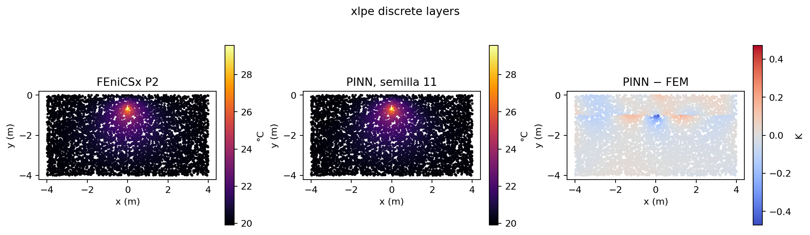

Fuente: elaboración propia, misma nube de evaluación; la figura usa la primera semilla guardada del directorio seleccionado.

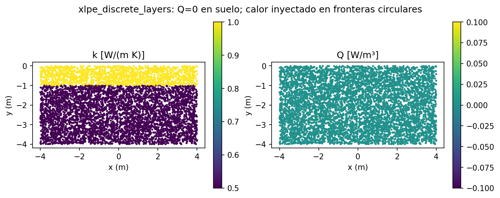

Fuente: elaboración propia a partir del JSON; en los casos de cables la generación se aplica en las fronteras, no en el volumen de suelo.

Campos y mallas: `results/xlpe_discrete_layers/fem_l*.npz`. Pesos e historiales: `coupled_final\xlpe_discrete_layers/pinn_seed*.pt` y `training_seed*.json`. Las tablas completas están en [all_runs.csv](summary/all_runs.csv).

## Caso `xlpe_dry_far`

El entrenamiento mediante residuos y diferenciación automática se fundamenta en la versión consultada de Raissi et al. (2017: 4–5). La verificación del cálculo térmico sigue la distinción entre verificación y validación de CIGRÉ Working Group B1.87 (2025: 93–99). La comparación de pesos responde a dificultades de optimización documentadas por Wang et al. (2020: 9–10); no se implementa ni se atribuye a la campaña su algoritmo adaptativo. La implementación FEM utiliza DOLFINx, cuyo entorno de solución y relación con FEniCSx describen Baratta et al. (2023: 1–3). Las versiones de software efectivamente ejecutadas se registran aparte. La separación entre capacidad, muestreo y optimización sigue De Ryck y Mishra (2024: 24–27, 51–57). Las cotas que relacionan error, estabilidad y cuadratura requieren hipótesis específicas (Mishra y Molinaro, 2020: 7–8); las pendientes observadas en esta batería no se presentan como órdenes teóricos de PINN. La solución manufacturada o el escenario XLPE específico es de elaboración propia; sus valores no se atribuyen a un experimento publicado. La resistencia DC se actualiza con la temperatura individual del conductor, siguiendo la ley lineal y el coeficiente del cobre documentados en CIGRÉ Working Group B1.56 (2022: 132). Las pérdidas AC adicionales de esa fuente quedan fuera del modelo DC ejecutado.

Datos completos: [JSON](cases/xlpe_dry_far.json). Revisión ejecutable: [cuaderno](notebooks/xlpe_dry_far.ipynb). Directorio seleccionado: `coupled_final\xlpe_dry_far`.

### Datos y formulación

Familia: `cable`. Ambiente: 20.0 °C. Conductividad: `1.0`.

Dominio: [-4.0, 4.0, -4.0, 0.0] m; 1 cable(s); radio exterior 0.015 m; corriente base 270.0 A; R20=0.000193 Ω/m; potencia de referencia a 20 °C por cable 14.0697 W/m.

Centros: `[[0.0, -0.7]]`. Capas `[ri,ro,k]`: `[[0, 0.0055, 400], [0.0055, 0.012, 0.286], [0.012, 0.013, 380], [0.013, 0.015, 0.45]]`.

Región continua: `[1, -0.7, 0.5, 0.5, 0.5, 0.08]`. Estratos heredados: `[]`. Control pareado: `xlpe_single`.

Dominio controlado 8 x 4 m; Dirichlet 20 C; pérdidas DC a 20 C; flujo circular uniforme. Kim usa nueve capas de la ficha corregida de 2025.

### Convergencia FEniCSx

| Nivel | Grados de libertad | Tmax °C | Balance % | Tiempo observado s |
| --- | --- | --- | --- | --- |
| 0 | 854 | 36.877764 | 2.512645 | 1.028 |
| 1 | 3183 | 36.893748 | 1.098409 | 2.468 |
| 2 | 11517 | 36.894738 | 0.269787 | 3.343 |

### Todos los entrenamientos evaluados

| Campaña | Semilla | Ancho×capas | RMSE K | NRMSE % | Máx. error campo K | Error Tmax K | Balance % | Pasa |
| --- | --- | --- | --- | --- | --- | --- | --- | --- |
| ampacity_final | 11 | 32×3 | 0.430985 | 0.6157 | 2.35004 | -0.03053 | 0.01413 | Sí |
| ampacity_final | 23 | 32×3 | 0.400526 | 0.5722 | 2.44820 | -0.03414 | 0.00064 | Sí |
| ampacity_final | 37 | 32×3 | 0.466892 | 0.6670 | 2.77606 | -0.03261 | 0.00148 | Sí |
| comparisons/final_w16 | 11 | 16×3 | 0.208268 | 1.2327 | 0.64697 | -0.17051 | 0.00407 | Sí |
| comparisons/final_w16 | 23 | 16×3 | 0.152627 | 0.9034 | 0.56677 | -0.18478 | 0.00211 | Sí |
| comparisons/final_w16 | 37 | 16×3 | 0.186191 | 1.1021 | 0.72255 | -0.12706 | 0.00015 | Sí |
| coupled_final | 11 | 32×3 | 0.140376 | 0.7757 | 0.62105 | -0.17491 | 0.00533 | Sí |
| coupled_final | 23 | 32×3 | 0.159856 | 0.8834 | 0.66043 | -0.26638 | 0.01149 | Sí |
| coupled_final | 37 | 32×3 | 0.197833 | 1.0932 | 0.85839 | -0.20202 | 0.00665 | Sí |
| results | 11 | 32×3 | 0.669249 | 3.9613 | 1.40623 | -0.59143 | 95.17106 | No |
| results | 23 | 32×3 | 0.635849 | 3.7636 | 1.31942 | -0.57673 | 90.94790 | No |
| results | 37 | 32×3 | 0.697254 | 4.1270 | 1.47233 | -0.60782 | 96.45385 | No |

### Ventajas, limitaciones y decisión

La configuración seleccionada supera la puerta térmica en 3 de 3 semillas. Su RMSE mediano es 0.15986 K; la desviación entre semillas es 0.02922 K.

### Operación y ampacidad con R(T) individual

La tabla FEM anterior corresponde al control a R20 fija. Las siguientes soluciones usan pérdidas actualizadas y constituyen las referencias operativas. Cada potencia se expresa en W/m y cada temperatura corresponde al mismo conductor, en el orden del JSON.

**Nominal, malla fina:** Tc = [38.096263] °C; P = [15.070313] W/m. Metadatos: [fem_l2.json](coupled_results/xlpe_dry_far/fem_l2.json).

**Ampacidad, malla fina:** Tc = [89.999913] °C; P = [58.294942] W/m. Metadatos: [fem_ampacity_l2.json](coupled_results/xlpe_dry_far/fem_ampacity_l2.json).

| Modo FEM | Malla | Corriente A | Tmax °C | Balance % | Residuo eléctrico % |
| --- | --- | --- | --- | --- | --- |
| Nominal | 0 | 270.0000 | 38.07679 | 2.51264 | 4.72e-14 |
| Nominal | 1 | 270.0000 | 38.09513 | 1.09841 | 2.63e-12 |
| Nominal | 2 | 270.0000 | 38.09626 | 0.26979 | 3.43e-12 |
| Ampacidad | 0 | 486.9489 | 90.00008 | 2.51264 | 1.83e-13 |
| Ampacidad | 1 | 486.7182 | 89.99997 | 1.09841 | 8.97e-12 |
| Ampacidad | 2 | 486.7038 | 89.99991 | 0.26979 | 1.17e-11 |

| Campaña | Semilla | Modo | Corriente A | Error I % | Residuo eléctrico % | Distancia a 90 °C K | Pasa corriente |
| --- | --- | --- | --- | --- | --- | --- | --- |
| ampacity_final | 11 | ampacity | 487.3469 | 0.13215 | 0.00742 | 0.03062 | True |
| ampacity_final | 23 | ampacity | 488.3917 | 0.34681 | 0.00502 | 0.03423 | True |
| ampacity_final | 37 | ampacity | 487.0395 | 0.06899 | 0.00582 | 0.03270 | True |
| coupled_final | 11 | coupled | 270.0000 | — | 0.00116 | — | No aplica |
| coupled_final | 23 | coupled | 270.0000 | — | 0.00248 | — | No aplica |
| coupled_final | 37 | coupled | 270.0000 | — | 0.00296 | — | No aplica |

### Balance por conductor y flujo local

Diagnóstico adicional para detectar compensaciones entre fronteras. No se añadió retrospectivamente a la puerta de aceptación. La integración FEM usa el gradiente de la solución P2; el flujo local PINN se evalúa sobre 512 puntos por circunferencia.

| Método/semilla | Frontera | P impuesta W/m | P integrada W/m | Error potencia % | RMSE flujo W/m² |
| --- | --- | --- | --- | --- | --- |
| FEM nominal | cable0 | 15.07031 | 15.03862 | 0.21033 | — |
| pinn_seed11 | cable0 | 15.06047 | 15.06048 | 0.00008 | 0.00640 |
| pinn_seed23 | cable0 | 15.05521 | 15.05520 | 0.00009 | 0.01265 |
| pinn_seed37 | cable0 | 15.05870 | 15.05861 | 0.00060 | 0.00410 |

**Ventaja:** ambos métodos comparten geometría, pérdidas, materiales y reconstrucción del conductor. **Limitación:** la frontera de flujo uniforme y las resistencias radiales reducen la física de las capas; las pérdidas son DC y no se reconstruye el ensayo publicado.

La interpretación del efecto material debe compararse con `xlpe_single`, conservando corriente, dominio y contornos.

### Gráficos y archivos de auditoría

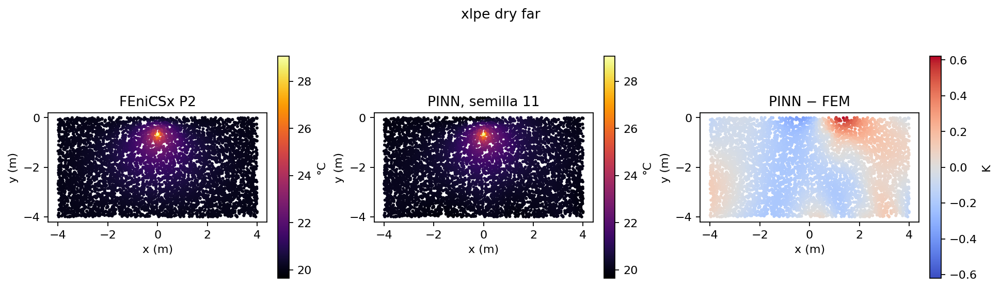

Fuente: elaboración propia, misma nube de evaluación; la figura usa la primera semilla guardada del directorio seleccionado.

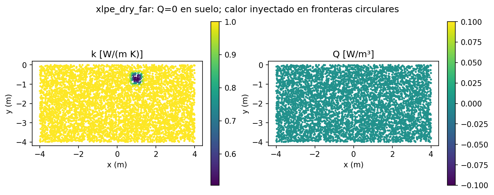

Fuente: elaboración propia a partir del JSON; en los casos de cables la generación se aplica en las fronteras, no en el volumen de suelo.

Campos y mallas: `results/xlpe_dry_far/fem_l*.npz`. Pesos e historiales: `coupled_final\xlpe_dry_far/pinn_seed*.pt` y `training_seed*.json`. Las tablas completas están en [all_runs.csv](summary/all_runs.csv).

## Caso `xlpe_dry_large`

El entrenamiento mediante residuos y diferenciación automática se fundamenta en la versión consultada de Raissi et al. (2017: 4–5). La verificación del cálculo térmico sigue la distinción entre verificación y validación de CIGRÉ Working Group B1.87 (2025: 93–99). La comparación de pesos responde a dificultades de optimización documentadas por Wang et al. (2020: 9–10); no se implementa ni se atribuye a la campaña su algoritmo adaptativo. La implementación FEM utiliza DOLFINx, cuyo entorno de solución y relación con FEniCSx describen Baratta et al. (2023: 1–3). Las versiones de software efectivamente ejecutadas se registran aparte. La separación entre capacidad, muestreo y optimización sigue De Ryck y Mishra (2024: 24–27, 51–57). Las cotas que relacionan error, estabilidad y cuadratura requieren hipótesis específicas (Mishra y Molinaro, 2020: 7–8); las pendientes observadas en esta batería no se presentan como órdenes teóricos de PINN. La solución manufacturada o el escenario XLPE específico es de elaboración propia; sus valores no se atribuyen a un experimento publicado. La resistencia DC se actualiza con la temperatura individual del conductor, siguiendo la ley lineal y el coeficiente del cobre documentados en CIGRÉ Working Group B1.56 (2022: 132). Las pérdidas AC adicionales de esa fuente quedan fuera del modelo DC ejecutado.

Datos completos: [JSON](cases/xlpe_dry_large.json). Revisión ejecutable: [cuaderno](notebooks/xlpe_dry_large.ipynb). Directorio seleccionado: `coupled_final\xlpe_dry_large`.

### Datos y formulación

Familia: `cable`. Ambiente: 20.0 °C. Conductividad: `1.0`.

Dominio: [-4.0, 4.0, -4.0, 0.0] m; 1 cable(s); radio exterior 0.015 m; corriente base 270.0 A; R20=0.000193 Ω/m; potencia de referencia a 20 °C por cable 14.0697 W/m.

Centros: `[[0.0, -0.7]]`. Capas `[ri,ro,k]`: `[[0, 0.0055, 400], [0.0055, 0.012, 0.286], [0.012, 0.013, 380], [0.013, 0.015, 0.45]]`.

Región continua: `[0, -0.7, 1.0, 1.0, 0.5, 0.08]`. Estratos heredados: `[]`. Control pareado: `xlpe_single`.

Dominio controlado 8 x 4 m; Dirichlet 20 C; pérdidas DC a 20 C; flujo circular uniforme. Kim usa nueve capas de la ficha corregida de 2025.

### Convergencia FEniCSx

| Nivel | Grados de libertad | Tmax °C | Balance % | Tiempo observado s |
| --- | --- | --- | --- | --- |
| 0 | 854 | 44.813708 | 1.736829 | 1.300 |
| 1 | 3183 | 44.857815 | 0.125953 | 2.181 |
| 2 | 11517 | 44.860533 | 0.095717 | 3.764 |

### Todos los entrenamientos evaluados

| Campaña | Semilla | Ancho×capas | RMSE K | NRMSE % | Máx. error campo K | Error Tmax K | Balance % | Pasa |
| --- | --- | --- | --- | --- | --- | --- | --- | --- |
| ampacity_final | 11 | 32×3 | 1.626761 | 2.3239 | 5.48636 | -0.11025 | 0.00639 | Sí |
| ampacity_final | 23 | 32×3 | 0.291950 | 0.4171 | 1.03397 | -0.04583 | 0.02890 | Sí |
| ampacity_final | 37 | 32×3 | 0.327444 | 0.4678 | 1.46967 | -0.03314 | 0.00659 | Sí |
| comparisons/ampacity_constraints1000 | 11 | 32×3 | 1.849112 | 2.6416 | 6.69419 | -0.03659 | 0.00781 | Sí |
| comparisons/ampacity_constraints1000 | 23 | 32×3 | 0.178171 | 0.2545 | 0.51251 | -0.02440 | 0.00862 | Sí |
| comparisons/ampacity_constraints1000 | 37 | 32×3 | 0.792762 | 1.1325 | 3.39428 | -0.03324 | 0.02616 | Sí |
| comparisons/final_w16 | 11 | 16×3 | 0.278326 | 1.1196 | 2.12575 | 0.36345 | 0.01588 | Sí |
| comparisons/final_w16 | 23 | 16×3 | 0.516933 | 2.0793 | 2.57450 | -0.98272 | 0.07988 | Sí |
| comparisons/final_w16 | 37 | 16×3 | 0.333929 | 1.3432 | 1.22359 | -0.51362 | 0.00173 | Sí |
| coupled_final | 11 | 32×3 | 0.457097 | 1.6590 | 2.30050 | -0.85281 | 0.01632 | Sí |
| coupled_final | 23 | 32×3 | 0.346008 | 1.2558 | 1.85186 | -0.54099 | 0.00719 | Sí |
| coupled_final | 37 | 32×3 | 0.546767 | 1.9845 | 3.07630 | -1.18075 | 0.03298 | Sí |
| results | 11 | 32×3 | 0.716935 | 2.8838 | 7.57614 | -9.17509 | 63.05108 | No |
| results | 23 | 32×3 | 0.668555 | 2.6892 | 7.58440 | -9.17827 | 56.95545 | No |
| results | 37 | 32×3 | 0.648100 | 2.6069 | 7.58494 | -9.17557 | 10.38372 | No |

### Ventajas, limitaciones y decisión

La configuración seleccionada supera la puerta térmica en 3 de 3 semillas. Su RMSE mediano es 0.45710 K; la desviación entre semillas es 0.10057 K.

### Operación y ampacidad con R(T) individual

La tabla FEM anterior corresponde al control a R20 fija. Las siguientes soluciones usan pérdidas actualizadas y constituyen las referencias operativas. Cada potencia se expresa en W/m y cada temperatura corresponde al mismo conductor, en el orden del JSON.

**Nominal, malla fina:** Tc = [47.55246] °C; P = [15.593184] W/m. Metadatos: [fem_l2.json](coupled_results/xlpe_dry_large/fem_l2.json).

**Ampacidad, malla fina:** Tc = [89.999973] °C; P = [39.616151] W/m. Metadatos: [fem_ampacity_l2.json](coupled_results/xlpe_dry_large/fem_ampacity_l2.json).

| Modo FEM | Malla | Corriente A | Tmax °C | Balance % | Residuo eléctrico % |
| --- | --- | --- | --- | --- | --- |
| Nominal | 0 | 270.0000 | 47.49496 | 1.73683 | 7.98e-14 |
| Nominal | 1 | 270.0000 | 47.54912 | 0.12595 | 2.9e-12 |
| Nominal | 2 | 270.0000 | 47.55246 | 0.09572 | 2.85e-13 |
| Ampacidad | 0 | 401.6011 | 90.00003 | 1.73683 | 1.97e-13 |
| Ampacidad | 1 | 401.2447 | 90.00007 | 0.12595 | 6.69e-12 |
| Ampacidad | 2 | 401.2226 | 89.99997 | 0.09572 | 6.46e-13 |

| Campaña | Semilla | Modo | Corriente A | Error I % | Residuo eléctrico % | Distancia a 90 °C K | Pasa corriente |
| --- | --- | --- | --- | --- | --- | --- | --- |
| ampacity_final | 11 | ampacity | 402.1295 | 0.22605 | 0.00379 | 0.11028 | False |
| ampacity_final | 23 | ampacity | 400.5490 | 0.16789 | 0.00712 | 0.04586 | True |
| ampacity_final | 37 | ampacity | 400.4903 | 0.18251 | 0.00615 | 0.03316 | True |
| comparisons/ampacity_constraints1000 | 11 | ampacity | 399.5651 | 0.41310 | 0.00693 | 0.03662 | True |
| comparisons/ampacity_constraints1000 | 23 | ampacity | 400.5608 | 0.16495 | 0.00832 | 0.02442 | True |
| comparisons/ampacity_constraints1000 | 37 | ampacity | 400.5265 | 0.17349 | 0.00485 | 0.03327 | True |
| coupled_final | 11 | coupled | 270.0000 | — | 0.05799 | — | No aplica |
| coupled_final | 23 | coupled | 270.0000 | — | 0.00659 | — | No aplica |
| coupled_final | 37 | coupled | 270.0000 | — | 0.09684 | — | No aplica |

### Balance por conductor y flujo local

Diagnóstico adicional para detectar compensaciones entre fronteras. No se añadió retrospectivamente a la puerta de aceptación. La integración FEM usa el gradiente de la solución P2; el flujo local PINN se evalúa sobre 512 puntos por circunferencia.

| Método/semilla | Frontera | P impuesta W/m | P integrada W/m | Error potencia % | RMSE flujo W/m² |
| --- | --- | --- | --- | --- | --- |
| FEM nominal | cable0 | 15.59318 | 15.56039 | 0.21033 | — |
| pinn_seed11 | cable0 | 15.53701 | 15.53727 | 0.00164 | 0.18933 |
| pinn_seed23 | cable0 | 15.56430 | 15.56423 | 0.00045 | 0.11108 |
| pinn_seed37 | cable0 | 15.51286 | 15.51313 | 0.00177 | 0.11374 |

**Ventaja:** ambos métodos comparten geometría, pérdidas, materiales y reconstrucción del conductor. **Limitación:** la frontera de flujo uniforme y las resistencias radiales reducen la física de las capas; las pérdidas son DC y no se reconstruye el ensayo publicado.

La interpretación del efecto material debe compararse con `xlpe_single`, conservando corriente, dominio y contornos.

### Gráficos y archivos de auditoría

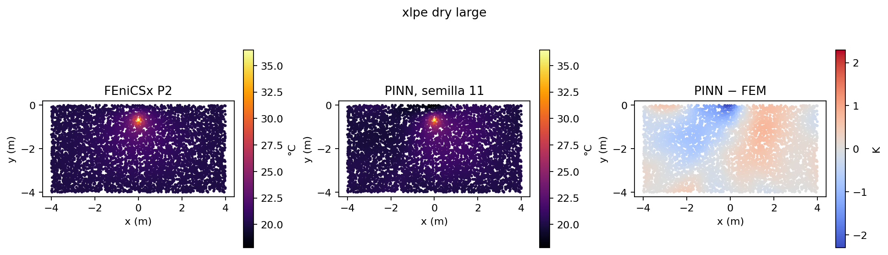

Fuente: elaboración propia, misma nube de evaluación; la figura usa la primera semilla guardada del directorio seleccionado.

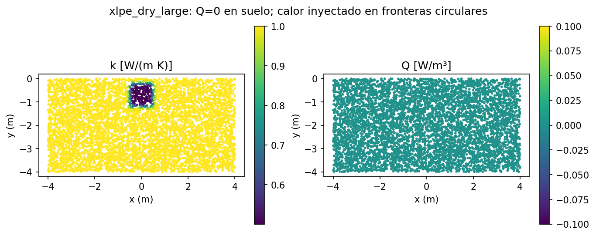

Fuente: elaboración propia a partir del JSON; en los casos de cables la generación se aplica en las fronteras, no en el volumen de suelo.

Campos y mallas: `results/xlpe_dry_large/fem_l*.npz`. Pesos e historiales: `coupled_final\xlpe_dry_large/pinn_seed*.pt` y `training_seed*.json`. Las tablas completas están en [all_runs.csv](summary/all_runs.csv).

## Caso `xlpe_dry_near`

El entrenamiento mediante residuos y diferenciación automática se fundamenta en la versión consultada de Raissi et al. (2017: 4–5). La verificación del cálculo térmico sigue la distinción entre verificación y validación de CIGRÉ Working Group B1.87 (2025: 93–99). La comparación de pesos responde a dificultades de optimización documentadas por Wang et al. (2020: 9–10); no se implementa ni se atribuye a la campaña su algoritmo adaptativo. La implementación FEM utiliza DOLFINx, cuyo entorno de solución y relación con FEniCSx describen Baratta et al. (2023: 1–3). Las versiones de software efectivamente ejecutadas se registran aparte. La separación entre capacidad, muestreo y optimización sigue De Ryck y Mishra (2024: 24–27, 51–57). Las cotas que relacionan error, estabilidad y cuadratura requieren hipótesis específicas (Mishra y Molinaro, 2020: 7–8); las pendientes observadas en esta batería no se presentan como órdenes teóricos de PINN. La solución manufacturada o el escenario XLPE específico es de elaboración propia; sus valores no se atribuyen a un experimento publicado. La resistencia DC se actualiza con la temperatura individual del conductor, siguiendo la ley lineal y el coeficiente del cobre documentados en CIGRÉ Working Group B1.56 (2022: 132). Las pérdidas AC adicionales de esa fuente quedan fuera del modelo DC ejecutado.

Datos completos: [JSON](cases/xlpe_dry_near.json). Revisión ejecutable: [cuaderno](notebooks/xlpe_dry_near.ipynb). Directorio seleccionado: `coupled_final\xlpe_dry_near`.

### Datos y formulación

Familia: `cable`. Ambiente: 20.0 °C. Conductividad: `1.0`.

Dominio: [-4.0, 4.0, -4.0, 0.0] m; 1 cable(s); radio exterior 0.015 m; corriente base 270.0 A; R20=0.000193 Ω/m; potencia de referencia a 20 °C por cable 14.0697 W/m.

Centros: `[[0.0, -0.7]]`. Capas `[ri,ro,k]`: `[[0, 0.0055, 400], [0.0055, 0.012, 0.286], [0.012, 0.013, 380], [0.013, 0.015, 0.45]]`.

Región continua: `[0, -0.7, 0.5, 0.5, 0.5, 0.08]`. Estratos heredados: `[]`. Control pareado: `xlpe_single`.

Dominio controlado 8 x 4 m; Dirichlet 20 C; pérdidas DC a 20 C; flujo circular uniforme. Kim usa nueve capas de la ficha corregida de 2025.

### Convergencia FEniCSx

| Nivel | Grados de libertad | Tmax °C | Balance % | Tiempo observado s |
| --- | --- | --- | --- | --- |
| 0 | 854 | 42.836615 | 2.705638 | 0.985 |
| 1 | 3183 | 42.872895 | 1.066726 | 2.403 |
| 2 | 11517 | 42.874783 | 0.264365 | 4.028 |

### Todos los entrenamientos evaluados

| Campaña | Semilla | Ancho×capas | RMSE K | NRMSE % | Máx. error campo K | Error Tmax K | Balance % | Pasa |
| --- | --- | --- | --- | --- | --- | --- | --- | --- |
| ampacity_final | 11 | 32×3 | 0.417896 | 0.5970 | 2.74963 | -0.07959 | 0.01789 | Sí |
| ampacity_final | 23 | 32×3 | 0.109087 | 0.1558 | 0.35182 | -0.02913 | 0.00498 | Sí |
| ampacity_final | 37 | 32×3 | 0.110891 | 0.1584 | 0.36947 | -0.03849 | 0.00185 | Sí |
| comparisons/conservative | 11 | 32×3 | 0.215923 | 0.9439 | 0.56766 | 0.09739 | 0.04385 | Sí |
| comparisons/conservative | 23 | 32×3 | 0.209337 | 0.9151 | 0.50781 | -0.03808 | 0.01911 | Sí |
| comparisons/conservative | 37 | 32×3 | 0.156628 | 0.6847 | 0.71139 | -0.30721 | 0.04957 | Sí |
| comparisons/final_w16 | 11 | 16×3 | 0.252687 | 1.1047 | 0.79409 | 0.25540 | 0.00700 | Sí |
| comparisons/final_w16 | 23 | 16×3 | 0.329800 | 1.4418 | 0.99129 | 0.09847 | 0.08561 | Sí |
| comparisons/final_w16 | 37 | 16×3 | 0.302469 | 1.3223 | 1.05930 | -0.56190 | 0.14773 | Sí |
| coupled_final | 11 | 32×3 | 0.135718 | 0.5400 | 0.49268 | -0.12651 | 0.01331 | Sí |
| coupled_final | 23 | 32×3 | 0.122583 | 0.4877 | 0.90096 | -0.30239 | 0.03111 | Sí |
| coupled_final | 37 | 32×3 | 0.100542 | 0.4000 | 0.61437 | -0.17181 | 0.03251 | Sí |
| results | 11 | 32×3 | 0.472803 | 2.0669 | 6.44928 | -8.02383 | 25.56024 | No |
| results | 23 | 32×3 | 0.747383 | 3.2673 | 6.76374 | -8.35217 | 91.86972 | No |
| results | 37 | 32×3 | 0.528294 | 2.3095 | 6.48055 | -8.04926 | 40.27415 | No |

### Ventajas, limitaciones y decisión

La configuración seleccionada supera la puerta térmica en 3 de 3 semillas. Su RMSE mediano es 0.12258 K; la desviación entre semillas es 0.01777 K.

### Operación y ampacidad con R(T) individual

La tabla FEM anterior corresponde al control a R20 fija. Las siguientes soluciones usan pérdidas actualizadas y constituyen las referencias operativas. Cada potencia se expresa en W/m y cada temperatura corresponde al mismo conductor, en el orden del JSON.

**Nominal, malla fina:** Tc = [45.134304] °C; P = [15.459474] W/m. Metadatos: [fem_l2.json](coupled_results/xlpe_dry_near/fem_l2.json).

**Ampacidad, malla fina:** Tc = [90.000002] °C; P = [43.05523] W/m. Metadatos: [fem_ampacity_l2.json](coupled_results/xlpe_dry_near/fem_ampacity_l2.json).

| Modo FEM | Malla | Corriente A | Tmax °C | Balance % | Residuo eléctrico % |
| --- | --- | --- | --- | --- | --- |
| Nominal | 0 | 270.0000 | 45.08823 | 2.70564 | 8.04e-14 |
| Nominal | 1 | 270.0000 | 45.13202 | 1.06673 | 1.4e-12 |
| Nominal | 2 | 270.0000 | 45.13430 | 0.26437 | 4.25e-12 |
| Ampacidad | 0 | 418.6244 | 89.99990 | 2.70564 | 1.98e-13 |
| Ampacidad | 1 | 418.2925 | 90.00000 | 1.06673 | 3.55e-12 |
| Ampacidad | 2 | 418.2753 | 90.00000 | 0.26437 | 1.07e-11 |

| Campaña | Semilla | Modo | Corriente A | Error I % | Residuo eléctrico % | Distancia a 90 °C K | Pasa corriente |
| --- | --- | --- | --- | --- | --- | --- | --- |
| ampacity_final | 11 | ampacity | 414.4286 | 0.91965 | 0.00522 | 0.07959 | True |
| ampacity_final | 23 | ampacity | 418.2797 | 0.00106 | 0.00463 | 0.02913 | True |
| ampacity_final | 37 | ampacity | 417.6817 | 0.14190 | 0.01248 | 0.03849 | True |
| coupled_final | 11 | coupled | 270.0000 | — | 0.01106 | — | No aplica |
| coupled_final | 23 | coupled | 270.0000 | — | 0.00510 | — | No aplica |
| coupled_final | 37 | coupled | 270.0000 | — | 0.03478 | — | No aplica |

### Balance por conductor y flujo local

Diagnóstico adicional para detectar compensaciones entre fronteras. No se añadió retrospectivamente a la puerta de aceptación. La integración FEM usa el gradiente de la solución P2; el flujo local PINN se evalúa sobre 512 puntos por circunferencia.

| Método/semilla | Frontera | P impuesta W/m | P integrada W/m | Error potencia % | RMSE flujo W/m² |
| --- | --- | --- | --- | --- | --- |
| FEM nominal | cable0 | 15.45947 | 15.42696 | 0.21034 | — |
| pinn_seed11 | cable0 | 15.45077 | 15.45071 | 0.00040 | 0.02214 |
| pinn_seed23 | cable0 | 15.44197 | 15.44192 | 0.00031 | 0.15641 |
| pinn_seed37 | cable0 | 15.44460 | 15.44467 | 0.00043 | 0.10653 |

**Ventaja:** ambos métodos comparten geometría, pérdidas, materiales y reconstrucción del conductor. **Limitación:** la frontera de flujo uniforme y las resistencias radiales reducen la física de las capas; las pérdidas son DC y no se reconstruye el ensayo publicado.

La interpretación del efecto material debe compararse con `xlpe_single`, conservando corriente, dominio y contornos.

### Gráficos y archivos de auditoría

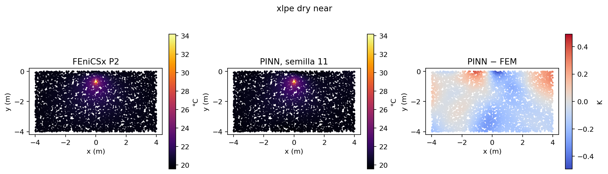

Fuente: elaboración propia, misma nube de evaluación; la figura usa la primera semilla guardada del directorio seleccionado.

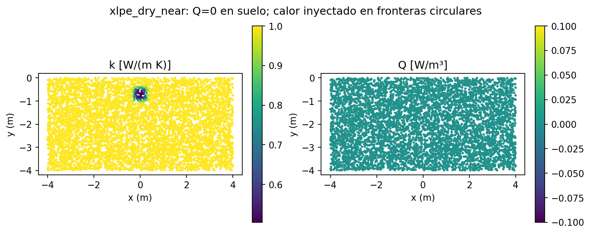

Fuente: elaboración propia a partir del JSON; en los casos de cables la generación se aplica en las fronteras, no en el volumen de suelo.

Campos y mallas: `results/xlpe_dry_near/fem_l*.npz`. Pesos e historiales: `coupled_final\xlpe_dry_near/pinn_seed*.pt` y `training_seed*.json`. Las tablas completas están en [all_runs.csv](summary/all_runs.csv).

## Caso `xlpe_single`

El entrenamiento mediante residuos y diferenciación automática se fundamenta en la versión consultada de Raissi et al. (2017: 4–5). La verificación del cálculo térmico sigue la distinción entre verificación y validación de CIGRÉ Working Group B1.87 (2025: 93–99). La comparación de pesos responde a dificultades de optimización documentadas por Wang et al. (2020: 9–10); no se implementa ni se atribuye a la campaña su algoritmo adaptativo. La implementación FEM utiliza DOLFINx, cuyo entorno de solución y relación con FEniCSx describen Baratta et al. (2023: 1–3). Las versiones de software efectivamente ejecutadas se registran aparte. La separación entre capacidad, muestreo y optimización sigue De Ryck y Mishra (2024: 24–27, 51–57). Las cotas que relacionan error, estabilidad y cuadratura requieren hipótesis específicas (Mishra y Molinaro, 2020: 7–8); las pendientes observadas en esta batería no se presentan como órdenes teóricos de PINN. La solución manufacturada o el escenario XLPE específico es de elaboración propia; sus valores no se atribuyen a un experimento publicado. La resistencia DC se actualiza con la temperatura individual del conductor, siguiendo la ley lineal y el coeficiente del cobre documentados en CIGRÉ Working Group B1.56 (2022: 132). Las pérdidas AC adicionales de esa fuente quedan fuera del modelo DC ejecutado.

Datos completos: [JSON](cases/xlpe_single.json). Revisión ejecutable: [cuaderno](notebooks/xlpe_single.ipynb). Directorio seleccionado: `coupled_final\xlpe_single`.

### Datos y formulación

Familia: `cable`. Ambiente: 20.0 °C. Conductividad: `1.0`.

Dominio: [-4.0, 4.0, -4.0, 0.0] m; 1 cable(s); radio exterior 0.015 m; corriente base 270.0 A; R20=0.000193 Ω/m; potencia de referencia a 20 °C por cable 14.0697 W/m.

Centros: `[[0.0, -0.7]]`. Capas `[ri,ro,k]`: `[[0, 0.0055, 400], [0.0055, 0.012, 0.286], [0.012, 0.013, 380], [0.013, 0.015, 0.45]]`.

Región continua: `None`. Estratos heredados: `[]`. Control pareado: `None`.

Dominio controlado 8 x 4 m; Dirichlet 20 C; pérdidas DC a 20 C; flujo circular uniforme. Kim usa nueve capas de la ficha corregida de 2025.

### Convergencia FEniCSx

| Nivel | Grados de libertad | Tmax °C | Balance % | Tiempo observado s |
| --- | --- | --- | --- | --- |
| 0 | 854 | 36.842136 | 2.795571 | 0.959 |
| 1 | 3183 | 36.857599 | 1.091709 | 2.029 |
| 2 | 11517 | 36.858504 | 0.266615 | 3.156 |

### Todos los entrenamientos evaluados

| Campaña | Semilla | Ancho×capas | RMSE K | NRMSE % | Máx. error campo K | Error Tmax K | Balance % | Pasa |
| --- | --- | --- | --- | --- | --- | --- | --- | --- |
| ampacity_final | 11 | 32×3 | 0.010599 | 0.0151 | 0.04042 | -0.01865 | 0.00142 | Sí |
| ampacity_final | 23 | 32×3 | 0.008621 | 0.0123 | 0.02455 | -0.01838 | 0.00159 | Sí |
| ampacity_final | 37 | 32×3 | 0.013591 | 0.0194 | 0.03943 | -0.01878 | 0.00150 | Sí |
| ampacity_pilot | 5 | 32×3 | 0.010891 | 0.0156 | 0.03550 | -0.01866 | 0.00152 | Sí |
| comparisons/C01_enriched | 5 | 32×3 | 0.671317 | 3.9821 | 1.51796 | -0.62028 | 88.25298 | No |
| comparisons/C02_energy | 5 | 32×3 | 0.394852 | 2.3422 | 1.12296 | -0.43099 | 0.00272 | Sí |
| comparisons/C03_reference | 5 | 32×3 | 0.036734 | 0.2179 | 0.12688 | 0.01735 | 0.00319 | Sí |
| comparisons/C04_width16 | 5 | 16×3 | 0.034972 | 0.2074 | 0.13833 | 0.02047 | 0.00375 | Sí |
| comparisons/C05_width64 | 5 | 64×3 | 0.033703 | 0.1999 | 0.09867 | 0.01178 | 0.00310 | Sí |
| comparisons/C06_depth4 | 5 | 32×4 | 0.037125 | 0.2202 | 0.12723 | 0.01333 | 0.00292 | Sí |
| comparisons/C07_lr0005 | 5 | 32×3 | 0.038702 | 0.2296 | 0.12155 | 0.01229 | 0.00298 | Sí |
| comparisons/C08_sampling1536 | 5 | 32×3 | 0.038856 | 0.2305 | 0.11594 | 0.01249 | 0.00159 | Sí |
| comparisons/conservative | 11 | 32×3 | 0.039766 | 0.2359 | 0.11278 | 0.00697 | 0.00335 | Sí |
| comparisons/conservative | 23 | 32×3 | 0.037799 | 0.2242 | 0.13648 | 0.01490 | 0.00296 | Sí |
| comparisons/conservative | 37 | 32×3 | 0.041161 | 0.2442 | 0.11126 | 0.00559 | 0.00320 | Sí |
| comparisons/direct | 5 | 32×3 | 0.732947 | 4.3476 | 8.21119 | -9.80429 | 144.24653 | No |
| comparisons/final_w16 | 11 | 16×3 | 0.040745 | 0.2417 | 0.14701 | 0.02144 | 0.00243 | Sí |
| comparisons/final_w16 | 23 | 16×3 | 0.040797 | 0.2420 | 0.13086 | 0.01141 | 0.00332 | Sí |
| comparisons/final_w16 | 37 | 16×3 | 0.039790 | 0.2360 | 0.11146 | 0.00165 | 0.00415 | Sí |
| comparisons/resolution_B2 | 11 | 32×3 | 0.015600 | 0.0864 | 0.05976 | 0.00903 | 0.00147 | Sí |
| comparisons/resolution_B2 | 23 | 32×3 | 0.008811 | 0.0488 | 0.03520 | 0.01094 | 0.00138 | Sí |
| comparisons/resolution_B2 | 37 | 32×3 | 0.010308 | 0.0571 | 0.03479 | 0.00026 | 0.00122 | Sí |
| comparisons/resolution_N1536 | 11 | 32×3 | 0.008176 | 0.0453 | 0.03883 | 0.00959 | 0.00135 | Sí |
| comparisons/resolution_N1536 | 23 | 32×3 | 0.009142 | 0.0506 | 0.03428 | 0.01297 | 0.00142 | Sí |
| comparisons/resolution_N1536 | 37 | 32×3 | 0.011136 | 0.0617 | 0.02736 | -0.00251 | 0.00135 | Sí |
| comparisons/resolution_N384 | 11 | 32×3 | 0.008479 | 0.0470 | 0.03895 | 0.00908 | 0.00143 | Sí |
| comparisons/resolution_N384 | 23 | 32×3 | 0.015676 | 0.0868 | 0.06029 | 0.01613 | 0.00160 | Sí |
| comparisons/resolution_N384 | 37 | 32×3 | 0.012309 | 0.0682 | 0.03024 | -0.00350 | 0.00138 | Sí |
| comparisons/resolution_W16 | 11 | 16×3 | 0.009440 | 0.0523 | 0.03468 | -0.00159 | 0.00141 | Sí |
| comparisons/resolution_W16 | 23 | 16×3 | 0.007667 | 0.0425 | 0.04442 | 0.00726 | 0.00134 | Sí |
| comparisons/resolution_W16 | 37 | 16×3 | 0.024496 | 0.1357 | 0.09971 | 0.02084 | 0.00213 | Sí |
| comparisons/resolution_W32 | 11 | 32×3 | 0.006316 | 0.0350 | 0.02732 | 0.00636 | 0.00160 | Sí |
| comparisons/resolution_W32 | 23 | 32×3 | 0.010073 | 0.0558 | 0.03558 | 0.01186 | 0.00131 | Sí |
| comparisons/resolution_W32 | 37 | 32×3 | 0.008370 | 0.0464 | 0.02840 | 0.00225 | 0.00144 | Sí |
| comparisons/resolution_W64 | 11 | 64×3 | 0.010607 | 0.0587 | 0.02896 | 0.01668 | 0.00148 | Sí |
| comparisons/resolution_W64 | 23 | 64×3 | 0.010319 | 0.0572 | 0.05950 | 0.00756 | 0.00126 | Sí |
| comparisons/resolution_W64 | 37 | 64×3 | 0.010469 | 0.0580 | 0.04458 | 0.01552 | 0.00127 | Sí |
| coupled_final | 11 | 32×3 | 0.006316 | 0.0350 | 0.02732 | 0.00636 | 0.00160 | Sí |
| coupled_final | 23 | 32×3 | 0.010073 | 0.0558 | 0.03558 | 0.01186 | 0.00131 | Sí |
| coupled_final | 37 | 32×3 | 0.008370 | 0.0464 | 0.02840 | 0.00225 | 0.00144 | Sí |
| coupled_pilot | 5 | 32×3 | 0.011262 | 0.0624 | 0.04294 | 0.00933 | 0.00126 | Sí |
| reproduced_entrypoint | 11 | 32×3 | 0.006316 | 0.0350 | 0.02732 | 0.00636 | 0.00160 | Sí |
| reproducibility_runs | 11 | 32×3 | 0.006316 | 0.0350 | 0.02732 | 0.00636 | 0.00160 | Sí |
| results | 11 | 32×3 | 0.680818 | 4.0384 | 1.56954 | -0.63813 | 90.51664 | No |
| results | 23 | 32×3 | 0.639144 | 3.7912 | 1.48016 | -0.62606 | 84.80299 | No |
| results | 37 | 32×3 | 0.658156 | 3.9040 | 1.56102 | -0.63628 | 86.96779 | No |

### Ventajas, limitaciones y decisión

La configuración seleccionada supera la puerta térmica en 3 de 3 semillas. Su RMSE mediano es 0.00837 K; la desviación entre semillas es 0.00188 K.

### Operación y ampacidad con R(T) individual

La tabla FEM anterior corresponde al control a R20 fija. Las siguientes soluciones usan pérdidas actualizadas y constituyen las referencias operativas. Cada potencia se expresa en W/m y cada temperatura corresponde al mismo conductor, en el orden del JSON.

**Nominal, malla fina:** Tc = [38.054698] °C; P = [15.068015] W/m. Metadatos: [fem_l2.json](coupled_results/xlpe_single/fem_l2.json).

**Ampacidad, malla fina:** Tc = [90.000082] °C; P = [58.420378] W/m. Metadatos: [fem_ampacity_l2.json](coupled_results/xlpe_single/fem_ampacity_l2.json).

| Modo FEM | Malla | Corriente A | Tmax °C | Balance % | Residuo eléctrico % |
| --- | --- | --- | --- | --- | --- |
| Nominal | 0 | 270.0000 | 38.03593 | 2.79557 | 5.19e-13 |
| Nominal | 1 | 270.0000 | 38.05366 | 1.09171 | 8.25e-14 |
| Nominal | 2 | 270.0000 | 38.05470 | 0.26662 | 1.53e-12 |
| Ampacidad | 0 | 487.4634 | 89.99996 | 2.79557 | 1.79e-12 |
| Ampacidad | 1 | 487.2399 | 90.00001 | 1.09171 | 2.8e-13 |
| Ampacidad | 2 | 487.2270 | 90.00008 | 0.26662 | 5.22e-12 |

| Campaña | Semilla | Modo | Corriente A | Error I % | Residuo eléctrico % | Distancia a 90 °C K | Pasa corriente |
| --- | --- | --- | --- | --- | --- | --- | --- |
| ampacity_final | 11 | ampacity | 487.1552 | 0.01473 | 0.00571 | 0.01856 | True |
| ampacity_final | 23 | ampacity | 487.1680 | 0.01211 | 0.00577 | 0.01829 | True |
| ampacity_final | 37 | ampacity | 487.1246 | 0.02102 | 0.00576 | 0.01869 | True |
| ampacity_pilot | 5 | ampacity | 487.1276 | 0.02039 | 0.00572 | 0.01858 | True |
| comparisons/resolution_B2 | 11 | coupled | 270.0000 | — | 0.00175 | — | No aplica |
| comparisons/resolution_B2 | 23 | coupled | 270.0000 | — | 0.00176 | — | No aplica |
| comparisons/resolution_B2 | 37 | coupled | 270.0000 | — | 0.00175 | — | No aplica |
| comparisons/resolution_N1536 | 11 | coupled | 270.0000 | — | 0.00175 | — | No aplica |
| comparisons/resolution_N1536 | 23 | coupled | 270.0000 | — | 0.00175 | — | No aplica |
| comparisons/resolution_N1536 | 37 | coupled | 270.0000 | — | 0.00176 | — | No aplica |
| comparisons/resolution_N384 | 11 | coupled | 270.0000 | — | 0.00175 | — | No aplica |
| comparisons/resolution_N384 | 23 | coupled | 270.0000 | — | 0.00174 | — | No aplica |
| comparisons/resolution_N384 | 37 | coupled | 270.0000 | — | 0.00176 | — | No aplica |
| comparisons/resolution_W16 | 11 | coupled | 270.0000 | — | 0.00175 | — | No aplica |
| comparisons/resolution_W16 | 23 | coupled | 270.0000 | — | 0.00175 | — | No aplica |
| comparisons/resolution_W16 | 37 | coupled | 270.0000 | — | 0.00175 | — | No aplica |
| comparisons/resolution_W32 | 11 | coupled | 270.0000 | — | 0.00175 | — | No aplica |
| comparisons/resolution_W32 | 23 | coupled | 270.0000 | — | 0.00176 | — | No aplica |
| comparisons/resolution_W32 | 37 | coupled | 270.0000 | — | 0.00175 | — | No aplica |
| comparisons/resolution_W64 | 11 | coupled | 270.0000 | — | 0.00176 | — | No aplica |
| comparisons/resolution_W64 | 23 | coupled | 270.0000 | — | 0.00175 | — | No aplica |
| comparisons/resolution_W64 | 37 | coupled | 270.0000 | — | 0.00175 | — | No aplica |
| coupled_final | 11 | coupled | 270.0000 | — | 0.00175 | — | No aplica |
| coupled_final | 23 | coupled | 270.0000 | — | 0.00176 | — | No aplica |
| coupled_final | 37 | coupled | 270.0000 | — | 0.00175 | — | No aplica |
| coupled_pilot | 5 | coupled | 270.0000 | — | 0.00175 | — | No aplica |
| reproduced_entrypoint | 11 | coupled | 270.0000 | — | 0.00175 | — | No aplica |
| reproducibility_runs | 11 | coupled | 270.0000 | — | 0.00175 | — | No aplica |

### Balance por conductor y flujo local

Diagnóstico adicional para detectar compensaciones entre fronteras. No se añadió retrospectivamente a la puerta de aceptación. La integración FEM usa el gradiente de la solución P2; el flujo local PINN se evalúa sobre 512 puntos por circunferencia.

| Método/semilla | Frontera | P impuesta W/m | P integrada W/m | Error potencia % | RMSE flujo W/m² |
| --- | --- | --- | --- | --- | --- |
| FEM nominal | cable0 | 15.06802 | 15.03632 | 0.21034 | — |
| pinn_seed11 | cable0 | 15.06863 | 15.06863 | 0.00000 | 0.00003 |
| pinn_seed23 | cable0 | 15.06894 | 15.06893 | 0.00003 | 0.00005 |
| pinn_seed37 | cable0 | 15.06840 | 15.06840 | 0.00001 | 0.00002 |

**Ventaja:** ambos métodos comparten geometría, pérdidas, materiales y reconstrucción del conductor. **Limitación:** la frontera de flujo uniforme y las resistencias radiales reducen la física de las capas; las pérdidas son DC y no se reconstruye el ensayo publicado.

### Gráficos y archivos de auditoría

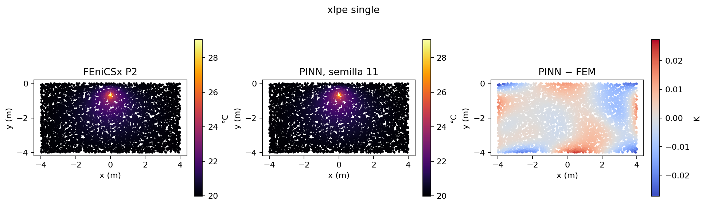

Fuente: elaboración propia, misma nube de evaluación; la figura usa la primera semilla guardada del directorio seleccionado.

Fuente: elaboración propia a partir del JSON; en los casos de cables la generación se aplica en las fronteras, no en el volumen de suelo.

Campos y mallas: `results/xlpe_single/fem_l*.npz`. Pesos e historiales: `coupled_final\xlpe_single/pinn_seed*.pt` y `training_seed*.json`. Las tablas completas están en [all_runs.csv](summary/all_runs.csv).

## Ampacidad DC acoplada y efecto de las pérdidas

FEniCSx construye una matriz de respuesta térmica con excitaciones unitarias, actualiza las pérdidas hasta converger y comprueba el punto fijo contra una solución matricial cerrada. La bisección encuentra la corriente que lleva el conductor más caliente a 90 °C. PINN aprende corriente, potencias y campo sin temperaturas FEM de entrenamiento. Se conservan los intentos rechazados; la mediana de corriente solo incluye los aceptados.

| Caso | FEM A | PINN mediana A | Aceptadas | Total | Máx. error I % |
| --- | --- | --- | --- | --- | --- |
| aras_flat | 1495.235767364502 | 1495.0070257870952 | 3 | 3 | 0.017037749418225 |
| aras_single | 1870.498101234436 | 1870.2287900897163 | 3 | 3 | 0.01517927389035334 |
| kim_layered | 1453.1353569030762 | 1401.5096408890336 | 2 | 3 | 5.801020490944408 |
| kim_pac | 1418.6384239196777 | 1382.7672386759805 | 2 | 3 | 5.286662566703981 |
| kim_sand | 1357.7560729980469 | 1353.9383054846123 | 3 | 3 | 0.2947626873192388 |
| xlpe_backfill | 543.9046096801758 | 530.6541378074144 | 2 | 3 | 10.450540693450538 |
| xlpe_discrete_layers | 479.8895072937012 | 479.4061399351645 | 3 | 3 | 0.12865909101944517 |
| xlpe_dry_far | 486.7037773132324 | 487.34693569559636 | 3 | 3 | 0.34680680919230156 |
| xlpe_dry_large | 401.2225914001465 | 400.52652359464327 | 3 | 3 | 0.4131047297975421 |
| xlpe_dry_near | 418.27526092529297 | 417.6817211974047 | 3 | 3 | 0.9196548787511305 |
| xlpe_single | 487.22700119018555 | 487.1552095578017 | 3 | 3 | 0.021015816143321597 |

### Consecuencia de fijar indebidamente R20

| Caso | T con R20 °C | T con R(Tc) °C | ΔT K | P20 W/m | P mínima W/m | P máxima W/m |
| --- | --- | --- | --- | --- | --- | --- |
| aras_flat | 50.43617013400312 | 54.44695332073345 | 4.010783186730329 | 18.60471 | 20.93720971450234 | 21.12335101728008 |
| aras_single | 63.080840986633646 | 71.86137063020149 | 8.780529643567846 | 41.4592999 | 49.9093348444539 | 49.9093348444539 |
| kim_layered | 47.61159141891281 | 50.82532735283939 | 3.2137359339265785 | 15.895407599999999 | 17.610362897282986 | 17.821033490719845 |
| kim_pac | 48.97171248576298 | 52.52898448143245 | 3.557271995669474 | 15.895407599999999 | 17.710945210283114 | 17.9274591658805 |
| kim_sand | 51.70060791340123 | 55.95678384249449 | 4.25617592909326 | 15.895407599999999 | 17.842610268992534 | 18.141590199185313 |
| xlpe_backfill | 33.528071182338174 | 34.28768027246164 | 0.7596090901234689 | 14.069700000000001 | 14.859721864259885 | 14.859721864259885 |
| xlpe_discrete_layers | 37.37796022533343 | 38.65179148094741 | 1.2738312556139775 | 14.069700000000001 | 15.101030684655639 | 15.101030684655639 |
| xlpe_dry_far | 36.89473807841665 | 38.09626338463749 | 1.2015253062208373 | 14.069700000000001 | 15.070313357985855 | 15.070313357985855 |
| xlpe_dry_large | 44.86053285882778 | 47.5524604310237 | 2.6919275721959153 | 14.069700000000001 | 15.593183570428607 | 15.593183570428607 |
| xlpe_dry_near | 42.87478267062006 | 45.13430368686792 | 2.2595210162478665 | 14.069700000000001 | 15.459474202451027 | 15.459474202451027 |
| xlpe_single | 36.85850363541242 | 38.054698149353676 | 1.1961945139412578 | 14.069700000000001 | 15.06801505314898 | 15.06801505314898 |

### Índice histórico con resistencia uniforme a 90 °C

El script `ampacity.py` conserva un índice condicional obtenido por escalado de los campos a fuente fija. Usa R(90 °C) común a todos los conductores; no resuelve su acoplamiento individual. Sus once resultados se guardan en [ampacity_conditional.csv](summary/ampacity_conditional.csv) y su historial en [ampacity_history.json](summary/ampacity_history.json). No se incluyen en la selección ni sustituyen la tabla acoplada de la tesis. El script exige entradas a R20 fija y genera una tabla separada para evitar mezclar los dos cálculos.

## Casos históricos del proyecto

Los ocho directorios de `examples` se mantienen. Sus salidas no se agregan a los resultados verificados porque no comparten necesariamente especificación o referencia convergente. El inventario siguiente permite revisar los antecedentes, incluidos los no seleccionados.

### Antecedente `aras_2005_154kv`

Estado: antecedente conservado; no se considera verificación de la batería común.

### Antecedente `aras_2005_154kv_flat`

Estado: antecedente conservado; no se considera verificación de la batería común.

### Antecedente `kim_2024_154kv_bedding`

Estado: antecedente conservado; no se considera verificación de la batería común.

- [README.md](../examples/kim_2024_154kv_bedding/README.md)

### Antecedente `kim_2024_154kv_optim_B`

Estado: antecedente conservado; no se considera verificación de la batería común.

### Antecedente `kim_2024_154kv_optim_C`

Estado: antecedente conservado; no se considera verificación de la batería común.

- [fem_fenicsx_colab.ipynb](../examples/kim_2024_154kv_optim_C/fem_fenicsx_colab.ipynb)

- [comparison_spatial_errors.csv](../examples/kim_2024_154kv_optim_C/results_fem/comparison_spatial_errors.csv)

### Antecedente `xlpe_single_cable`

Estado: antecedente conservado; no se considera verificación de la batería común.

### Antecedente `xlpe_three_trefoils`

Estado: antecedente conservado; no se considera verificación de la batería común.

### Antecedente `xlpe_trefoil`

Estado: antecedente conservado; no se considera verificación de la batería común.

## Auditoría independiente de archivos

Se comprobaron 290 registros PINN, 57 referencias FEM de verificación y 66 acopladas. Las 90 ejecuciones de la selección principal tienen fuentes de entrenamiento archivadas y verificadas. En 54 registros históricos la fuente original no quedó completamente archivada; sus pesos y campos permanecen, y la reevaluación actual sí tiene código identificado.

Las comprobaciones recalculan RMSE y máximos desde NPZ, verifican la referencia FEM y su hash, la superposición de respuestas y la ley R(T) por conductor. El detalle de excepciones históricas está en [artifact_validation.json](summary/artifact_validation.json). Las fuentes recuperadas de otros expedientes se copiaron solo cuando su hash coincidía exactamente; la procedencia está en [source_recovery.json](environment/source_recovery.json).

## Incidencias y límites de procedencia

- El primer entrenamiento del anillo se detuvo al detectar nubes de evaluación distintas; se guardó el peso y se repitió la evaluación con la nube común.

- El piloto multipolar inicial se interrumpió antes de obtener resultados para precalcular las funciones geométricas y sus derivadas. La versión evaluada conserva esa optimización algebraica.

- La primera ejecución de los perfiles continuos se archivó antes de migrar a expresiones explícitas; se recalcularon FEM y PINN con el nuevo JSON.

- Las primeras ejecuciones exploratorias guardaron datos, semillas y pesos, pero no todas archivaron el código exacto cargado. Las ejecuciones finales posteriores archivan fuentes por SHA-256; no se fabricaron retrospectivamente huellas de versiones anteriores.

- El adjunto histórico identificado como Raissi (2019) corresponde realmente a la prepublicación de 2017. Los cuadernos citan el documento y las páginas efectivamente consultados.

- Los resultados numéricos demuestran verificación del modelo definido; no constituyen validación de campo ni una certificación profesional de ampacidad.

## Referencias

Aras, F., Oysu, C., & Yılmaz, G. (2005). An assessment of the methods for calculating ampacity of underground power cables. *Electric Power Components and Systems, 33*(12), 1385–1402. https://doi.org/10.1080/15325000590964425

Baratta, I. A., Dean, J. P., Dokken, J. S., Habera, M., Hale, J. S., Richardson, C. N., Rognes, M. E., Scroggs, M. W., Sime, N., & Wells, G. N. (2023). *DOLFINx: The next generation FEniCS problem solving environment* [Prepublicación, versión 1]. Zenodo. https://doi.org/10.5281/zenodo.10447666

CIGRÉ Working Group B1.56. (2022). *Power cable rating examples for calculation tool verification* (Technical Brochure No. 880). CIGRÉ.

CIGRÉ Working Group B1.87. (2025). *Finite element analysis for cable rating calculations* (Technical Brochure No. 963). CIGRÉ.

De Ryck, T., & Mishra, S. (2024). *Numerical analysis of physics-informed neural networks and related models in physics-informed machine learning* [Prepublicación, versión 1]. arXiv. https://arxiv.org/abs/2402.10926v1

Kim, Y.-S., Cong, H. N., Dinh, B. H., & Kim, H.-K. (2025). Effect of ambient air and ground temperatures on heat transfer in underground power cable system buried in newly developed cable bedding material. *Geothermics, 125*, Article 103151. https://doi.org/10.1016/j.geothermics.2024.103151

Mishra, S., & Molinaro, R. (2020). *Estimates on the generalization error of physics informed neural networks (PINNs) for approximating PDEs* [Prepublicación, versión 1]. arXiv. https://arxiv.org/abs/2006.16144v1

Raissi, M., Perdikaris, P., & Karniadakis, G. E. (2017). *Physics informed deep learning (Part I): Data-driven solutions of nonlinear partial differential equations* [Prepublicación, versión 1]. arXiv. https://arxiv.org/abs/1711.10561

Shukla, K., Jagtap, A. D., & Karniadakis, G. E. (2021). Parallel physics-informed neural networks via domain decomposition. *Journal of Computational Physics, 447*, Article 110683. https://doi.org/10.1016/j.jcp.2021.110683 (Versión consultada: https://arxiv.org/abs/2104.10013v3).

Wang, S., Teng, Y., & Perdikaris, P. (2020). *Understanding and mitigating gradient pathologies in physics-informed neural networks* [Prepublicación, versión 1]. arXiv. https://arxiv.org/abs/2001.04536

Wu, C., Zhu, M., Tan, Q., Kartha, Y., & Lu, L. (2022). *A comprehensive study of non-adaptive and residual-based adaptive sampling for physics-informed neural networks* [Prepublicación, versión 1]. arXiv. https://arxiv.org/abs/2207.10289v1
