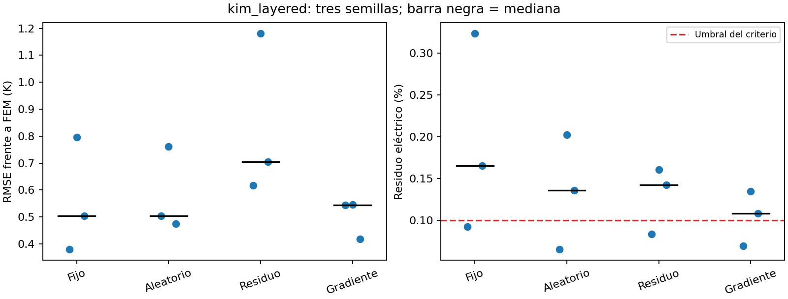
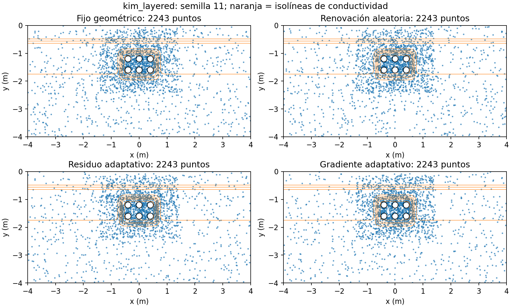
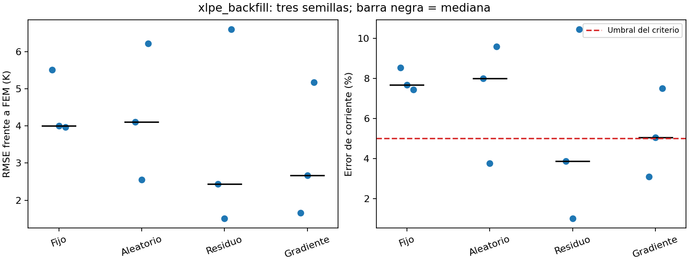
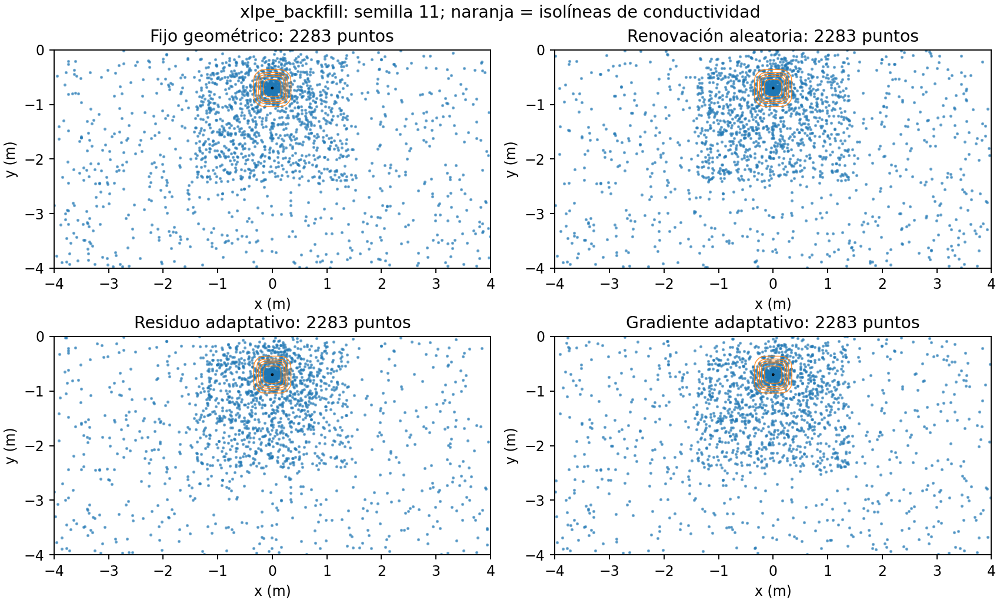

# Muestreo adaptativo: expediente de comparación

Se incorporan 18 entrenamientos nuevos y seis controles fijos existentes. Los dos escenarios mantienen conductividad espacial continua: seis cables con estratificación regularizada a corriente nominal y un cable XLPE con relleno mejorado a corriente límite. Cada alternativa usa tres semillas, la misma física y la misma referencia FEniCSx acoplada, verificada en tres mallas.

## Protocolo y fundamento

Wu et al. (2022: 6–8) comparan renovación aleatoria y muestreo por residuo, y proponen RAD. Aquí se implementa una adaptación propia con anclajes geométricos. El indicador alternativo de gradiente térmico no se atribuye como experimento de esos autores.

- Arquitectura multipolar 32×3, 1200 pasos Adam, hasta 1600 iteraciones L-BFGS, mismas pérdidas y 768 puntos globales más muestras geométricas. El número interior efectivo se mantiene exactamente por semilla.

- Actualizaciones al comienzo de los pasos Adam 400 y 800. Se conserva una mitad de la nube inicial y se selecciona sin reemplazo la otra mitad de un conjunto candidato generado con n=3072 y la misma distribución geométrica.

- Indicador residual: abs(div(k grad T)+Q)/(k·escala térmica). Indicador de gradiente: norma(grad T)/escala térmica. Ambos utilizan el campo completo, incluidas fuentes analíticas, multipolos y potencias aprendidas.

- Probabilidades discretas proporcionales a score/media(score)+1. Si todos los indicadores son cero, se usa distribución uniforme sobre candidatos. El control aleatorio siempre usa probabilidades uniformes sobre esa misma familia geométrica; no es muestreo espacial uniforme en todo el suelo.

- No se añaden puntos ni se adaptan fronteras o interfaces. L-BFGS mantiene fija la última nube. No se corrige la pérdida por importancia; cambia su ponderación espacial efectiva.

- Se mantienen 6000 puntos externos y los criterios originales de campo, Tmax, balance, electricidad y corriente. El residuo local alto no constituye por sí solo una cota del error térmico.

## Resultados agregados

| Caso | Muestreo | RMSE mediano K | Rango K | Máx. residuo eléctrico % | Máx. error corriente % | Máx. distancia a 90 °C K | Aceptadas |
| --- | --- | --- | --- | --- | --- | --- | --- |
| kim_layered | Fijo geométrico | 0.503588 | 0.379296–0.795797 | 0.323652 | No aplica | No aplica | 1/3 |
| kim_layered | Renovación aleatoria | 0.503557 | 0.474241–0.761487 | 0.202551 | No aplica | No aplica | 1/3 |
| kim_layered | Residuo adaptativo | 0.705341 | 0.616240–1.181226 | 0.160229 | No aplica | No aplica | 1/3 |
| kim_layered | Gradiente adaptativo | 0.544025 | 0.417435–0.546044 | 0.134782 | No aplica | No aplica | 1/3 |
| xlpe_backfill | Fijo geométrico | 4.001354 | 3.962778–5.513374 | 0.016100 | 8.544765 | 0.103725 | 0/3 |
| xlpe_backfill | Renovación aleatoria | 4.106628 | 2.552176–6.213565 | 0.008344 | 9.581911 | 0.098897 | 1/3 |
| xlpe_backfill | Residuo adaptativo | 2.433703 | 1.505653–6.597814 | 0.008611 | 10.450541 | 0.110598 | 2/3 |
| xlpe_backfill | Gradiente adaptativo | 2.669447 | 1.652835–5.175790 | 0.005187 | 7.506602 | 0.069923 | 1/3 |

## Comparaciones pareadas por semilla

La reducción positiva indica menor RMSE; una reducción negativa indica empeoramiento. Se distingue el control fijo de la renovación aleatoria.

| Caso | Muestreo | Semilla | RMSE K | Reducción frente a fijo % | Reducción frente a renovación % | Aceptada |
| --- | --- | --- | --- | --- | --- | --- |
| kim_layered | Renovación aleatoria | 11 | 0.503557 | -32.761 | 0.000 | True |
| kim_layered | Renovación aleatoria | 23 | 0.761487 | 4.311 | 0.000 | False |
| kim_layered | Renovación aleatoria | 37 | 0.474241 | 5.828 | 0.000 | False |
| kim_layered | Residuo adaptativo | 11 | 0.616240 | -62.470 | -22.377 | True |
| kim_layered | Residuo adaptativo | 23 | 1.181226 | -48.433 | -55.121 | False |
| kim_layered | Residuo adaptativo | 37 | 0.705341 | -40.063 | -48.730 | False |
| kim_layered | Gradiente adaptativo | 11 | 0.544025 | -43.430 | -8.036 | True |
| kim_layered | Gradiente adaptativo | 23 | 0.546044 | 31.384 | 28.292 | False |
| kim_layered | Gradiente adaptativo | 37 | 0.417435 | 17.108 | 11.978 | False |
| xlpe_backfill | Renovación aleatoria | 11 | 4.106628 | 25.515 | 0.000 | False |
| xlpe_backfill | Renovación aleatoria | 23 | 2.552176 | 36.217 | 0.000 | True |
| xlpe_backfill | Renovación aleatoria | 37 | 6.213565 | -56.798 | 0.000 | False |
| xlpe_backfill | Residuo adaptativo | 11 | 2.433703 | 55.858 | 40.737 | True |
| xlpe_backfill | Residuo adaptativo | 23 | 1.505653 | 62.371 | 41.005 | True |
| xlpe_backfill | Residuo adaptativo | 37 | 6.597814 | -66.495 | -6.184 | False |
| xlpe_backfill | Gradiente adaptativo | 11 | 1.652835 | 70.021 | 59.752 | True |
| xlpe_backfill | Gradiente adaptativo | 23 | 2.669447 | 33.286 | -4.595 | False |
| xlpe_backfill | Gradiente adaptativo | 37 | 5.175790 | -30.610 | 16.702 | False |

En kim_layered, la nube fija obtiene un RMSE mediano de 0.5036 K y acepta 1/3 semillas. La renovación aleatoria obtiene 0.5036 K y 1/3 aceptadas; la selección por residuo obtiene 0.7053 K y 1/3 aceptadas; la selección por gradiente obtiene 0.5440 K y 1/3 aceptadas.

Renovación aleatoria: la reducción del RMSE mediano frente a la nube fija es 0.01 %; la aceptación pasa de 1/3 a 1/3. Se conserva el signo negativo cuando el error aumenta.

Residuo adaptativo: la reducción del RMSE mediano frente a la nube fija es -40.06 %; la aceptación pasa de 1/3 a 1/3. Se conserva el signo negativo cuando el error aumenta.

Gradiente adaptativo: la reducción del RMSE mediano frente a la nube fija es -8.03 %; la aceptación pasa de 1/3 a 1/3. Se conserva el signo negativo cuando el error aumenta.

La configuración seleccionada utiliza renovación aleatoria, con 1/3 ejecuciones aceptadas. La aceptación parcial exige contrastar cada ejecución con FEM y no acredita robustez entre semillas.

En xlpe_backfill, la nube fija obtiene un RMSE mediano de 4.0014 K y acepta 0/3 semillas. La renovación aleatoria obtiene 4.1066 K y 1/3 aceptadas; la selección por residuo obtiene 2.4337 K y 2/3 aceptadas; la selección por gradiente obtiene 2.6694 K y 1/3 aceptadas.

Renovación aleatoria: la reducción del RMSE mediano frente a la nube fija es -2.63 %; la aceptación pasa de 0/3 a 1/3. Se conserva el signo negativo cuando el error aumenta.

Residuo adaptativo: la reducción del RMSE mediano frente a la nube fija es 39.18 %; la aceptación pasa de 0/3 a 2/3. Se conserva el signo negativo cuando el error aumenta.

Gradiente adaptativo: la reducción del RMSE mediano frente a la nube fija es 33.29 %; la aceptación pasa de 0/3 a 1/3. Se conserva el signo negativo cuando el error aumenta.

Los errores máximos de corriente son fijo geométrico: 8.545 %, renovación aleatoria: 9.582 %, residuo adaptativo: 10.451 %, gradiente adaptativo: 7.507 %.

La configuración seleccionada utiliza residuo adaptativo, con 2/3 ejecuciones aceptadas. La aceptación parcial exige contrastar cada ejecución con FEM y no acredita robustez entre semillas.

## Interpretación, ventajas y limitaciones

La redistribución se evalúa como una decisión de entrenamiento, no como una mejora garantizada. Concentrar puntos donde el gradiente térmico es alto puede reforzar regiones próximas a los cables cuya variación ya representa el enriquecimiento analítico. El residuo prioriza incumplimientos de la ecuación, pero no mide directamente el error de temperatura ni asegura el cumplimiento eléctrico. La renovación aleatoria permite identificar mejoras que no requieren un indicador físico. La selección utiliza todas las semillas y todos los criterios, sin equiparar una mejora del RMSE con aceptación de corriente.

Ventajas: redistribución sin aumentar el tamaño del sistema de colocaciones, control aleatorio comparable y trazabilidad de candidatos, probabilidades y coordenadas. Limitaciones: dos casos elegidos por dificultades previas, dos actualizaciones, tres semillas, fronteras fijas y ausencia de garantía de error; no constituye generalización independiente ni búsqueda exhaustiva de frecuencia o fracción adaptativa.

## Auditoría y reproducción

Se reconstruye exactamente la nube inicial y cada selección a partir de las semillas guardadas. Para residuo y gradiente se archiva además el estado de la red antes de cada actualización; se recalculan 96 puntuaciones por ronda y se contrastan con las guardadas. En el control aleatorio la puntuación es uno y no depende del estado de la red. El algoritmo geométrico de los controles fijos se contrasta con su fuente original archivada antes de reconstruir su nube.

Comandos: `python Benchmarks/adaptive_campaign.py`, `python Benchmarks/select_configuration.py`, `python Benchmarks/adaptive_analysis.py`. Las configuraciones individuales están en `configurations/adaptive/`; los cuadernos de ambos casos permiten repetirlas en otra carpeta. Las ejecuciones mínimas de comprobación del código están en `docs/auditoria/adaptive_smoke`, fuera de la batería científica.

El JSON `summary/adaptive_sampling.json` contiene controles de replay, huellas de entradas y comparaciones completas. Los tiempos guardados incluyen evaluación de indicadores y concurrencia; no se usan para afirmar aceleración frente a FEM.

## Referencias

Wu, C., Zhu, M., Tan, Q., Kartha, Y., & Lu, L. (2022). *A comprehensive study of non-adaptive and residual-based adaptive sampling for physics-informed neural networks* [Prepublicación, versión 1]. arXiv. https://arxiv.org/abs/2207.10289v1
