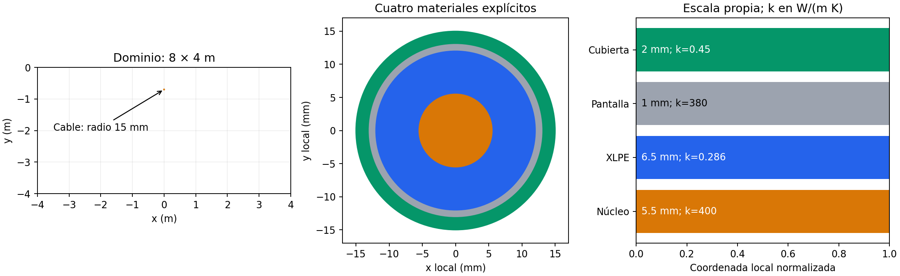
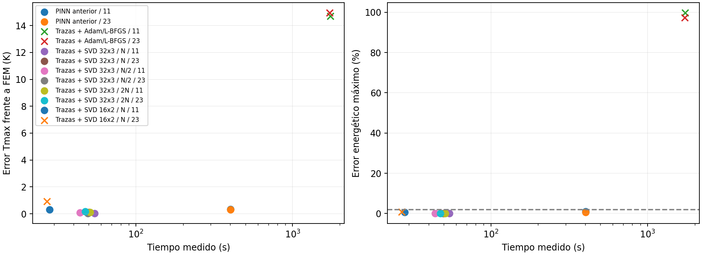

# Resultados exploratorios multiescala

Mismo problema físico, mismos puntos de evaluación y mismo FEM convergido. Sin etiquetas FEM en la pérdida.

| Método | Semilla | Aceptado | Coef. ajustados | s | Error Tmax (K) | RMSE (K) | Energía máx. (%) | Salto T (K) | Salto q RMS (%) |
|---|---:|---|---:|---:|---:|---:|---:|---:|---:|
| PINN anterior | 11 | sí | 11338 | 401.92 | 0.3357 | 0.2875 | 0.9066 | 0.0457 | 0.391 |
| PINN anterior | 23 | sí | 11338 | 401.53 | 0.3061 | 0.5990 | 0.6569 | 0.092 | 0.416 |
| Trazas + Adam/L-BFGS | 11 | no | 11438 | 1738.53 | 14.6951 | 1.1044 | 99.8259 | 3.55e-14 | 1.98e-09 |
| Trazas + Adam/L-BFGS | 23 | no | 11438 | 1725.62 | 14.9596 | 1.8688 | 97.2846 | 3.2e-14 | 1.75e-09 |
| Trazas + SVD 32x3 / N | 11 | sí | 269 | 54.34 | 0.0353 | 0.2195 | 0.1032 | 2.2e-13 | 3.75e-09 |
| Trazas + SVD 32x3 / N | 23 | sí | 269 | 50.06 | 0.1030 | 0.2966 | 0.1158 | 3.23e-13 | 4.05e-09 |
| Trazas + SVD 32x3 / N/2 | 11 | sí | 269 | 43.94 | 0.0837 | 0.2182 | 0.1020 | 2.34e-13 | 3.96e-09 |
| Trazas + SVD 32x3 / N/2 | 23 | sí | 269 | 49.41 | 0.0289 | 0.2255 | 0.0616 | 2.95e-13 | 3.76e-09 |
| Trazas + SVD 32x3 / 2N | 11 | sí | 269 | 51.02 | 0.0997 | 0.2403 | 0.1114 | 2.49e-13 | 4.01e-09 |
| Trazas + SVD 32x3 / 2N | 23 | sí | 269 | 47.52 | 0.1814 | 0.3219 | 0.1057 | 3.09e-13 | 4.02e-09 |
| Trazas + SVD 16x2 / N | 11 | sí | 189 | 28.12 | 0.3116 | 0.3592 | 0.5534 | 7.11e-14 | 3.92e-09 |
| Trazas + SVD 16x2 / N | 23 | no | 189 | 26.99 | 0.9172 | 0.7697 | 0.7962 | 7.11e-14 | 3.76e-09 |

Los tiempos incluyen construcción/resolución para SVD y optimización para Adam/L-BFGS; excluyen la evaluación FEM posterior. Se ejecutaron ensayos concurrentes: estas medidas no prueban una aceleración aislada del hardware.

SVD congela las capas ocultas y ajusta sólo salidas y trazas; no son 269 pesos totales ni una PINN entrenada de extremo a extremo. Las cantidades de parámetros fijos y ajustados constan en JSON.

Las semillas son de desarrollo. No hay evidencia todavía para múltiples cables, estratos, transitorio ni acoplamiento DC no lineal de esta nueva construcción.

[Campos FEM/PINN/error en los mismos puntos](campos_semilla11.png)

## Sensibilidad a colocaciones

| Semilla | Cambio | Campo máx. regional / ΔT FEM (%) | Tmax / ΔT FEM (%) | Ambos ≤0,5% | Ambos aceptados |
|---:|---|---:|---:|---|---|
| 11 | points_half → linear | 0.3362 | 0.2871 | sí | sí |
| 11 | linear → points_double | 0.3822 | 0.3822 | sí | sí |
| 23 | points_half → linear | 0.7886 | 0.7825 | no | sí |
| 23 | linear → points_double | 0.4656 | 0.4656 | sí | sí |

El refinamiento corresponde a la arquitectura 32×3. No certifica independencia de puntos para 16×2 ni para otros casos. N=512 puntos de suelo, 256 por capa y 192 por interfaz. También cambia la cuadratura de balances al cambiar puntos de interfaz/frontera; es una sensibilidad conjunta, no un aislamiento del efecto de colocaciones interiores.
